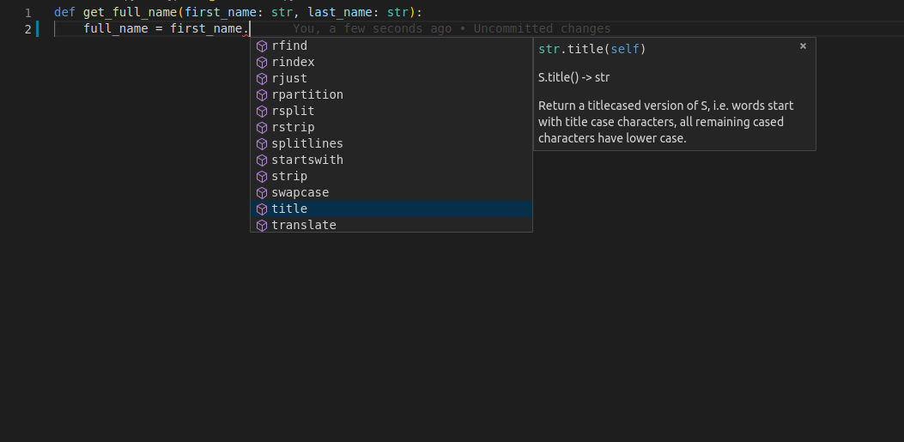
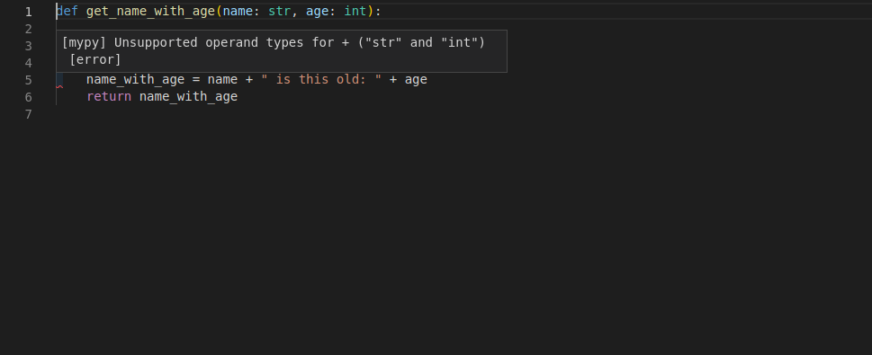
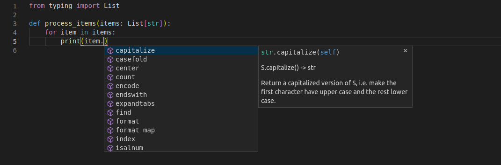
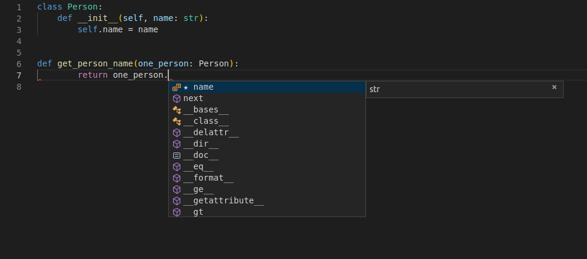

## 后端基础：FastAPI 快速入门——Python Types Intro（类型简介）

Python has support for optional "type hints" (also called "type annotations").
> Python支持可选的“类型提示”（也称为“类型注解”）。

These "type hints" or annotations are a special syntax that allow declaring the type of a variable.
> 这些“类型提示”或注释是一种特殊的语法，可用于声明变量的类型。

By declaring types for your variables, editors and tools can give you better support.
> 通过为变量声明类型，编辑器和工具可以为你提供更好的支持。

FastAPI is all based on these type hints, they give it many advantages and benefits.
> FastAPI 完全基于这些类型提示，它们为其带来了诸多优势和益处。

### Motivation 动机
**Python 3.9+**

```python 3.9+
def get_full_name(first_name, last_name):
    full_name = first_name.title() + " " + last_name.title()
    return full_name

print(get_full_name("john", "doe"))

# output: John Doe
```

The function does the following: 

- Takes a first_name and last_name. 
- Converts the first letter of each one to upper case with title().
- Concatenates them with a space in the middle.

#### Edit it
It's a very simple program. 

But now imagine that you were writing it from scratch.
> 但现在想象一下，你要从头开始编写它。

At some point you would have started the definition of the function, you had the parameters ready...
> 在某个时刻，你可能已经开始定义这个函数，并且准备好了参数……

But then you have to call "that method that converts the first letter to upper case".
> 但接下来你必须调用“那个将首字母转换为大写的方法”。

Was it `upper`? Was it `uppercase`? `first_uppercase`? `capitalize`?
> 是upper吗？是uppercase吗？first_uppercase？capitalize？

Then, you try with the old programmer's friend, editor autocompletion.
> 然后，你会尝试使用程序员的老伙计——编辑器自动补全功能。

You type the first parameter of the function, `first_name`, then a dot (`.`) and then hit `Ctrl+Space` to trigger the completion.
> 你输入函数的第一个参数first_name，然后输入一个点（.），接着按Ctrl+Space来触发补全。

But, sadly, you get nothing useful:


#### Add types
Let's modify a single line from the previous version.
> 让我们修改上一版本中的一行内容。

We will change exactly this fragment, the parameters of the function, from: `first_name, last_name` to `first_name: str, last_name: str`
> 我们将精确修改这部分内容，即函数的参数，  

Those are the "type hints": 
``` Python 3.9+
def get_full_name(first_name: str, last_name: str):
    full_name = first_name.title() + " " + last_name.title()
    return full_name

print(get_full_name("john", "doe"))
```
That is not the same as declaring default values like would be with: `first_name="john", last_name="doe"`
> 这与像这样声明默认值并不相同：
    
It's a different thing. We are using colons (:), not equals (=).

And adding type hints normally doesn't change what happens from what would happen without them.

But now, imagine you are again in the middle of creating that function, but with type hints.
> 但现在，想象一下你再次处于创建该函数的过程中，但这次带有类型提示。

At the same point, you try to trigger the autocomplete with `Ctrl+Space` and you see:


With that, you can scroll, seeing the options, until you find the one that "rings a bell":
> 有了这个，你可以滚动查看选项，直到找到那个“听起来耳熟”的选项：



### More motivation
Check this function, it already has type hints:

```Python 3.9+
def get_name_with_age(name: str, age: int):
    name_with_age = name + " is this old: " + age
    return name_with_age
```
Because the editor knows the types of the variables, you don't only get completion, you also get error checks:



Now you know that you have to fix it, convert `age` to a string with `str(age)`:

```Python 3.9+
def get_name_with_age(name: str, age: int):
    name_with_age = name + " is this old: " + str(age)
    return name_with_age
```
### Declaring types
You just saw the main place to declare type hints. As function parameters.This is also the main place you would use them with FastAPI.
> 你刚刚看到了声明类型提示的主要位置，也就是函数参数处。这也是在 FastAPI 中使用它们的主要地方。

#### Simple types
You can declare all the standard Python types, not only str. You can use, for example:
- `int`
- `float`
- `bool`
- `bytes`

```Python 3.9+
def get_items(item_a: str, item_b: int, item_c: float, item_d: bool, item_e: bytes):
    return item_a, item_b, item_c, item_d, item_e
```

#### Generic types with type parameters
There are some data structures that can contain other values, like dict, list, set and tuple. And the internal values can have their own type too.
> 有些数据结构可以包含其他值，例如dict、list、set和tuple。而且内部的值也可以有它们自己的类型。

These types that have internal types are called "generic" types. And it's possible to declare them, even with their internal types.
> 这些包含内部类型的类型被称为“泛型”类型。我们甚至可以连同它们的内部类型一起声明这些泛型类型。

To declare those types and the internal types, you can use the standard Python module typing. It exists specifically to support these type hints.
> 要声明这些类型和内部类型，您可以使用标准的Python模块typing。它的存在就是专门为了支持这些类型提示。

##### Newer versions of Python
The syntax using `typing` is compatible with all versions, from Python 3.6 to the latest ones, including Python 3.9, Python 3.10, etc.
> 使用`typing`的语法与所有版本兼容，从Python 3.6到最新版本，包括Python 3.9、Python 3.10等。

As Python advances, newer versions come with improved support for these type annotations and in many cases you won't even need to import and use the `typing` module to declare the type annotations.
> 随着Python的发展，更新的版本对这些类型注解提供了更好的支持，而且在很多情况下，你甚至不需要导入和使用`typing`模块来声明类型注解。

If you can choose a more recent version of Python for your project, you will be able to take advantage of that extra simplicity.
> 如果你的项目可以选择更新版本的Python，你将能够利用这种额外的简洁性。

In all the docs there are examples compatible with each version of Python (when there's a difference).
> 所有文档中都包含与各个Python版本兼容的示例（当存在差异时）。

For example "Python 3.6+" means it's compatible with Python 3.6 or above (including 3.7, 3.8, 3.9, 3.10, etc). And "Python 3.9+" means it's compatible with Python 3.9 or above (including 3.10, etc).
> 例如，“Python 3.6+”表示它兼容Python 3.6及更高版本（包括3.7、3.8、3.9、3.10等）。而“Python 3.9+”表示它兼容Python 3.9及更高版本（包括3.10等）。

If you can use the latest versions of Python, use the examples for the latest version, those will have the best and simplest syntax, for example, "Python 3.10+".
> 如果你能使用最新版本的Python，请使用最新版本的示例，这些示例将具有最佳且最简单的语法，例如“Python 3.10+”。

##### List
For example, let's define a variable to be a `list` of `str`.
> 例如，我们来定义一个变量，使其成为一个`list`，其中包含`str`。

Declare the variable, with the same colon (`:`) syntax.
> 使用相同的冒号（`:`）语法声明变量。

As the type, put `list`. 
> 类型请填写 list。

As the list is a type that contains some internal types, you put them in square brackets:
> 由于列表是一种包含某些内部类型的类型，你需要将这些内部类型放在方括号中：

```Python 3.9+

def process_items(items: list[str]):
    for item in items:
        print(item)
```

> Those internal types in the square brackets are called "type parameters".
>> 方括号中的这些内部类型被称为“类型参数”。
>
> In this case, str is the type parameter passed to list.
>> 在这种情况下，str 是传递给 list 的类型参数。

That means: "the variable items is a list, and each of the items in this list is a str".
> 这意味着：“变量items是一个list，且该列表中的每个元素都是一个str”。

By doing that, your editor can provide support even while processing items from the list:
> 通过这种方式，你的编辑器即使在处理列表中的元素时也能提供支持：



Without types, that's almost impossible to achieve.
> 没有类型的话，这几乎是不可能实现的。

Notice that the variable item is one of the elements in the list items.
> 请注意，变量item是列表items中的元素之一。

And still, the editor knows it is a `str`, and provides support for that.
> 而且，编辑器知道它是一个字符串，并为此提供支持。

##### Tuple and Set
You would do the same to declare tuples and sets:
> 声明tuple和set时，你也会采用同样的方式：

```Python 3.9+
def process_items(items_t: tuple[int, int, str], items_s: set[bytes]):
    return items_t, items_s
```
This means:

- The variable items_t is a tuple with 3 items, an int, another int, and a str.
- > 变量items_t是一个包含3个元素的tuple，分别是一个int、另一个int和一个str。

- The variable items_s is a set, and each of its items is of type bytes.
- > 变量items_s是一个set，其每个元素的类型都是bytes。

##### Dict
To define a dict, you pass 2 type parameters, separated by commas: keys and values.
> 要定义一个dict，需要传入两个类型参数，用逗号分隔。

```Python 3.9+
def process_items(prices: dict[str, float]):
    for item_name, item_price in prices.items():
        print(item_name)
        print(item_price)
```

The variable prices is a dict: 

- The keys of this dict are of type str (let's say, the name of each item).
- > 这个dict的键是str类型（比如说，每个物品的名称）。

The values of this dict are of type float (let's say, the price of each item).

##### Union
You can declare that a variable can be any of several types, for example, an int or a str.
> 你可以声明一个变量可以是多种类型中的任意一种，例如，int或str。

In Python 3.6 and above (including Python 3.10) you can use the `Union` type from `typing` and put inside the square brackets the possible types to accept.
> 在Python 3.6及更高版本（包括Python 3.10）中，你可以使用typing模块中的Union类型，并在方括号中放入可接受的可能类型。

In Python 3.10 there's also a new syntax where you can put the possible types separated by a vertical bar (|).
> 在Python 3.10中，还有一种新语法，你可以用竖线（|）分隔可能的类型。


```Python 3.10+
def process_item(item: int | str):
    print(item)
```
```Python 3.9+
from typing import Union


def process_item(item: Union[int, str]):
    print(item)
```

In both cases this means that item could be an int or a str.
> 在这两种情况下，这意味着item可以是一个int或一个str。

##### Possibly `None`
You can declare that a value could have a type, like str, but that it could also be None.
> 你可以声明一个值可能具有某种类型，比如str，但它也可能是None。

In Python 3.6 and above (including Python 3.10) you can declare it by importing and using Optional from the typing module.
> 在Python 3.6及更高版本（包括Python 3.10）中，你可以通过从typing模块导入并使用Optional来声明它。

```python
from typing import Optional


def say_hi(name: Optional[str] = None):
    if name is not None:
        print(f"Hey {name}!")
    else:
        print("Hello World")
```
Using `Optional[str]` instead of just `str` will let the editor help you detect errors where you could be assuming that a value is always a str, when it could actually be `None` too.
> 使用Optional[str]而不是单纯的str，可以让编辑器帮助你检测一些错误，这些错误可能是由于你假设某个值始终是str类型，但实际上它也可能是None类型而导致的。

`Optional[Something]` is actually a shortcut for `Union[Something, None]`, they are equivalent.
> Optional[Something]实际上是Union[Something, None]的快捷方式，它们是等效的。

This also means that in Python 3.10, you can use `Something | None`:
> 这也意味着在Python 3.10中，你可以使用Something | None：

```Python 3.10+
def say_hi(name: str | None = None):
    if name is not None:
        print(f"Hey {name}!")
    else:
        print("Hello World")
```
```Python 3.9+
from typing import Optional


def say_hi(name: Optional[str] = None):
    if name is not None:
        print(f"Hey {name}!")
    else:
        print("Hello World")
```
```Python 3.9+ alternative
from typing import Union


def say_hi(name: Union[str, None] = None):
    if name is not None:
        print(f"Hey {name}!")
    else:
        print("Hello World")
```

##### Using Union or Optional
If you are using a Python version below 3.10, here's a tip from my very subjective point of view:
> 如果你使用的Python版本低于3.10，以下是从我非常主观的角度给出的一个建议：

- 🚨 Avoid using `Optional[SomeType]`.
- Instead, ✨ use `Union[SomeType, None]` ✨.

Both are equivalent and underneath they are the same, but I would recommend `Union` instead of `Optional` because the word "optional" would seem to imply that the value is optional, and it actually means "it can be None", even if it's not optional and is still required.
> l两者是等价的，本质上是一样的，但我建议使用`Union`而不是`Optional`，因为“optional”这个词似乎暗示该值是可选的，而实际上它的意思是“它可以是None”，即便它不是可选的，仍然是必填的。

I think `Union[SomeType, None]` is more explicit about what it means.
> 我认为Union[SomeType, None]的含义更为明确。

It's just about the words and names. But those words can affect how you and your teammates think about the code.
> 这只关乎词语和名称。但这些词语会影响你和你的队友对代码的看法。

As an example, let's take this function:
> 举个例子，让我们看看这个函数：

```Python 3.9+
from typing import Optional


def say_hi(name: Optional[str]):
    print(f"Hey {name}!")
```

The parameter name is defined as `Optional[str]`, but it is not optional, you cannot call the function without the parameter:
> 参数name被定义为Optional[str]，但它是非可选的，调用该函数时不能缺少此参数：

`say_hi()  # Oh, no, this throws an error! 😱`

The name parameter is still required (not optional) because it doesn't have a default value. Still, name accepts None as the value:
> name参数是仍然必需的（不是可选的），因为它没有默认值。不过，name接受None作为值：


`say_hi(name=None)  # This works, None is valid 🎉`
The good news is, once you are on Python 3.10 you won't have to worry about that, as you will be able to simply use | to define unions of types:
> 好消息是，一旦你使用Python 3.10，就不必担心这个问题了，因为你可以直接使用|来定义类型的并集：

```Python 3.10+

def say_hi(name: str | None):
    print(f"Hey {name}!")
```
And then you won't have to worry about names like `Optional` and `Union`. 😎
> 这样你就不必担心像Optional和Union这样的名称了。😎

##### Generic types
These types that take type parameters in square brackets are called `Generic` types or `Generics`, for example:
> 这些在方括号中带有类型参数的类型被称为泛型类型或泛型，例如：

**Python 3.9+**

You can use the same builtin types as generics (with square brackets and types inside):
> 你可以将相同的内置类型用作泛型（使用方括号并在其中包含类型）：
- list
- tuple
- set
- dict

And the same as with previous Python versions, from the typing module:
> 和之前的Python版本一样，来自typing模块：
- Union
- Optional
- ...and others.

In Python 3.10, as an alternative to using the generics Union and Optional, you can use the vertical bar (|) to declare unions of types, that's a lot better and simpler.
> 在Python 3.10中，作为使用泛型Union和Optional的替代方法，你可以使用竖线（|）来声明类型联合，这要更好也更简单。

#### Classes as types
You can also declare a class as the type of a variable.
> 你也可以将一个类声明为变量的类型。

Let's say you have a class Person, with a name:
> 假设你有一个 Person 类，它包含一个姓名：

Then you can declare a variable to be of type Person:
> 然后你可以声明一个类型为Person的变量：
```Python 3.9+
class Person:
    def __init__(self, name: str):
        self.name = name


def get_person_name(one_person: Person):
    return one_person.name
```
And then, again, you get all the editor support:
> 然后，同样，你会获得所有的编辑器支持：



Notice that this means "`one_perso`n is an instance of the class `Person`".
> 请注意，这意味着“one_person是Person类的一个实例”。

It doesn't mean "`one_person` is the class called `Person`".
> 这并不意味着“one_person是名为Person的类”。

### Pydantic models
Pydantic is a Python library to perform data validation.
> Pydantic 是一个用于执行数据验证的 Python 库。

You declare the "shape" of the data as classes with attributes.
> 你将数据的“形状”声明为带有属性的类。

And each attribute has a type. 
> 并且每个属性都有一个类型。

Then you create an instance of that class with some values and it will validate the values, convert them to the appropriate type (if that's the case) and give you an object with all the data.
> 然后你用一些值创建该类的实例，它会验证这些值，将它们转换为适当的类型（如果情况如此），并为你提供一个包含所有数据的对象。

And you get all the editor support with that resulting object.
> 并且你会获得针对该结果对象的所有编辑器支持。

An example from the official Pydantic docs:
> 来自Pydantic官方文档的一个示例：

```Python 3.10+

from datetime import datetime

from pydantic import BaseModel


class User(BaseModel):
    id: int
    name: str = "John Doe"
    signup_ts: datetime | None = None
    friends: list[int] = []


external_data = {
    "id": "123",
    "signup_ts": "2017-06-01 12:22",
    "friends": [1, "2", b"3"],
}
user = User(**external_data)
print(user)
# > User id=123 name='John Doe' signup_ts=datetime.datetime(2017, 6, 1, 12, 22) friends=[1, 2, 3]
print(user.id)
# > 123
```

```
Info 信息

To learn more about Pydantic, check its docs.
要了解更多关于Pydantic的信息，请查看其文档。
```
FastAPI is all based on Pydantic.

You will see a lot more of all this in practice in the Tutorial - User Guide.
> 在《教程 - 用户指南》中，你会在实践中看到更多这方面的内容。

```Tip 提示

Pydantic has a special behavior when you use Optional or Union[Something, None] without a default value, you can read more about it in the Pydantic docs about Required Optional fields.
当你使用没有默认值的Optional或Union[Something, None]时，Pydantic有一个特殊行为，你可以在Pydantic文档中关于必填可选字段的部分了解更多相关内容。
```
### Type Hints with Metadata Annotations
Python also has a feature that allows putting additional metadata in these type hints using `Annotated`.
> Python 还有一个特性，允许使用 Annotated 在这些类型提示中放入 附加元数据。

Since Python 3.9, Annotated is a part of the standard library, so you can import it from typing.
> 自Python 3.9起，Annotated成为标准库的一部分，因此你可以从typing中导入它。

```Python 3.9+

from typing import Annotated


def say_hello(name: Annotated[str, "this is just metadata"]) -> str:
    return f"Hello {name}"
```
Python itself doesn't do anything with this Annotated. And for editors and other tools, the type is still str.
> Python本身不会对这个Annotated做任何处理。对于编辑器和其他工具来说，其类型仍然是str。

But you can use this space in Annotated to provide FastAPI with additional metadata about how you want your application to behave.
> 但你可以在Annotated部分使用这个空间，向FastAPI提供关于你希望应用程序如何运行的额外元数据。

The important thing to remember is that the first type parameter you pass to Annotated is the actual type. The rest, is just metadata for other tools.
> 需要记住的重要一点是，传递给Annotated的第一个类型参数是实际类型。其余的都只是供其他工具使用的元数据。

For now, you just need to know that Annotated exists, and that it's standard Python. 😎
> 目前，你只需要知道Annotated 存在，并且它是标准的Python即可。😎

Later you will see how powerful it can be.
> 稍后你会看到它有多么强大。

```
Tip 提示

The fact that this is standard Python means that you will still get the best possible developer experience in your editor, with the tools you use to analyze and refactor your code, etc. ✨
这是标准Python这一事实意味着，在你的编辑器中，借助你用于分析和重构代码等的工具，你仍将获得尽可能好的开发体验。✨

And also that your code will be very compatible with many other Python tools and libraries. 🚀
而且你的代码也将与许多其他Python工具和库具有很好的兼容性。🚀
```

### Type hints in FastAPI
FastAPI takes advantage of these type hints to do several things.
> FastAPI 利用这些类型提示来实现多项功能。

With FastAPI you declare parameters with type hints and you get:
> 使用FastAPI时，你可以通过类型提示来声明参数，并且你会获得：

- Editor support.
- Type checks.
...and FastAPI uses the same declarations to:
> ……FastAPI使用相同的声明来：

- **Define requirements**: from request path parameters, query parameters, headers, bodies, dependencies, etc.
- > 定义需求：从请求路径参数、查询参数、标头、主体、依赖项等中获取。
- **Convert data**: from the request to the required type.
- > 转换数据：将请求中的数据转换为所需类型。
- **Validate data**: coming from each request:
- > 验证数据：来自每个请求：
- - Generating automatic errors returned to the client when the data is invalid.
- - > 当数据无效时，生成返回给客户端的自动错误。
- Document the API using OpenAPI:
- > 使用OpenAPI为API生成文档：
- - which is then used by the automatic interactive documentation user interfaces.
- - > 然后，这会被自动交互式文档用户界面所使用。

This might all sound abstract. Don't worry. You'll see all this in action in the Tutorial - User Guide.
> 这听起来可能有些抽象。别担心，你会在《教程 - 用户指南》中看到所有这些的实际应用。

The important thing is that by using standard Python types, in a single place (instead of adding more classes, decorators, etc), FastAPI will do a lot of the work for you.
> 重要的是，通过在一个地方使用标准的Python类型（而不是添加更多的类、装饰器等），FastAPI将为你完成大量工作。

```
Info

If you already went through all the tutorial and came back to see more about types, a good resource is the "cheat sheet" from `mypy`.
如果你已经看完了所有教程，回来想了解更多关于类型的内容，一个不错的资源是来自mypy的“速查表”。
```

---

## 后端基础：FastAPI 快速入门——Concurrency and async / await（并发和异步/等待）
Details about the `async def` syntax for path operation functions and some background about asynchronous code, concurrency, and parallelism.
> 关于 async def 语法在 路径操作函数 中的详细信息，以及一些关于异步代码、并发和并行性的背景知识。

### In a hurry?赶时间吗
**TL;DR: 长话短说：**

If you are using third party libraries that tell you to call them with `await`, like:
如果你正在使用要求你用await调用它们的第三方库，例如：

``` python
results = await some_library()
```

Then, declare your path operation functions with async def like:
> 然后，用async def声明你的路径操作函数，如下所示：

``` python
@app.get('/')
async def read_results():
    results = await some_library()
    return results
```

```
Note
You can only use await inside of functions created with async def.
你只能在使用 async def 创建的函数内部使用 await。
```

If you are using a third party library that communicates with something (a database, an API, the file system, etc.) and doesn't have support for using await, (this is currently the case for most database libraries), then declare your path operation functions as normally, with just def, like:
> 如果你正在使用一个第三方库来与某些东西（数据库、API、文件系统等）进行通信，且该库不支持使用await（目前大多数数据库库都是这种情况），那么只需像平常一样用def来声明你的路径操作函数，例如：

``` python
@app.get('/')
def results():
    results = some_library()
    return results
```

If your application (somehow) **doesn't** have to communicate with anything else and wait for it to respond, use `async def`, even if you don't need to use `await` inside.
> 如果你的应用程序（不管出于什么原因）不需要与其他任何东西通信并等待其响应，那么即使你不需要在内部使用await，也请使用async def。

If you just don't know, use normal `def`.
> 如果你不确定，就使用普通的def。

Note: You can mix `def` and `async def` in your path operation functions as much as you need and define each one using the best option for you. FastAPI will do the right thing with them.
> 你可以根据需要在路径操作函数中混合使用def和async def，并选择最适合自己的方式来定义每一个函数。FastAPI会妥善处理它们。

Anyway, in any of the cases above, FastAPI will still work asynchronously and be extremely fast.
> 无论如何，在上述任何情况下，FastAPI 仍将以异步方式工作，并且速度极快。

But by following the steps above, it will be able to do some performance optimizations.
> 但按照上述步骤操作，它将能够进行一些性能优化。

### Technical Details
Modern versions of Python have support for "asynchronous code" using something called "coroutines", with async and await syntax.
> Python 的现代版本支持使用名为“协程”的 “异步代码”，并采用 async 和 await 语法。

Let's see that phrase by parts in the sections below:
> 下面我们将在各部分中逐部分分析这个短语：
- Asynchronous Code 异步代码
- async and await
- Coroutines 协程

### Asynchronous Code
Asynchronous code just means that the language has a way to tell the computer / program that at some point in the code, it will have to wait for something else to finish somewhere else. Let's say that something else is called "slow-file".
> 异步代码的意思就是，这种语言有一种方式可以告诉计算机/程序，在代码的某个地方，它必须等待其他事情在别处完成。假设这个其他事情叫做“慢文件”。

So, during that time, the computer can go and do some other work, while "slow-file" finishes.
> 因此，在这段时间里，计算机可以去做一些其他工作，同时等待“慢文件”完成。

Then the computer / program will come back every time it has a chance because it's waiting again, or whenever it finished all the work it had at that point. And it will see if any of the tasks it was waiting for have already finished, doing whatever it had to do.
> 然后，计算机/程序每次有机会时都会回来，因为它又在等待了，或者每当它完成了当时手头的所有工作时也会回来。而且它会查看它正在等待的任务中是否有已经完成的，并执行它必须做的任何事情。

Next, it takes the first task to finish (let's say, our "slow-file") and continues whatever it had to do with it.
> 接下来，它会先完成第一项任务（假设是我们的“慢文件”），然后继续处理与该任务相关的后续事宜。

That "wait for something else" normally refers to I/O operations that are relatively "slow" (compared to the speed of the processor and the RAM memory), like waiting for:
> 这里的“等待其他事物”通常指的是相对“缓慢”的输入/输出操作（与处理器和随机存取存储器的速度相比），比如等待：

- the data from the client to be sent through the network
- > 通过网络发送的来自客户端的数据
- the data sent by your program to be received by the client through the network
- > 你的程序发送、将通过网络被客户端接收的数据
- the contents of a file in the disk to be read by the system and given to your program
- > 将由系统读取并提供给你的程序的磁盘中文件的内容
- the contents your program gave to the system to be written to disk
- > 你的程序提供给系统以便写入磁盘的内容
- a remote API operation
- a database operation to finish
- a database query to return the results
- etc. 

As the execution time is consumed mostly by waiting for I/O operations, they call them "**I/O bound**" operations.
> 由于执行时间主要消耗在等待输入/输出操作上，因此它们被称为“输入/输出密集型”操作。

It's called "asynchronous" because the computer / program doesn't have to be "synchronized" with the slow task, waiting for the exact moment that the task finishes, while doing nothing, to be able to take the task result and continue the work.
> 它被称为“异步”，是因为计算机/程序不必与缓慢的任务“同步”，不必在等待任务完成的确切时刻无所事事，而是可以获取任务结果并继续工作。

Instead of that, by being an "asynchronous" system, once finished, the task can wait in line a little bit (some microseconds) for the computer / program to finish whatever it went to do, and then come back to take the results and continue working with them.
> 相反，作为一个“异步”系统，任务完成后，可以稍等片刻（几微秒），让计算机/程序完成它正在做的任何事情，然后再回来获取结果并继续处理。

For "synchronous" (contrary to "asynchronous") they commonly also use the term "sequential", because the computer / program follows all the steps in sequence before switching to a different task, even if those steps involve waiting.
> 对于“同步”（与“异步”相对），他们通常也使用“顺序”这一术语，因为计算机/程序会按顺序执行所有步骤，然后才切换到其他任务，即便这些步骤涉及等待。

#### Concurrency and Burgers
This idea of **asynchronous** code described above is also sometimes called "**concurrency**". It is different from "**parallelism**".
> 上面描述的这种异步代码的概念有时也被称为“并发”。它与“并行”不同。

Concurrency and parallelism both relate to "different things happening more or less at the same time".
> 并发和并行都与“或多或少同时发生的不同事情”有关。

But the details between concurrency and parallelism are quite different.
> 但并发（concurrency）和并行（parallelism）之间的细节存在很大差异。

To see the difference, imagine the following story about burgers:
> 要了解其中的区别，请想象下面这个关于汉堡的故事：

#### Concurrent Burgers
You go with your crush to get fast food, you stand in line while the cashier takes the orders from the people in front of you.
> 你和你暗恋的人一起去买快餐，你排队的时候，收银员正在接待你前面的人。

Then it's your turn, you place your order of 2 very fancy burgers for your crush and you.
> 然后轮到你了，你为自己和心仪的人点了两份非常精致的汉堡。

The cashier says something to the cook in the kitchen so they know they have to prepare your burgers (even though they are currently preparing the ones for the previous clients).
> 收银员对厨房里的厨师说了些什么，这样他们就知道得准备你的汉堡了（尽管他们目前正在为之前的顾客准备汉堡）。

You pay. 

The cashier gives you the number of your turn.
> 收银员给了你你的取餐号码。

While you are waiting, you go with your crush and pick a table, you sit and talk with your crush for a long time (as your burgers are very fancy and take some time to prepare).
> 等待的时候，你和心仪的人一起选了个桌子坐下，和对方聊了很久（因为你们点的汉堡很精致，需要花点时间准备）。

As you are sitting at the table with your crush, while you wait for the burgers, you can spend that time admiring how awesome, cute and smart your crush is.
> 当你和心仪的人坐在餐桌旁等汉堡时，你可以趁这段时间欣赏对方有多棒、多可爱、多聪明。

While waiting and talking to your crush, from time to time, you check the number displayed on the counter to see if it's your turn already.
> 在等待并和你暗恋的人聊天时，你会时不时查看计数器上显示的数字，看看是不是已经轮到你了。

Then at some point, it finally is your turn. You go to the counter, get your burgers and come back to the table.
> 然后在某个时刻，终于轮到你了。你走到柜台，拿到汉堡，然后回到座位上。

You and your crush eat the burgers and have a nice time. 
> 你和你的心上人一起吃汉堡，度过了一段愉快的时光。

Imagine you are the computer / program in that story.
> 想象你是那个故事里的电脑/程序。

While you are at the line, you are just idle, waiting for your turn, not doing anything very "productive". But the line is fast because the cashier is only taking the orders (not preparing them), so that's fine.
> 排队的时候，你只是闲着，等着轮到自己，没做什么很“有成效”的事。不过队伍移动很快，因为收银员只负责接单（不负责备餐），所以还好。

Then, when it's your turn, you do actual "productive" work, you process the menu, decide what you want, get your crush's choice, pay, check that you give the correct bill or card, check that you are charged correctly, check that the order has the correct items, etc.
> 然后，轮到你时，你就会做一些实际的“有成效”的工作：看菜单、决定自己想吃什么、问心上人想吃什么、付款、确认自己给的账单或卡片是对的、确认收费无误、确认点的餐品都对，等等。

> But then, even though you still don't have your burgers, your work with the cashier is "on pause", because you have to wait for your burgers to be ready.
> 但即便如此，尽管你还没拿到汉堡，你和收银员的事务处于“暂停”状态，因为你得等待汉堡做好。

But as you go away from the counter and sit at the table with a number for your turn, you can switch your attention to your crush, and "work" on that. Then you are again doing something very "productive" as is flirting with your crush.
> 但当你离开柜台，坐到标有自己序号的桌子旁时，你可以把注意力转移到你的心上人身上，然后“专注”于这件事。这样一来，你又在做一件非常“有成效”的事情了，就像和心上人调情一样。

Then the cashier says "I'm finished with doing the burgers" by putting your number on the counter's display, but you don't jump like crazy immediately when the displayed number changes to your turn number. You know no one will steal your burgers because you have the number of your turn, and they have theirs.
> 然后收银员把你的号码放在柜台的显示屏上，说“汉堡做好了”，但当显示屏上的号码变成你的号码时，你不会立刻激动地跳起来。你知道没人会偷走你的汉堡，因为你有自己的取餐号，他们也有他们的。

So you wait for your crush to finish the story (finish the current work/ task being processed), smile gently and say that you are going for the burgers.
> 所以你要等你的心上人讲完这个故事（完成当前的工作/正在处理的任务），温柔地笑一笑，然后说你要去买汉堡了。

Then you go to the counter, to the initial task that is now finished, pick the burgers, say thanks and take them to the table. That finishes that step / task of interaction with the counter. That in turn, creates a new task, of "eating burgers", but the previous one of "getting burgers" is finished.
> 然后你走到柜台，去处理那个现在已经完成的初始任务，拿起汉堡，说声谢谢，再把它们拿到桌子上。这就完成了与柜台互动的那一步/任务。这相应地会生成一个新任务——“吃汉堡”，但之前那个“拿汉堡”的任务已经完成了。

#### Parallel Burgers
Now let's imagine these aren't "Concurrent Burgers", but "Parallel Burgers".
> 现在让我们想象一下，这些不是“并发汉堡”，而是“并行汉堡”。

You go with your crush to get parallel fast food.
> 你和你的心上人一起去买并行快餐。

You stand in line while several (let's say 8) cashiers that at the same time are cooks take the orders from the people in front of you.
> 你排队的时候，有几位（假设是8位）同时兼任厨师的收银员正在接待你前面的人点单。

Everyone before you is waiting for their burgers to be ready before leaving the counter because each of the 8 cashiers goes and prepares the burger right away before getting the next order.
> 在你之前的每个人都在等他们的汉堡做好后才离开柜台，因为8个收银员中的每一个都会先去马上准备汉堡，然后再处理下一个订单。

Then it's finally your turn, you place your order of 2 very fancy burgers for your crush and you.
> 然后终于轮到你了，你为你和你的心上人点了两份非常精致的汉堡。

You pay.

The cashier goes to the kitchen.

You wait, standing in front of the counter, so that no one else takes your burgers before you do, as there are no numbers for turns.
> 你站在柜台前等待，这样就不会有人在你之前拿走你的汉堡，因为这里没有取餐号码。

As you and your crush are busy not letting anyone get in front of you and take your burgers whenever they arrive, you cannot pay attention to your crush.
> 当你和你暗恋的人忙着不让任何人插到你们前面、抢走你们点的汉堡（无论汉堡什么时候送到）时，你根本没法关注到你的暗恋对象。

This is "synchronous" work, you are "synchronized" with the cashier/cook. You have to wait and be there at the exact moment that the cashier/cook finishes the burgers and gives them to you, or otherwise, someone else might take them.
> 这是“同步”工作，你要和收银员/厨师保持“同步”。你必须等待，并在收银员/厨师做好汉堡并交给你的确切时刻在场，否则，其他人可能会把汉堡拿走。

Then your cashier/cook finally comes back with your burgers, after a long time waiting there in front of the counter.
> 在柜台前等了很久之后，你的收银员/厨师终于拿着汉堡回来了。

You take your burgers and go to the table with your crush.
> 你拿着汉堡，和你的心上人一起走向餐桌。

You just eat them, and you are done.
> 你只要吃掉它们，就完事了。

There was not much talk or flirting as most of the time was spent waiting in front of the counter.
> 大部分时间都花在柜台前等待，所以没什么交谈或调情。

In this scenario of the parallel burgers, you are a computer / program with two processors (you and your crush), both waiting and dedicating their attention to be "waiting on the counter" for a long time.
> 在这个平行汉堡的场景中，你是一台电脑/程序，拥有两个处理器（你和你的心上人），两者都在等待，并全神贯注，长时间“在柜台前等待”。

The fast food store has 8 processors (cashiers/cooks). While the concurrent burgers store might have had only 2 (one cashier and one cook).
> 这家快餐店有8名处理人员（收银员/厨师）。而那家同时经营汉堡的店可能只有2名（1名收银员和1名厨师）。

But still, the final experience is not the best.
> 但即便如此，最终的体验也不是最好的。

This would be the parallel equivalent story for burgers.
> 这将是汉堡的并行等效故事。

For a more "real life" example of this, imagine a bank.
> 举一个更“贴近现实生活”的例子，想象一下银行。

Up to recently, most of the banks had multiple cashiers and a big line.
> 直到最近，大多数银行都有多名出纳员，还有长长的队伍。

All of the cashiers doing all the work with one client after the other.
> 所有收银员都在一个接一个地为客户处理业务。

And you have to wait in the line for a long time or you lose your turn.
> 而且你得在队伍里等很久，否则就会错过轮到你的机会。

You probably wouldn't want to take your crush with you to run errands at the bank.
> 你可能不会想带着你的心上人一起去银行办事。

#### Burger Conclusion
In this scenario of "fast food burgers with your crush", as there is a lot of waiting, it makes a lot more sense to have a concurrent system.
> 在“和心仪对象一起吃快餐汉堡”这种场景中，由于需要等待很长时间，采用并发系统就合理多了。

This is the case for most of the web applications.
> 大多数Web应用程序都是如此。

Many, many users, but your server is waiting for their not-so-good connection to send their requests.
> 用户非常非常多，但你的服务器却在等待他们不那么好的网络来发送请求。

And then waiting again for the responses to come back.
> 然后再次等待响应返回。

This "waiting" is measured in microseconds, but still, summing it all, it's a lot of waiting in the end.
> 这种“等待”以微秒为单位来衡量，但总的来说，最终还是有大量的等待时间。

That's why it makes a lot of sense to use asynchronous code for web APIs.
这> 就是为什么对Web API使用异步代码是非常合理的。

This kind of asynchronicity is what made NodeJS popular (even though NodeJS is not parallel) and that's the strength of Go as a programming language.
> 这种异步性正是NodeJS流行的原因（尽管NodeJS并非并行的），这也是Go作为编程语言的优势所在。

And that's the same level of performance you get with FastAPI.
> 而这正是你使用FastAPI所能获得的同等性能水平。

And as you can have parallelism and asynchronicity at the same time, you get higher performance than most of the tested NodeJS frameworks and on par with Go, which is a compiled language closer to C (all thanks to Starlette).
> 而且，由于你可以同时拥有并行性和异步性，你能获得比大多数经过测试的NodeJS框架更高的性能，并且与Go相当——Go是一种更接近C的编译型语言（这一切都要归功于Starlette）。

#### Is concurrency better than parallelism?
Nope! That's not the moral of the story.
> 不！这不是这个故事的寓意。

Concurrency is different than parallelism. And it is better on specific scenarios that involve a lot of waiting. Because of that, it generally is a lot better than parallelism for web application development. But not for everything.
> 并发与并行不同。它在涉及大量等待的特定场景中表现更佳。正因为如此，在Web应用程序开发中，它通常比并行要好得多。但并非在所有情况下都是如此。

So, to balance that out, imagine the following short story:
> 那么，为了平衡这一点，请想象下面这个小故事：

> You have to clean a big, dirty house.
> 你必须打扫一个又大又脏的房子。

Yep, that's the whole story.

There's no waiting anywhere, just a lot of work to be done, on multiple places of the house.
> 到处都没有等待，只有大量的工作要做，而且是在房子的多个地方。

You could have turns as in the burgers example, first the living room, then the kitchen, but as you are not waiting for anything, just cleaning and cleaning, the turns wouldn't affect anything.
> 你可以像汉堡的例子那样轮流进行，先打扫客厅，然后是厨房，但由于你不需要等待任何事情，只是不停地打扫，这种轮流方式并不会产生任何影响。

It would take the same amount of time to finish with or without turns (concurrency) and you would have done the same amount of work.
> 无论有没有轮次（并发），完成任务所需的时间相同，你所做的工作量也相同。

But in this case, if you could bring the 8 ex-cashier/cooks/now-cleaners, and each one of them (plus you) could take a zone of the house to clean it, you could do all the work in parallel, with the extra help, and finish much sooner.
> 但在这种情况下，如果你能带来那8名曾经的收银员/厨师/现在的清洁工，并且他们每个人（再加上你）都能负责房子的一个区域进行清洁，那么借助额外的帮助，你们就可以并行完成所有工作，而且能快得多地完成。

In this scenario, each one of the cleaners (including you) would be a processor, doing their part of the job.
> 在这种情况下，每个清洁工（包括你在内）都将是一个处理者，负责完成自己分内的工作。

And as most of the execution time is taken by actual work (instead of waiting), and the work in a computer is done by a CPU, they call these problems "**CPU bound**".
> 由于大部分执行时间都用于实际工作（而非等待），而计算机中的工作是由CPU完成的，因此他们将这些问题称为“CPU密集型”。

Common examples of CPU bound operations are things that require complex math processing.
> CPU密集型操作的常见例子是那些需要复杂数学处理的事情。

For example: 

- Audio or image processing.
- Computer vision: an image is composed of millions of pixels, each pixel has 3 values / colors, processing that normally requires computing something on those pixels, all at the same time.
- > 计算机视觉：图像由数百万个像素组成，每个像素都有3个值/颜色，处理图像通常需要同时对这些像素进行计算。
- Machine Learning: it normally requires lots of "matrix" and "vector" multiplications. Think of a huge spreadsheet with numbers and multiplying all of them together at the same time.
- > 机器学习：它通常需要大量的“矩阵”和“向量”乘法运算。可以想象成一个巨大的数字表格，并且要同时将所有数字相乘。
- Deep Learning: this is a sub-field of Machine Learning, so, the same applies. It's just that there is not a single spreadsheet of numbers to multiply, but a huge set of them, and in many cases, you use a special processor to build and / or use those models.
- > 深度学习：这是机器学习的一个子领域，因此，同样的道理也适用。只不过这里不是单一的数字表格进行乘法运算，而是有大量的数字集合，而且在很多情况下，你需要使用专门的处理器来构建和/或使用这些模型。

#### Concurrency + Parallelism: Web + Machine Learning
With FastAPI you can take advantage of concurrency that is very common for web development (the same main attraction of NodeJS).
> 借助FastAPI，你可以利用在Web开发中非常常见的并发特性（这也是NodeJS的主要优势）。

But you can also exploit the benefits of parallelism and multiprocessing (having multiple processes running in parallel) for CPU bound workloads like those in Machine Learning systems.
> 但你也可以利用并行性和多处理（让多个进程并行运行）的优势来处理像机器学习系统中那样的CPU密集型工作负载。

That, plus the simple fact that Python is the main language for Data Science, Machine Learning and especially Deep Learning, make FastAPI a very good match for Data Science / Machine Learning web APIs and applications (among many others).
> 此外，Python 是 数据科学、机器学习，尤其是深度学习的主要语言，这一简单事实使得 FastAPI 非常适合数据科学/机器学习 Web API 和应用程序（以及许多其他领域）。

To see how to achieve this parallelism in production see the section about [Deployment](https://fastapi.tiangolo.com/deployment/, "deployment").
> 要了解如何在生产环境中实现这种并行性，请参见关于部署的部分。

### async and await
Modern versions of Python have a very intuitive way to define asynchronous code. This makes it look just like normal "sequential" code and do the "awaiting" for you at the right moments.
> Python的现代版本有一种非常直观的方式来定义异步代码。这使得它看起来就像普通的“顺序”代码，并在适当的时刻为你执行“等待”操作。

When there is an operation that will require waiting before giving the results and has support for these new Python features, you can code it like:
> 当存在需要等待一段时间才能给出结果的操作，并且该操作支持这些新的Python功能时，你可以这样编写代码：

```
burgers = await get_burgers(2)
```

The key here is the `await`. It tells Python that it has to wait for `get_burgers(2)` to finish doing its thing before storing the results in `burgers`. With that, Python will know that it can go and do something else in the meanwhile (like receiving another request).
> 这里的关键是await。它告诉Python，必须等待get_burgers(2)完成其操作，然后才能将结果存储到burgers中。这样一来，Python就会知道在此期间可以去做其他事情（比如接收另一个请求）。

For `await` to work, it has to be inside a function that supports this asynchronicity. To do that, you just declare it with `async def`:
> 要让await生效，它必须位于一个支持这种异步性的函数内部。要实现这一点，只需用async def来声明该函数即可：

``` python
async def get_burgers(number: int):
    # Do some asynchronous stuff to create the burgers
    return burgers
```
...instead of def:
``` python
# This is not asynchronous
def get_sequential_burgers(number: int):
    # Do some sequential stuff to create the burgers
    return burgers
```

With `async def`, Python knows that, inside that function, it has to be aware of await expressions, and that it can "pause" the execution of that function and go do something else before coming back.
> 通过async def，Python 知道在该函数内部需要留意await表达式，并且它可以“暂停”该函数的执行，去做其他事情之后再回来。

When you want to call an `async def` function, you have to "await" it. So, this won't work:
> 当你想要调用一个async def函数时，你必须“await”它。因此，下面这样做是行不通的：

```
# This won't work, because get_burgers was defined with: async def
burgers = get_burgers(2)
```
So, if you are using a library that tells you that you can call it with `await`, you need to create the path operation functions that uses it with `async def`, like in:
> 所以，如果你正在使用一个库，它告诉你可以用await来调用它，那么你需要创建使用async def的路径操作函数，就像这样：

``` python
@app.get('/burgers')
async def read_burgers():
    burgers = await get_burgers(2)
    return burgers
```

#### More technical details
You might have noticed that `await` can only be used inside of functions defined with `async def`.
> 你可能已经注意到，await只能在以async def定义的函数内部使用。

But at the same time, functions defined with `async def` have to be "awaited". So, functions with `async def` can only be called inside of functions defined with `async def` too.
> 但与此同时，用async def定义的函数必须被“等待”。因此，用async def定义的函数也只能在同样用async def定义的函数内部被调用。

So, about `the egg and the chicken`, how do you call the first async function?
> 那么，关于先有蛋还是先有鸡的问题，第一个async函数该如何调用呢？

If you are working with FastAPI you don't have to worry about that, because that "first" function will be your path operation function, and FastAPI will know how to do the right thing.
> 如果你正在使用FastAPI，就不必担心这一点，因为那个“第一个”函数将是你的路径操作函数，而FastAPI会知道如何正确处理。

But if you want to use async / await without FastAPI, you can do it as well.
> 但如果你想在不使用FastAPI的情况下使用async/await，也是可以的。

#### Write your own async code
Starlette (and FastAPI) are based on [AnyIO](https://anyio.readthedocs.io/en/stable/, "AnyIO"), which makes it compatible with both Python's standard library asyncio and Trio.
> Starlette（以及FastAPI）基于AnyIO构建，这使其与Python标准库中的asyncio和Trio都能兼容。

In particular, you can directly use AnyIO for your advanced concurrency use cases that require more advanced patterns in your own code.
> 特别是，对于在自己的代码中需要更高级模式的高级并发用例，您可以直接使用AnyIO。

And even if you were not using FastAPI, you could also write your own async applications with AnyIO to be highly compatible and get its benefits (e.g. structured concurrency).
> 即使你没有使用FastAPI，也可以用AnyIO编写自己的异步应用程序，使其具有高度的兼容性并获得其带来的优势（例如结构化并发）。

I created another library on top of AnyIO, as a thin layer on top, to improve a bit the type annotations and get better autocompletion, inline errors, etc. It also has a friendly introduction and tutorial to help you understand and write your own async code: [Asyncer](https://asyncer.tiangolo.com/, "Asyncer"). It would be particularly useful if you need to combine async code with regular (blocking/synchronous) code.
> 我在AnyIO的基础上又创建了一个库，作为其顶层的一个薄封装层，以稍微改进类型注解，并获得更好的自动补全、行内错误提示等功能。它还配有友好的入门介绍和教程，帮助你理解并编写自己的异步代码：Asyncer。如果你需要将异步代码与常规（阻塞/同步）代码结合使用，这个库会特别有用。

#### Other forms of asynchronous code
This style of using async and await is relatively new in the language.
> 这种使用async和await的风格在该语言中相对较新。

But it makes working with asynchronous code a lot easier.
> 但它让异步代码的处理变得容易多了。

This same syntax (or almost identical) was also included recently in modern versions of JavaScript (in Browser and NodeJS).
> 这种相同的语法（或几乎相同的语法）最近也被纳入了JavaScript的现代版本中（包括浏览器端和NodeJS环境）。

But before that, handling asynchronous code was quite more complex and difficult.
> 但在此之前，处理异步代码要复杂和困难得多。

In previous versions of Python, you could have used threads or Gevent. But the code is way more complex to understand, debug, and think about.
> 在Python的早期版本中，你可以使用线程或Gevent。但这样的代码在理解、调试和思考起来要复杂得多。

In previous versions of NodeJS / Browser JavaScript, you would have used "callbacks". Which leads to "**callback hell**".
> 在 NodeJS/浏览器 JavaScript 的早期版本中，你可能会使用“回调函数”。这会导致“回调地狱”。

### Coroutines
Coroutine is just the very fancy term for the thing returned by an async def function. Python knows that it is something like a function, that it can start and that it will end at some point, but that it might be paused internally too, whenever there is an await inside of it.
> 协程只是一个花哨的术语，指的是由async def函数返回的东西。Python知道它有点像函数，可以启动，并且会在某个时候结束，但只要其中包含await，它内部也可能会暂停。

But all this functionality of using asynchronous code with async and await is many times summarized as using "coroutines". It is comparable to the main key feature of Go, the "Goroutines".
> 但使用带有async和await的异步代码的所有这些功能，很多时候都被概括为使用“协程”。这类似于Go语言的主要核心特性“Goroutines”。

### Conclusion
Let's see the same phrase from above:
> 让我们看看上面的同一个短语：

> Modern versions of Python have support for "asynchronous code" using something called "coroutines", with async and await syntax.

All that is what powers FastAPI (through Starlette) and what makes it have such an impressive performance.
> 所有这些都是 FastAPI（通过 Starlette）的动力所在，也正是这些使其拥有如此出色的性能。

### Very Technical Details¶ 非常技术化的细节¶
Warning: You can probably skip this.

These are very technical details of how FastAPI works underneath.
> 这些是关于 FastAPI 底层工作原理的非常技术性的细节。

If you have quite some technical knowledge (coroutines, threads, blocking, etc.) and are curious about how FastAPI handles async def vs normal def, go ahead.
> 如果你具备相当多的技术知识（协程、线程、阻塞等），并且好奇FastAPI是如何处理async def与普通的def的，那就继续往下看吧。

#### Path operation functions
When you declare a path operation function with normal def instead of `async def`, it is run in an external threadpool that is then awaited, instead of being called directly (as it would block the server).
> 当你使用普通的def而非async def来声明一个路径操作函数时，该函数会在一个外部线程池中运行，然后等待其完成，而不是直接被调用（因为直接调用会阻塞服务器）。

If you are coming from another async framework that does not work in the way described above and you are used to defining trivial compute-only path operation functions with plain def for a tiny performance gain (about 100 nanoseconds), please note that in FastAPI the effect would be quite opposite. In these cases, it's better to use async def unless your path operation functions use code that performs blocking I/O.
> 如果你之前使用的是另一种异步框架，其工作方式与上述描述不同，并且你习惯用普通的def来定义仅用于简单计算的路径操作函数，以获得微小的性能提升（约100纳秒），那么请注意，在FastAPI中，这样做的效果会截然相反。在这些情况下，除非你的路径操作函数使用了执行阻塞式I/O的代码，否则最好使用async def。

Still, in both situations, chances are that FastAPI will still be faster than (or at least comparable to) your previous framework.
> 不过，在这两种情况下，FastAPI有可能会比你之前使用的框架仍然更快（或者至少不相上下）。

#### Dependencies
The same applies for dependencies. If a dependency is a standard def function instead of async def, it is run in the external threadpool.
> 对于依赖项也是如此。如果依赖项是标准的def函数而非async def函数，它将在外部线程池中运行。

#### Sub-dependencies
You can have multiple dependencies and sub-dependencies requiring each other (as parameters of the function definitions), some of them might be created with async def and some with normal def. It would still work, and the ones created with normal def would be called on an external thread (from the threadpool) instead of being "awaited".
> 你可以有多个依赖项和子依赖项相互依赖（作为函数定义的参数），其中一些可能是用async def创建的，另一些则是用普通的def创建的。这仍然可以正常工作，而用普通def创建的那些将在外部线程（来自线程池）上被调用，而不是被“等待”。

#### Other utility functions
Any other utility function that you call directly can be created with normal def or async def and FastAPI won't affect the way you call it.
> 你直接调用的任何其他工具函数都可以用普通的def或async def创建，FastAPI不会影响你调用它的方式。

This is in contrast to the functions that FastAPI calls for you: path operation functions and dependencies.
> 这与 FastAPI 为你调用的函数形成对比：路径操作函数和依赖项。

If your utility function is a normal function with def, it will be called directly (as you write it in your code), not in a threadpool, if the function is created with async def then you should `await` for that function when you call it in your code.
> 如果你的工具函数是一个用 def 定义的普通函数，它会被直接调用（就像你在代码中编写的那样），而不是在线程池中调用；如果该函数是用 async def 创建的，那么在代码中调用它时，你应该使用 await 来等待该函数。

Again, these are very technical details that would probably be useful if you came searching for them.
> 再说一次，这些都是非常技术性的细节，如果你是专门来查找它们的，可能会觉得有用。

Otherwise, you should be good with the guidelines from the section above: In a hurry?.
否则，遵循上文“赶时间？”部分的指导原则就足够了。

---

## 后端基础：FastAPI 快速入门——Environment Variables

An environment variable (also known as "env var") is a variable that lives outside of the Python code, in the operating system, and could be read by your Python code (or by other programs as well).
环境变量（也称为“环境变量”）是一种存在于Python代码外部、位于操作系统中的变量，可被你的Python代码（也可被其他程序）读取。

### Create and Use Env Vars
You can create and use environment variables in the shell (terminal), without needing Python:

``` bash
# Linux, macOS, Windows Bash
# You could create an env var MY_NAME with:
export MY_NAME="Wade Wilson"

# Then you could use it with other programs, like:
echo "Hello $MY_NAME"

Hello Wade Wilson
```
``` bash
# Windows PowerShell
$Env:MY_NAME = "Wade Wilson"

echo "Hello $Env:MY_NAME"
```

### Read env vars in Python
You could also create environment variables outside of Python, in the terminal (or with any other method), and then read them in Python. For example:

``` python
import os

name = os.getenv("MY_NAME", "World")
print(f"Hello {name} from Python")
```

Tips: The second argument to os.getenv() is the default value to return. If not provided, it's None by default, here we provide "World" as the default value to use.

Then you could call that Python program:

``` bash
# Linux, macOS, Windows Bash
# Here we don't set the env var yet
python main.py 

# As we didn't set the env var, we get the default value
> Hello World from Python

# But if we create an environment variable first
export MY_NAME="Wade Wilson"

# And then call the program again
python main.py 

#  Now it can read the environment variable
> Hello Wade Wilson from Python
```

python main.py
``` bash
# Windows PowerShell
python main.py
> Hello World from Python

$Env:MY_NAME = "Wade Wilson"
python main.py
> Hello Wade Wilson from Python
```

As environment variables can be set outside of the code, but can be read by the code, and don't have to be stored (committed to git) with the rest of the files, it's common to use them for configurations or settings.

You can also create an environment variable only for a specific program invocation, that is only available to that program, and only for its duration.

To do that, create it right **before the program itself, on the same line**:

``` bash
# Create an env var MY_NAME in line for this program call
MY_NAME="Wade Wilson" python main.py

# Now it can read the environment variable
> Hello Wade Wilson from Python

# The env var no longer exists afterwards
python main.py

> Hello World from Python
```

### Types and Validation
These environment variables can only handle text strings, as they are external to Python and have to be compatible with other programs and the rest of the system (and even with different operating systems, as Linux, Windows, macOS).
> 这些环境变量只能处理文本字符串，因为它们在Python外部，必须与其他程序、系统的其余部分（甚至与不同的操作系统，如Linux、Windows、macOS）兼容。

That means that any value read in Python from an environment variable will be a str, and any conversion to a different type or any validation has to be done in code.
这意味着在Python中从环境变量读取的任何值都将是一个str，任何到其他类型的转换或任何验证都必须在代码中完成。

### `PATH` Environment Variable
There is a special environment variable called `PATH` that is used by the operating systems (Linux, macOS, Windows) to find programs to run.
> 有一种名为`PATH`的特殊环境变量，操作系统（Linux、macOS、Windows）会使用它来查找要运行的程序。

The value of the variable `PATH` is a long string that is made of directories separated by a colon : on Linux and macOS, and by a semicolon ; on Windows.
> 变量PATH的值是一个长字符串，由多个目录组成，在Linux和macOS上这些目录用冒号:分隔，在Windows上则用分号;分隔。

For example, the PATH environment variable could look like this:

``` bash
# Linux, macOS
/usr/local/bin:/usr/bin:/bin:/usr/sbin:/sbin
```
``` bash
# Windows
C:\Program Files\Python312\Scripts;C:\Program Files\Python312;C:\Windows\System32
```

This means that the system should look for programs in the directories:
- /usr/local/bin
- C:\Program Files\Python312\Scripts
- ...

When you type a command in the terminal, the operating system looks for the program in each of those directories listed in the `PATH` environment variable.
> 当你在终端中输入一个命令时，操作系统会在`PATH`环境变量列出的每个目录中查找该程序。

For example, when you type `python` in the terminal, the operating system looks for a program called `python` in the first directory in that list.
> 例如，当你在终端中输入`python`时，操作系统会在该列表的第一个目录中查找名为`python`的程序。

If it finds it, then it will use it. **Otherwise** it keeps looking in the other directories.
> 如果找到了，它就会使用它。否则，它会继续在其他目录中查找。

#### Installing Python and Updating the PATH
When you install Python, you might be asked if you want to update the PATH environment variable.

##### Linux, macOS

Let's say you install Python and it ends up in a directory /opt/custompython/bin.
> 假设你安装了Python，它最终位于目录/opt/custompython/bin中。

If you say yes to update the PATH environment variable, then the installer will add /opt/custompython/bin to the `PATH` environment variable.

It could look like this:

`/usr/local/bin:/usr/bin:/bin:/usr/sbin:/sbin:/opt/custompython/bin`

This way, when you type python in the terminal, the system will find the Python program in /opt/custompython/bin (the last directory) and use that one.

So, if you type:
``` python
python
```

The system will find the python program in /opt/custompython/bin and run it.

It would be roughly equivalent to typing:
这大致相当于输入：
``` python
/opt/custompython/bin/python
```

##### Windows
类似

This information will be useful when learning about Virtual Environments.

### Conclusion
With this you should have a basic understanding of what environment variables are and how to use them in Python.

You can also read more about them in the Wikipedia for Environment Variable.

In many cases it's not very obvious how environment variables would be useful and applicable right away. But they keep showing up in many different scenarios when you are developing, so it's good to know about them.
> 在很多情况下，环境变量的用途和适用性并非显而易见。但在开发过程中，它们会频繁出现在各种不同的场景中，因此了解它们是很有必要的。

For example, you will need this information in the next section, about Virtual Environments.

---

## 后端基础：FastAPI 快速入门——Virtual Environments
When you work in Python projects you probably should use a **virtual environment** (or a similar mechanism) to isolate the packages you install for each project.
> 在 Python 项目中工作时，你可能应该使用 虚拟环境（或类似机制）来隔离为每个项目安装的包。

Tip: A virtual environment is a directory with some files in it.

This page will teach you how to use virtual environments and how they work.
> 本页面将教你如何使用虚拟环境以及它们的工作原理。

If you are ready to adopt a tool that manages everything for you (including installing Python), try uv.
如果你已经准备好采用一个能为你管理所有事务（包括安装Python）的工具，不妨试试uv。

### Create a Project
First, create a directory for your project.

What I normally do is that I create a directory named code inside my home/user directory.

And inside of that I create **one directory per project**.

### Create a Virtual Environment
When you start working on a Python project for the first time, create a virtual environment inside your project.
> 当你开始从事一个Python项目时，第一时间在你的项目内部创建一个虚拟环境。

Tip： You only need to do this **once** per project, not every time you work.

#### venv
To create a virtual environment, you can use the venv module that comes with Python.
> 要创建虚拟环境，你可以使用 Python 自带的 venv 模块。
``` bash
python -m venv .venv
# python: use the program called python
# -m: call a module as a script, we'll tell it which module next
# venv: use the module called venv that normally comes installed with Python
# .venv: create the virtual environment in the new directory .venv
```

#### uv
If you have uv installed, you can use it to create a virtual environment.
``` bash
uv venv
```
Tip: 
- By default, uv will create a virtual environment in a directory called .venv.
- But you could customize it passing an additional argument with the directory name.

That command creates a new virtual environment in a directory called .venv.
> 该命令会在名为.venv的目录中创建一个新的虚拟环境。

.venv or other name: You could create the virtual environment in a different directory, but there's a convention of calling it .venv.

``` bash
# 执行结果
C:\Users\myj\Desktop\2025-2026\code\fastapi>tree
卷 Windows-SSD 的文件夹 PATH 列表
卷序列号为 DA3E-CD6D
C:.
└─.venv
    ├─Include
    ├─Lib
    │  └─site-packages
    │      ├─pip
    │      │  ├─_internal
    │      │  │  ├─cli
    │      │  │  │  └─__pycache__
    │      │  │  ├─commands
    │      │  │  │  └─__pycache__
    │      │  │  ├─models
    │      │  │  │  └─__pycache__
    │      │  │  ├─operations
    │      │  │  │  └─__pycache__
    │      │  │  ├─req
    │      │  │  │  └─__pycache__
    │      │  │  ├─utils
    │      │  │  │  └─__pycache__
    │      │  │  ├─vcs
    │      │  │  │  └─__pycache__
    │      │  │  └─__pycache__
    │      │  ├─_vendor
    │      │  │  ├─cachecontrol
    │      │  │  │  ├─caches
    │      │  │  │  │  └─__pycache__
    │      │  │  │  └─__pycache__
    │      │  │  ├─certifi
    │      │  │  │  └─__pycache__
    │      │  │  ├─chardet
    │      │  │  │  ├─cli
    │      │  │  │  │  └─__pycache__
    │      │  │  │  └─__pycache__
    │      │  │  ├─colorama
    │      │  │  │  └─__pycache__
    │      │  │  ├─distlib
    │      │  │  │  ├─_backport
    │      │  │  │  │  └─__pycache__
    │      │  │  │  └─__pycache__
    │      │  │  ├─html5lib
    │      │  │  │  ├─filters
    │      │  │  │  │  └─__pycache__
    │      │  │  │  ├─treeadapters
    │      │  │  │  │  └─__pycache__
    │      │  │  │  ├─treebuilders
    │      │  │  │  │  └─__pycache__
    │      │  │  │  ├─treewalkers
    │      │  │  │  │  └─__pycache__
    │      │  │  │  ├─_trie
    │      │  │  │  │  └─__pycache__
    │      │  │  │  └─__pycache__
    │      │  │  ├─idna
    │      │  │  │  └─__pycache__
    │      │  │  ├─lockfile
    │      │  │  │  └─__pycache__
    │      │  │  ├─msgpack
    │      │  │  │  └─__pycache__
    │      │  │  ├─packaging
    │      │  │  │  └─__pycache__
    │      │  │  ├─pep517
    │      │  │  │  └─__pycache__
    │      │  │  ├─pkg_resources
    │      │  │  │  └─__pycache__
    │      │  │  ├─progress
    │      │  │  │  └─__pycache__
    │      │  │  ├─pytoml
    │      │  │  │  └─__pycache__
    │      │  │  ├─requests
    │      │  │  │  └─__pycache__
    │      │  │  ├─urllib3
    │      │  │  │  ├─contrib
    │      │  │  │  │  ├─_securetransport
    │      │  │  │  │  │  └─__pycache__
    │      │  │  │  │  └─__pycache__
    │      │  │  │  ├─packages
    │      │  │  │  │  ├─backports
    │      │  │  │  │  │  └─__pycache__
    │      │  │  │  │  ├─ssl_match_hostname
    │      │  │  │  │  │  └─__pycache__
    │      │  │  │  │  └─__pycache__
    │      │  │  │  ├─util
    │      │  │  │  │  └─__pycache__
    │      │  │  │  └─__pycache__
    │      │  │  ├─webencodings
    │      │  │  │  └─__pycache__
    │      │  │  └─__pycache__
    │      │  └─__pycache__
    │      ├─pip-19.0.3.dist-info
    │      ├─pkg_resources
    │      │  ├─extern
    │      │  │  └─__pycache__
    │      │  ├─_vendor
    │      │  │  ├─packaging
    │      │  │  │  └─__pycache__
    │      │  │  └─__pycache__
    │      │  └─__pycache__
    │      ├─setuptools
    │      │  ├─command
    │      │  │  └─__pycache__
    │      │  ├─extern
    │      │  │  └─__pycache__
    │      │  ├─_vendor
    │      │  │  ├─packaging
    │      │  │  │  └─__pycache__
    │      │  │  └─__pycache__
    │      │  └─__pycache__
    │      ├─setuptools-40.8.0.dist-info
    │      └─__pycache__
    └─Scripts
```

### Activate the Virtual Environment
Activate the new virtual environment so that any Python command you run or package you install uses it.
激活新的虚拟环境，以便你运行的任何Python命令或安装的任何包都能使用该环境。

Tip: Do this **every time** you start a new terminal session to work on the project.

``` bash
# Linux, macOS
source .venv/bin/asource .venv/bin/activate
```

``` bash
# Windows PowerShell
.venv\Scripts\Activate.ps1
```

``` bash
# Windows Bash
source .venv/Scripts/activate
```

Tip:

- Every time you install a new package in that environment, activate the environment **again**.
- > 每次在该环境中安装新包时，请再次激活该环境。

- This makes sure that if you use a terminal (CLI) program installed by that package, you use the one from your virtual environment and not any other that could be installed globally, probably with a different version than what you need.
- > 这确保了如果你使用由该包安装的终端（CLI）程序，你使用的是来自虚拟环境的那个，而不是可能全局安装的任何其他程序，这些程序的版本很可能与你需要的版本不同。

### Check the Virtual Environment is Active
Check that the virtual environment is active (the previous command worked).
> 检查虚拟环境是否处于激活状态（之前的命令是否生效）。

Tip: This is optional, but it's a good way to check that everything is working as expected and you are using the virtual environment you intended.
> 这是可选的，但这是一个很好的方法，可以检查一切是否按预期运行，以及你是否在使用你想要的虚拟环境。

``` bash
# Linux, macOS, Windows Bash
which python
```

``` bash
# Windows PowerShell
Get-Command python
> PS C:\Users\myj\Desktop\2025-2026\code\fastapi> Get-Command python
> 
> CommandType     Name                                               Version    Source
> -----------     ----                                               -------    ------
> Application     python.exe                                         3.7.415... D:\installsite\Python\Python37\python.exe

```

If it shows the python binary at .venv\Scripts\python, inside of your project (in this case awesome-project), then it worked. 🎉
> 如果它显示的 python 可执行文件位于项目（在本例中为 awesome-project）内的 .venv\Scripts\python，那就说明成功了。🎉


Upgrade pip¶ 升级 pip¶
Tip 提示

If you use uv you would use it to install things instead of pip, so you don't need to upgrade pip. 😎
如果你使用uv，你会用它来安装东西，而不是用pip，所以你不需要升级pip。😎

If you are using pip to install packages (it comes by default with Python), you should upgrade it to the latest version.
如果你正在使用pip安装包（它是Python默认自带的），你应该将其升级到最新版本。

Many exotic errors while installing a package are solved by just upgrading pip first.
安装软件包时出现的许多奇特错误，只需先升级pip即可解决。

Tip 提示

You would normally do this once, right after you create the virtual environment.
通常情况下，你只需在创建虚拟环境后执行一次这个操作。

Make sure the virtual environment is active (with the command above) and then run:
确保虚拟环境处于激活状态（使用上面的命令），然后运行：


python -m pip install --upgrade pip

████████████████████████████████████████ 100%
████████████████████████████████████████ 百分之百

restart ↻ 重启 ↻
Tip 提示

Sometimes, you might get a No module named pip error when trying to upgrade pip.
有时，在尝试升级pip时，你可能会遇到No module named pip错误。

If this happens, install and upgrade pip using the command below:
如果发生这种情况，请使用以下命令安装并升级pip：


python -m ensurepip --upgrade 

████████████████████████████████████████ 100%
████████████████████████████████████████ 百分之百

restart ↻ 重启 ↻
This command will install pip if it is not already installed and also ensures that the installed version of pip is at least as recent as the one available in ensurepip.
如果尚未安装pip，此命令将安装它，并且还会确保所安装的pip版本至少与ensurepip中提供的版本一样新。

Add .gitignore¶ 添加.gitignore¶
If you are using Git (you should), add a .gitignore file to exclude everything in your .venv from Git.
如果你正在使用Git（你应该使用），请添加一个.gitignore文件，以从Git中排除.venv中的所有内容。

Tip 提示

If you used uv to create the virtual environment, it already did this for you, you can skip this step. 😎
如果你使用uv创建虚拟环境，它已经为你完成了这一步，你可以跳过此步骤。😎

Tip 提示

Do this once, right after you create the virtual environment.
在创建虚拟环境后立即执行此操作一次。


echo "*" > .venv/.gitignore

restart ↻ 重启 ↻
What that command means 该命令的含义
Install Packages¶ 安装包¶
After activating the environment, you can install packages in it.
激活环境后，你可以在其中安装包。

Tip 提示

Do this once when installing or upgrading the packages your project needs.
在安装或升级项目所需的包时，只需执行此操作一次。

If you need to upgrade a version or add a new package you would do this again.
如果需要升级版本或添加新包，你需要再次执行此操作。

Install Packages Directly¶ 直接安装包¶
If you're in a hurry and don't want to use a file to declare your project's package requirements, you can install them directly.
如果你很匆忙，不想用文件来声明项目的包需求，可以直接安装它们。

Tip 提示

It's a (very) good idea to put the packages and versions your program needs in a file (for example requirements.txt or pyproject.toml).
将程序所需的包及其版本放在一个文件中（例如requirements.txt或pyproject.toml）是一个（非常）好主意。


pip
uv

pip install "fastapi[standard]"

████████████████████████████████████████ 100%

restart ↻ 重启 ↻

Install from requirements.txt¶ 从requirements.txt¶安装
If you have a requirements.txt, you can now use it to install its packages.
如果你有一个requirements.txt，现在就可以用它来安装其中的包。


pip
uv

pip install -r requirements.txt
████████████████████████████████████████ 100%

restart ↻ 重启 ↻

requirements.txt
Run Your Program¶ 运行你的程序¶
After you activated the virtual environment, you can run your program, and it will use the Python inside of your virtual environment with the packages you installed there.
激活虚拟环境后，你可以运行程序，程序将使用虚拟环境中的Python以及你在那里安装的包。


python main.py

Hello World

restart ↻ 重启 ↻
Configure Your Editor¶ 配置编辑器¶
You would probably use an editor, make sure you configure it to use the same virtual environment you created (it will probably autodetect it) so that you can get autocompletion and inline errors.
你可能会使用一个编辑器，要确保将其配置为使用你创建的同一个虚拟环境（它很可能会自动检测到该环境），这样你就能获得自动补全和行内错误提示功能。

For example: 例如：

VS Code VS代码
PyCharm 
Tip 提示

You normally have to do this only once, when you create the virtual environment.
通常情况下，你只需要在创建虚拟环境时执行一次这个操作。

Deactivate the Virtual Environment¶ 停用虚拟环境¶
Once you are done working on your project you can deactivate the virtual environment.
完成项目工作后，你可以停用虚拟环境。


deactivate

restart ↻ 重启 ↻
This way, when you run python it won't try to run it from that virtual environment with the packages installed there.
这样一来，当你运行python时，它就不会尝试从那个安装了相关包的虚拟环境中运行了。

Ready to Work¶ 准备工作¶
Now you're ready to start working on your project.
现在你可以开始处理你的项目了。

Tip 提示

Do you want to understand what's all that above?
你想理解上面所说的一切吗？

Continue reading. 👇🤓 继续阅读。👇🤓

Why Virtual Environments¶ 为什么需要虚拟环境¶
To work with FastAPI you need to install Python.
要使用FastAPI，你需要安装Python。

After that, you would need to install FastAPI and any other packages you want to use.
之后，你需要安装 FastAPI以及任何你想要使用的其他包。

To install packages you would normally use the pip command that comes with Python (or similar alternatives).
要安装包，通常使用Python自带的pip命令（或类似的替代工具）。

Nevertheless, if you just use pip directly, the packages would be installed in your global Python environment (the global installation of Python).
然而，如果你直接使用pip，这些包将会安装在你的全局Python环境（Python的全局安装）中。

The Problem¶ 问题¶
So, what's the problem with installing packages in the global Python environment?
那么，在全局Python环境中安装包有什么问题呢？

At some point, you will probably end up writing many different programs that depend on different packages. And some of these projects you work on will depend on different versions of the same package. 😱
在某些时候，你可能最终会编写许多依赖于不同包的不同程序。而且你参与的一些项目会依赖于同一包的不同版本。😱

For example, you could create a project called philosophers-stone, this program depends on another package called harry, using the version 1. So, you need to install harry.
例如，你可以创建一个名为philosophers-stone的项目，这个程序依赖于另一个名为harry的包，使用的版本是1。因此，你需要安装harry。

requires

philosophers-stone

harry v1

Then, at some point later, you create another project called prisoner-of-azkaban, and this project also depends on harry, but this project needs harry version 3.
然后，在之后的某个时刻，你创建了另一个名为prisoner-of-azkaban的项目，这个项目也依赖于harry</b1，但它需要harry的版本为3。

requires

prisoner-of-azkaban

harry v3

But now the problem is, if you install the packages globally (in the global environment) instead of in a local virtual environment, you will have to choose which version of harry to install.
但现在的问题是，如果你在全局环境中（而非本地的虚拟环境中）安装这些包，你就必须选择要安装哪个版本的harry。

If you want to run philosophers-stone you will need to first install harry version 1, for example with:
如果你想运行philosophers-stone，首先需要安装harry版本1，例如使用：


pip install "harry==1"

restart ↻ 重启 ↻
And then you would end up with harry version 1 installed in your global Python environment.
然后，你的全局Python环境中最终会安装harry版本1。

philosophers-stone project

global env

requires

harry v1

philosophers-stone

But then if you want to run prisoner-of-azkaban, you will need to uninstall harry version 1 and install harry version 3 (or just installing version 3 would automatically uninstall version 1).
但是，如果你想运行prisoner-of-azkaban，你需要卸载harry版本1</b2，并安装harry版本3（或者直接安装版本3会自动卸载版本1）。


pip install "harry==3"

restart ↻ 重启 ↻
And then you would end up with harry version 3 installed in your global Python environment.
然后你的全局Python环境中最终会安装harry版本3。

And if you try to run philosophers-stone again, there's a chance it would not work because it needs harry version 1.
如果你尝试再次运行philosophers-stone，它有可能无法工作</b1，因为它需要harry的1版本。

prisoner-of-azkaban project

philosophers-stone project

global env

⛔️

requires

harry v1

harry v3

philosophers-stone

prisoner-of-azkaban

Tip 提示

It's very common in Python packages to try the best to avoid breaking changes in new versions, but it's better to be safe, and install newer versions intentionally and when you can run the tests to check everything is working correctly.
在Python包中，尽最大努力避免在新版本中出现破坏性变更的情况非常常见，但为了安全起见，最好有意安装更新版本，并且在能够运行测试以检查一切是否正常工作时再进行安装。

Now, imagine that with many other packages that all your projects depend on. That's very difficult to manage. And you would probably end up running some projects with some incompatible versions of the packages, and not knowing why something isn't working.
现在，想象一下，你的所有项目都依赖于许多其他包。这非常难以管理。而且你可能最终会在运行某些项目时使用了这些包的一些不兼容版本，却不知道为什么某些功能无法正常工作。

Also, depending on your operating system (e.g. Linux, Windows, macOS), it could have come with Python already installed. And in that case it probably had some packages pre-installed with some specific versions needed by your system. If you install packages in the global Python environment, you could end up breaking some of the programs that came with your operating system.
此外，根据你的操作系统（例如Linux、Windows、macOS），它可能已经预装了Python。在这种情况下，它可能还预装了一些特定版本的软件包，这些是你的系统所需要的。如果你在全局Python环境中安装软件包，最终可能会破坏一些随操作系统一起安装的程序。

Where are Packages Installed¶ 包安装在哪里¶
When you install Python, it creates some directories with some files in your computer.
安装Python时，它会在你的电脑中创建一些包含文件的目录。

Some of these directories are the ones in charge of having all the packages you install.
其中一些目录负责存放你安装的所有包。

When you run: 当你运行：


💬 Don't run this now, it's just an example 🤓
pip install "fastapi[standard]"
████████████████████████████████████████ 100%

restart ↻ 重启 ↻
That will download a compressed file with the FastAPI code, normally from PyPI.
这将下载一个包含FastAPI代码的压缩文件，通常来自PyPI。

It will also download files for other packages that FastAPI depends on.
它还将为FastAPI所依赖的其他包下载文件。

Then it will extract all those files and put them in a directory in your computer.
然后它会提取所有这些文件，并将它们放入你电脑的一个目录中。

By default, it will put those files downloaded and extracted in the directory that comes with your Python installation, that's the global environment.
默认情况下，它会将那些下载并解压的文件放在Python安装自带的目录中，也就是全局环境。

What are Virtual Environments¶ 什么是虚拟环境¶
The solution to the problems of having all the packages in the global environment is to use a virtual environment for each project you work on.
解决所有包都位于全局环境这一问题的方法是，为你所从事的每个项目使用一个虚拟环境。

A virtual environment is a directory, very similar to the global one, where you can install the packages for a project.
虚拟环境是一个目录，与全局目录非常相似，您可以在其中安装项目所需的包。

This way, each project will have its own virtual environment (.venv directory) with its own packages.
这样一来，每个项目都将拥有自己的虚拟环境（.venv目录）和独立的包。

prisoner-of-azkaban project

.venv

requires

harry v3

prisoner-of-azkaban

philosophers-stone project

.venv

requires

harry v1

philosophers-stone

What Does Activating a Virtual Environment Mean¶
激活虚拟环境是什么意思¶
When you activate a virtual environment, for example with:
当你激活虚拟环境时，例如使用：


Linux, macOS
Windows PowerShell
Windows Bash

source .venv/bin/activate

restart ↻ 重启 ↻

That command will create or modify some environment variables that will be available for the next commands.
该命令将创建或修改一些环境变量</b0，这些变量将可供后续命令使用。

One of those variables is the PATH variable.
其中一个变量是PATH变量。

Tip 提示

You can learn more about the PATH environment variable in the Environment Variables section.
你可以在环境变量部分了解更多关于PATH环境变量的信息。

Activating a virtual environment adds its path .venv/bin (on Linux and macOS) or .venv\Scripts (on Windows) to the PATH environment variable.
激活虚拟环境会将其路径.venv/bin（在Linux和macOS上）或.venv\Scripts（在Windows上）添加到PATH环境变量中。

Let's say that before activating the environment, the PATH variable looked like this:
假设在激活环境之前，PATH变量是这样的：


Linux, macOS
Windows

C:\Windows\System32
That means that the system would look for programs in:
这意味着系统将在以下位置查找程序：

C:\Windows\System32

After activating the virtual environment, the PATH variable would look something like this:
激活虚拟环境后，PATH变量会看起来像这样：


Linux, macOS
Windows

C:\Users\user\code\awesome-project\.venv\Scripts;C:\Windows\System32
That means that the system will now start looking first for programs in:
这意味着系统现在将首先开始在以下位置查找程序：


C:\Users\user\code\awesome-project\.venv\Scripts
before looking in the other directories.
然后再查看其他目录。

So, when you type python in the terminal, the system will find the Python program in
所以，当你在终端中输入python时，系统会在


C:\Users\user\code\awesome-project\.venv\Scripts\python
and use that one. 并使用那个。


An important detail is that it will put the virtual environment path at the beginning of the PATH variable. The system will find it before finding any other Python available. This way, when you run python, it will use the Python from the virtual environment instead of any other python (for example, a python from a global environment).
一个重要的细节是，它会将虚拟环境路径放在PATH变量的开头。系统会在找到其他任何可用的Python之前先找到它。这样，当你运行python时，它会使用虚拟环境中的Python，而不是其他任何python（例如，全局环境中的python）。

Activating a virtual environment also changes a couple of other things, but this is one of the most important things it does.
激活虚拟环境还会改变其他一些事情，但这是它所做的最重要的事情之一。

Checking a Virtual Environment¶ 检查虚拟环境¶
When you check if a virtual environment is active, for example with:
当你检查虚拟环境是否处于激活状态时，例如使用：


Linux, macOS, Windows Bash
Windows PowerShell

Get-Command python

C:\Users\user\code\awesome-project\.venv\Scripts\python

restart ↻ 重启 ↻

That means that the python program that will be used is the one in the virtual environment.
这意味着将要使用的python程序是虚拟环境中的那个。

You use which in Linux and macOS and Get-Command in Windows PowerShell.
在Linux和macOS中使用which</b0，在Windows PowerShell中使用Get-Command。

The way that command works is that it will go and check in the PATH environment variable, going through each path in order, looking for the program called python. Once it finds it, it will show you the path to that program.
该命令的工作方式是，它会去检查<PATH>环境变量，按顺序遍历每个路径，寻找名为<python>的程序。一旦找到，它就会向你显示该程序的路径。

The most important part is that when you call python, that is the exact "python" that will be executed.
最重要的部分是，当你调用python时，这正是将要执行的"python"。

So, you can confirm if you are in the correct virtual environment.
因此，你可以确认自己是否处于正确的虚拟环境中。

Tip 提示

It's easy to activate one virtual environment, get one Python, and then go to another project.
激活一个虚拟环境、获取一个Python很容易，然后就可以转到另一个项目。

And the second project wouldn't work because you are using the incorrect Python, from a virtual environment for another project.
第二个项目无法运行，因为你使用的是错误的Python，来自另一个项目的虚拟环境。

It's useful being able to check what python is being used. 🤓
能够查看正在使用的python版本是很有用的。🤓

Why Deactivate a Virtual Environment¶
为什么要停用虚拟环境¶
For example, you could be working on a project philosophers-stone, activate that virtual environment, install packages and work with that environment.
例如，你可能正在处理一个名为philosophers-stone的项目，激活该虚拟环境，安装包并使用该环境。

And then you want to work on another project prisoner-of-azkaban.
然后你想从事另一个项目《阿兹卡班的囚徒》。

You go to that project: 你进入那个项目：


cd ~/code/prisoner-of-azkaban

restart ↻ 重启 ↻
If you don't deactivate the virtual environment for philosophers-stone, when you run python in the terminal, it will try to use the Python from philosophers-stone.
如果你不关闭philosophers-stone的虚拟环境，当你在终端中运行python时，它会尝试使用来自philosophers-stone的Python。


cd ~/code/prisoner-of-azkaban

python main.py

💬 Error importing sirius, it's not installed 😱
Traceback (most recent call last):
    File "main.py", line 1, in 
        import sirius

restart ↻ 重启 ↻
But if you deactivate the virtual environment and activate the new one for prisoner-of-askaban then when you run python it will use the Python from the virtual environment in prisoner-of-azkaban.
但是如果你停用虚拟环境，并为prisoner-of-askaban激活新的虚拟环境，那么当你运行python时，它将使用prisoner-of-azkaban中虚拟环境里的Python。


cd ~/code/prisoner-of-azkaban

💬 You don't need to be in the old directory to deactivate, you can do it wherever you are, even after going to the other project 😎
deactivate

💬 Activate the virtual environment in prisoner-of-azkaban/.venv 🚀
source .venv/bin/activate

💬 Now when you run python, it will find the package sirius installed in this virtual environment ✨
python main.py

I solemnly swear 🐺

restart ↻ 重启 ↻
Alternatives¶ 替代方案¶
This is a simple guide to get you started and teach you how everything works underneath.
这是一份简单的入门指南，将教你了解其底层的工作原理。

There are many alternatives to managing virtual environments, package dependencies (requirements), projects.
管理虚拟环境、包依赖（需求）和项目有很多替代方案。

Once you are ready and want to use a tool to manage the entire project, packages dependencies, virtual environments, etc. I would suggest you try uv.
一旦你准备好了，并且想要使用工具来管理整个项目</b0、包依赖、虚拟环境等，我建议你试试uv。

uv can do a lot of things, it can:
uv 可以做很多事情，它能够：

Install Python for you, including different versions
为您安装Python，包括不同版本
Manage the virtual environment for your projects
管理项目的虚拟环境
Install packages 安装包
Manage package dependencies and versions for your project
管理项目的包依赖和版本
Make sure you have an exact set of packages and versions to install, including their dependencies, so that you can be sure that you can run your project in production exactly the same as in your computer while developing, this is called locking
确保你有一套需要安装的精确的软件包及其版本，包括它们的依赖项，这样你才能确保项目在生产环境中运行的情况与你开发时在自己电脑上的完全一致，这被称为锁定。
And many other things 以及许多其他事情
Conclusion¶ 结论¶
If you read and understood all this, now you know much more about virtual environments than many developers out there. 🤓
如果你阅读并理解了所有这些内容，那么现在你对虚拟环境的了解已经比许多开发者都要多了。🤓

Knowing these details will most probably be useful in a future time when you are debugging something that seems complex, but you will know how it all works underneath. 😎
了解这些细节很可能在将来调试一些看似复杂的东西时会派上用场，而你会知道它的底层工作原理。😎

---


