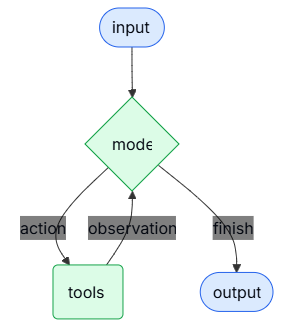

# Agents

Agents combine **language models** with **tools** to create systems that can reason about tasks, decide which tools to use, and iteratively work towards solutions.
> 智能体将语言模型与工具相结合，创建出能够对任务进行推理、决定使用哪些工具并迭代地朝着解决方案努力的系统。

`create_agent` provides a production-ready agent implementation.
> `create_agent`提供了一个可用于生产环境的智能体实现。

An LLM Agent runs tools in a **loop** to achieve a goal. An agent runs until a stop condition is met - i.e., when the model emits a final output or an iteration limit is reached.
> 大语言模型智能体通过循环运行工具来实现目标。智能体会一直运行，直到满足停止条件——即当模型输出最终结果或达到迭代次数限制时。

create_agent builds a graph-based agent runtime using LangGraph. A graph consists of nodes (steps) and edges (connections) that define how your agent processes information. The agent moves through this graph, executing nodes like the model node (which calls the model), the tools node (which executes tools), or middleware.
create_agent使用LangGraph构建基于图的智能体运行时。图由节点（步骤）和边（连接）组成，这些节点和边定义了智能体处理信息的方式。智能体在该图中移动，执行各种节点，如模型节点（用于调用模型）、工具节点（用于执行工具）或中间件。
Learn more about the Graph API. 了解更多关于图API的信息。
​
Core components 核心组件
​
Model 模型
The model is the reasoning engine of your agent. It can be specified in multiple ways, supporting both static and dynamic model selection.
模型是智能体的推理引擎。它可以通过多种方式指定，支持静态和动态模型选择。
​
Static model 静态模型
Static models are configured once when creating the agent and remain unchanged throughout execution. This is the most common and straightforward approach.
静态模型在创建智能体时配置一次，并且在整个执行过程中保持不变。这是最常见且最简单直接的方法。
To initialize a static model from a
从一个模型标识符字符串初始化静态模型 模型标识符字符串支持自动推断（例如，"gpt-5" 将被推断为 "openai:gpt-5"）。参考 参考资料</b2 查看完整的模型标识符字符串映射列表。 要更好地控制模型配置，请直接使用提供程序包初始化模型实例。在这个示例中，我们使用 ChatOpenAI。查看 聊天模型 了解其他可用的聊天模型类。 模型实例使您能够完全控制配置。当您需要设置特定的 参数</b0（如 温度、最大令牌数、超时时间、基础URL 以及其他特定于提供程序的设置）时，请使用它们。参考 参考资料</b5 查看模型上的可用参数和方法。 动态模型 动态模型在运行时根据当前状态进行选择
model identifier string 模型标识符字符串:
from langchain.agents import create_agent

agent = create_agent("openai:gpt-5", tools=tools)
Model identifier strings support automatic inference (e.g., "gpt-5" will be inferred as "openai:gpt-5"). Refer to the reference to see a full list of model identifier string mappings.
模型标识符字符串支持自动推断（例如，"gpt-5" 将被推断为 "openai:gpt-5"）。请参考 参考资料 查看完整的模型标识符字符串映射列表。
For more control over the model configuration, initialize a model instance directly using the provider package. In this example, we use ChatOpenAI. See Chat models for other available chat model classes.
若要更好地控制模型配置，可以直接使用提供程序包初始化模型实例。在本示例中，我们使用ChatOpenAI。有关其他可用的聊天模型类，请参见聊天模型。
from langchain.agents import create_agent
from langchain_openai import ChatOpenAI

model = ChatOpenAI(
    model="gpt-5",
    temperature=0.1,
    max_tokens=1000,
    timeout=30
    # ... (other params)
)
agent = create_agent(model, tools=tools)
Model instances give you complete control over configuration. Use them when you need to set specific parameters like temperature, max_tokens, timeouts, base_url, and other provider-specific settings. Refer to the reference to see available params and methods on your model.
模型实例让你能够完全控制配置。当你需要设置特定的参数</b0（如temperature、max_tokens、timeouts、base_url）以及其他特定于提供商的设置时，可以使用它们。请参考参考文档，了解模型上可用的参数和方法。
​
Dynamic model 动态模型
Dynamic models are selected at 动态模型是在runtime 运行时 based on the current 基于当前state 状态 and context. This enables sophisticated routing logic and cost optimization.
以及上下文。这实现了复杂的路由逻辑和成本优化。
To use a dynamic model, create middleware using the @wrap_model_call decorator that modifies the model in the request:
要使用动态模型，请使用@wrap_model_call装饰器创建中间件，以修改请求中的模型：
from langchain_openai import ChatOpenAI
from langchain.agents import create_agent
from langchain.agents.middleware import wrap_model_call, ModelRequest, ModelResponse

basic_model = ChatOpenAI(model="gpt-4.1-mini")
advanced_model = ChatOpenAI(model="gpt-4.1")

@wrap_model_call
def dynamic_model_selection(request: ModelRequest, handler) -> ModelResponse:
    """Choose model based on conversation complexity."""
    message_count = len(request.state["messages"])

    if message_count > 10:
        # Use an advanced model for longer conversations
        model = advanced_model
    else:
        model = basic_model

    return handler(request.override(model=model))

agent = create_agent(
    model=basic_model,  # Default model
    tools=tools,
    middleware=[dynamic_model_selection]
)
Pre-bound models (models with bind_tools already called) are not supported when using structured output. If you need dynamic model selection with structured output, ensure the models passed to the middleware are not pre-bound.
使用结构化输出时，不支持预绑定模型（已调用bind_tools的模型）。如果需要结合结构化输出进行动态模型选择，请确保传递给中间件的模型未经过预绑定。
For model configuration details, see Models. For dynamic model selection patterns, see Dynamic model in middleware.
有关模型配置的详细信息，请参见模型。有关动态模型选择模式，请参见中间件中的动态模型。
​
Tools 工具
Tools give agents the ability to take actions. Agents go beyond simple model-only tool binding by facilitating:
工具赋予智能体采取行动的能力。智能体超越了单纯的模型工具绑定，其优势在于：
Multiple tool calls in sequence (triggered by a single prompt)
由单个提示触发的多轮工具调用序列
Parallel tool calls when appropriate
在适当的时候进行并行工具调用
Dynamic tool selection based on previous results
基于先前结果的动态工具选择
Tool retry logic and error handling
工具重试逻辑和错误处理
State persistence across tool calls 工具调用间的状态持久性
For more information, see Tools. 有关更多信息，请参阅工具。
​
Static tools 静态工具
Static tools are defined when creating the agent and remain unchanged throughout execution. This is the most common and straightforward approach.
静态工具在创建智能体时就已定义，并且在整个执行过程中保持不变。这是最常见且最简单直接的方法。
To define an agent with static tools, pass a list of the tools to the agent.
要定义一个具有静态工具的智能体，请将工具列表传递给该智能体。
Tools can be specified as plain Python functions or
工具可以指定为普通的Python函数或协程 工具装饰器可用于自定义工具名称、描述、参数模式和其他属性。 如果提供的工具列表为空，智能体将由单个LLM节点组成，不具备工具调用能力。 动态工具 借助动态工具，智能体可用的工具集在运行时会被修改，而非预先全部定义。并非每种工具都适用于所有情况。工具过多可能会让模型不堪重负（上下文过载）并增加错误；工具过少则会限制功能。动态工具选择能够根据认证状态、用户权限、功能标志或对话阶段调整可用的工具集。 根据工具是否提前已知，有两种方法： 筛选预先注册的工具 运行时工具注册
coroutines 协程.
The tool decorator can be used to customize tool names, descriptions, argument schemas, and other properties.
工具装饰器可用于自定义工具名称、描述、参数模式和其他属性。
from langchain.tools import tool
from langchain.agents import create_agent

@tool
def search(query: str) -> str:
    """Search for information."""
    return f"Results for: {query}"

@tool
def get_weather(location: str) -> str:
    """Get weather information for a location."""
    return f"Weather in {location}: Sunny, 72°F"

agent = create_agent(model, tools=[search, get_weather])
If an empty tool list is provided, the agent will consist of a single LLM node without tool-calling capabilities.
如果提供的工具列表为空，智能体将由一个不具备工具调用能力的单一LLM节点组成。
​
Dynamic tools 动态工具
With dynamic tools, the set of tools available to the agent is modified at runtime rather than defined all upfront. Not every tool is appropriate for every situation. Too many tools may overwhelm the model (overload context) and increase errors; too few limit capabilities. Dynamic tool selection enables adapting the available toolset based on authentication state, user permissions, feature flags, or conversation stage.
借助动态工具，智能体可用的工具集是在运行时修改的，而非预先全部定义好。并非每种工具都适用于所有情况。工具过多可能会让模型不堪重负（上下文过载）并增加错误；工具过少则会限制功能。动态工具选择能够根据认证状态、用户权限、功能标志或对话阶段来调整可用的工具集。
There are two approaches depending on whether tools are known ahead of time:
根据工具是否提前已知，有两种方法：
Filtering pre-registered tools
筛选预先注册的工具
Runtime tool registration
运行时工具注册
When all possible tools are known at agent creation time, you can pre-register them and dynamically filter which ones are exposed to the model based on state, permissions, or context.
当所有可能的工具在智能体创建时都已知晓，你可以预先注册这些工具，并根据状态、权限或上下文动态筛选哪些工具对模型开放。
State
状态
Store
存储
Runtime Context
运行时上下文
Enable advanced tools only after certain conversation milestones:
仅在达到特定对话里程碑后启用高级工具：
from langchain.agents import create_agent
from langchain.agents.middleware import wrap_model_call, ModelRequest, ModelResponse
from typing import Callable

@wrap_model_call
def state_based_tools(
    request: ModelRequest,
    handler: Callable[[ModelRequest], ModelResponse]
) -> ModelResponse:
    """Filter tools based on conversation State."""
    # Read from State: check if user has authenticated
    state = request.state
    is_authenticated = state.get("authenticated", False)
    message_count = len(state["messages"])

    # Only enable sensitive tools after authentication
    if not is_authenticated:
        tools = [t for t in request.tools if t.name.startswith("public_")]
        request = request.override(tools=tools)
    elif message_count < 5:
        # Limit tools early in conversation
        tools = [t for t in request.tools if t.name != "advanced_search"]
        request = request.override(tools=tools)

    return handler(request)

agent = create_agent(
    model="gpt-4.1",
    tools=[public_search, private_search, advanced_search],
    middleware=[state_based_tools]
)
This approach is best when: 以下情况下，此方法效果最佳：
All possible tools are known at compile/startup time
所有可能的工具在编译/启动时都是已知的
You want to filter based on permissions, feature flags, or conversation state
你希望根据权限、功能标志或对话状态进行筛选
Tools are static but their availability is dynamic
工具是静态的，但其可用性是动态的
See Dynamically selecting tools for more examples.
有关更多示例，请参见动态选择工具。
To learn more about tools, see Tools.
要了解有关工具的更多信息，请参见工具。
​
Tool error handling 工具错误处理
To customize how tool errors are handled, use the @wrap_tool_call decorator to create middleware:
要自定义工具错误的处理方式，请使用@wrap_tool_call装饰器来创建中间件：
from langchain.agents import create_agent
from langchain.agents.middleware import wrap_tool_call
from langchain.messages import ToolMessage

@wrap_tool_call
def handle_tool_errors(request, handler):
    """Handle tool execution errors with custom messages."""
    try:
        return handler(request)
    except Exception as e:
        # Return a custom error message to the model
        return ToolMessage(
            content=f"Tool error: Please check your input and try again. ({str(e)})",
            tool_call_id=request.tool_call["id"]
        )

agent = create_agent(
    model="gpt-4.1",
    tools=[search, get_weather],
    middleware=[handle_tool_errors]
)
The agent will return a ToolMessage with the custom error message when a tool fails:
当工具失败时，智能体将返回一条包含自定义错误消息的ToolMessage：
[
    ...
    ToolMessage(
        content="Tool error: Please check your input and try again. (division by zero)",
        tool_call_id="..."
    ),
    ...
]
​
Tool use in the ReAct loop ReAct循环中的工具使用
Agents follow the ReAct (“Reasoning + Acting”) pattern, alternating between brief reasoning steps with targeted tool calls and feeding the resulting observations into subsequent decisions until they can deliver a final answer.
智能体遵循ReAct（“推理+行动”）模式，在简短的推理步骤与有针对性的工具调用之间交替进行，并将产生的观察结果纳入后续决策，直至能够给出最终答案。
Example of ReAct loop ReAct循环示例

​
System prompt 系统提示
You can shape how your agent approaches tasks by providing a prompt. The system_prompt parameter can be provided as a string:
你可以通过提供提示词来塑造你的智能体处理任务的方式。system_prompt参数可以作为字符串提供：
agent = create_agent(
    model,
    tools,
    system_prompt="You are a helpful assistant. Be concise and accurate."
)
When no system_prompt is provided, the agent will infer its task from the messages directly.
当未提供system_prompt时，智能体将直接从消息中推断其任务。
The system_prompt parameter accepts either a str or a SystemMessage. Using a SystemMessage gives you more control over the prompt structure, which is useful for provider-specific features like Anthropic’s prompt caching:
system_prompt参数接受str或SystemMessage</b3作为输入。使用SystemMessage可以让你更好地控制提示词结构，这对于特定提供商的功能（如Anthropic的提示词缓存）很有用：
from langchain.agents import create_agent
from langchain.messages import SystemMessage, HumanMessage

literary_agent = create_agent(
    model="anthropic:claude-sonnet-4-5",
    system_prompt=SystemMessage(
        content=[
            {
                "type": "text",
                "text": "You are an AI assistant tasked with analyzing literary works.",
            },
            {
                "type": "text",
                "text": "<the entire contents of 'Pride and Prejudice'>",
                "cache_control": {"type": "ephemeral"}
            }
        ]
    )
)

result = literary_agent.invoke(
    {"messages": [HumanMessage("Analyze the major themes in 'Pride and Prejudice'.")]}
)
The cache_control field with {"type": "ephemeral"} tells Anthropic to cache that content block, reducing latency and costs for repeated requests that use the same system prompt.
带有{"type": "ephemeral"}的cache_control字段会告知Anthropic缓存该内容块，从而减少使用相同系统提示的重复请求的延迟并降低成本。
​
Dynamic system prompt 动态系统提示
For more advanced use cases where you need to modify the system prompt based on runtime context or agent state, you can use middleware.
对于需要根据运行时上下文或智能体状态修改系统提示的更高级用例，您可以使用中间件。
The @dynamic_prompt decorator creates middleware that generates system prompts based on the model request:
@dynamic_prompt装饰器会创建中间件，该中间件根据模型请求生成系统提示。
from typing import TypedDict

from langchain.agents import create_agent
from langchain.agents.middleware import dynamic_prompt, ModelRequest

class Context(TypedDict):
    user_role: str

@dynamic_prompt
def user_role_prompt(request: ModelRequest) -> str:
    """Generate system prompt based on user role."""
    user_role = request.runtime.context.get("user_role", "user")
    base_prompt = "You are a helpful assistant."

    if user_role == "expert":
        return f"{base_prompt} Provide detailed technical responses."
    elif user_role == "beginner":
        return f"{base_prompt} Explain concepts simply and avoid jargon."

    return base_prompt

agent = create_agent(
    model="gpt-4.1",
    tools=[web_search],
    middleware=[user_role_prompt],
    context_schema=Context
)

# The system prompt will be set dynamically based on context
result = agent.invoke(
    {"messages": [{"role": "user", "content": "Explain machine learning"}]},
    context={"user_role": "expert"}
)
For more details on message types and formatting, see Messages. For comprehensive middleware documentation, see Middleware.
有关消息类型和格式的更多详细信息，请参阅消息。有关全面的中间件文档，请参阅中间件。
​
Name 名称
Set an optional name for the agent. This is used as the node identifier when adding the agent as a subgraph in multi-agent systems:
为智能体设置一个可选的name。在多智能体系统中将该智能体作为子图添加时，此名称会用作节点标识符：
agent = create_agent(
    model,
    tools,
    name="research_assistant"
)
Prefer snake_case for agent names (e.g., research_assistant instead of Research Assistant). Some model providers reject names containing spaces or special characters with errors. Using alphanumeric characters, underscores, and hyphens only ensures compatibility across all providers. The same applies to tool names.
智能体名称最好使用snake_case（例如，使用research_assistant而不是Research Assistant）。一些模型提供商不接受包含空格或特殊字符的名称，并会报错。仅使用字母数字字符、下划线和连字符可以确保在所有提供商处都能兼容。这一点同样适用于工具名称。
​
Invocation 调用
You can invoke an agent by passing an update to its State. All agents include a sequence of messages in their state; to invoke the agent, pass a new message:
你可以通过向智能体的State传递更新来调用它。所有智能体的状态中都包含一个消息序列；要调用智能体，请传递一条新消息：
result = agent.invoke(
    {"messages": [{"role": "user", "content": "What's the weather in San Francisco?"}]}
)
For streaming steps and / or tokens from the agent, refer to the streaming guide.
有关从智能体流式传输步骤和/或令牌的内容，请参考流式传输指南。
Otherwise, the agent follows the LangGraph Graph API and supports all associated methods, such as stream and invoke.
否则，该智能体遵循LangGraph 图API，并支持所有相关方法，例如stream和invoke。
Use LangSmith to trace, debug, and evaluate your agents.
使用LangSmith来跟踪、调试和评估你的智能体。
​
Advanced concepts 高级概念
​
Structured output 结构化输出
In some situations, you may want the agent to return an output in a specific format. LangChain provides strategies for structured output via the response_format parameter.
在某些情况下，你可能希望智能体以特定格式返回输出。LangChain 通过 response_format 参数提供了结构化输出的策略。
​
ToolStrategy 工具策略
ToolStrategy uses artificial tool calling to generate structured output. This works with any model that supports tool calling. ToolStrategy should be used when provider-native structured output (via ProviderStrategy) is not available or reliable.
ToolStrategy使用人工工具调用生成结构化输出。这适用于任何支持工具调用的模型。当原生提供商的结构化输出（通过ProviderStrategy）不可用或不可靠时，应使用ToolStrategy。
from pydantic import BaseModel
from langchain.agents import create_agent
from langchain.agents.structured_output import ToolStrategy

class ContactInfo(BaseModel):
    name: str
    email: str
    phone: str

agent = create_agent(
    model="gpt-4.1-mini",
    tools=[search_tool],
    response_format=ToolStrategy(ContactInfo)
)

result = agent.invoke({
    "messages": [{"role": "user", "content": "Extract contact info from: John Doe, john@example.com, (555) 123-4567"}]
})

result["structured_response"]
# ContactInfo(name='John Doe', email='john@example.com', phone='(555) 123-4567')
​
ProviderStrategy 提供商策略
ProviderStrategy uses the model provider’s native structured output generation. This is more reliable but only works with providers that support native structured output:
ProviderStrategy 使用模型提供商的原生结构化输出生成。这种方式更可靠，但仅适用于支持原生结构化输出的提供商：
from langchain.agents.structured_output import ProviderStrategy

agent = create_agent(
    model="gpt-4.1",
    response_format=ProviderStrategy(ContactInfo)
)
As of langchain 1.0, simply passing a schema (e.g., response_format=ContactInfo) will default to ProviderStrategy if the model supports native structured output. It will fall back to ToolStrategy otherwise.
在langchain 1.0中，只需传递一个模式（例如，response_format=ContactInfo），如果模型支持原生结构化输出，将默认使用ProviderStrategy；否则，将回退到ToolStrategy。
To learn about structured output, see Structured output.
要了解结构化输出，请参阅结构化输出。
​
Memory 记忆
Agents maintain conversation history automatically through the message state. You can also configure the agent to use a custom state schema to remember additional information during the conversation.
智能体通过消息状态自动保存对话历史。你也可以配置智能体使用自定义状态模式，以在对话过程中记住更多信息。
Information stored in the state can be thought of as the short-term memory of the agent:
存储在状态中的信息可以被视为智能体的短期记忆：
Custom state schemas must extend AgentState as a TypedDict.
自定义状态模式必须作为TypedDict扩展AgentState。
There are two ways to define custom state:
定义自定义状态有两种方式：
Via middleware (preferred) 通过中间件（首选）
Via state_schema on create_agent 通过 state_schema 在 create_agent 上
​
Defining state via middleware 通过中间件定义状态
Use middleware to define custom state when your custom state needs to be accessed by specific middleware hooks and tools attached to said middleware.
当你的自定义状态需要被特定的中间件钩子和附加到该中间件的工具访问时，请使用中间件来定义自定义状态。
from langchain.agents import AgentState
from langchain.agents.middleware import AgentMiddleware
from typing import Any

class CustomState(AgentState):
    user_preferences: dict

class CustomMiddleware(AgentMiddleware):
    state_schema = CustomState
    tools = [tool1, tool2]

    def before_model(self, state: CustomState, runtime) -> dict[str, Any] | None:
        ...

agent = create_agent(
    model,
    tools=tools,
    middleware=[CustomMiddleware()]
)

# The agent can now track additional state beyond messages
result = agent.invoke({
    "messages": [{"role": "user", "content": "I prefer technical explanations"}],
    "user_preferences": {"style": "technical", "verbosity": "detailed"},
})
​
Defining state via state_schema 通过state_schema定义状态
Use the state_schema parameter as a shortcut to define custom state that is only used in tools.
使用state_schema参数作为快捷方式来定义仅在工具中使用的自定义状态。
from langchain.agents import AgentState

class CustomState(AgentState):
    user_preferences: dict

agent = create_agent(
    model,
    tools=[tool1, tool2],
    state_schema=CustomState
)
# The agent can now track additional state beyond messages
result = agent.invoke({
    "messages": [{"role": "user", "content": "I prefer technical explanations"}],
    "user_preferences": {"style": "technical", "verbosity": "detailed"},
})
As of langchain 1.0, custom state schemas must be TypedDict types. Pydantic models and dataclasses are no longer supported. See the v1 migration guide for more details.
自langchain 1.0起，自定义状态模式必须为TypedDict类型。Pydantic模型和数据类不再受支持。有关更多详细信息，请参阅v1迁移指南。
Defining custom state via middleware is preferred over defining it via state_schema on create_agent because it allows you to keep state extensions conceptually scoped to the relevant middleware and tools.
通过中间件定义自定义状态比在state_schema上通过create_agent定义更可取，因为它允许你将状态扩展从概念上限定在相关的中间件和工具范围内。
state_schema is still supported for backwards compatibility on create_agent.
为了向后兼容，state_schema在create_agent上仍然受支持。
To learn more about memory, see Memory. For information on implementing long-term memory that persists across sessions, see Long-term memory.
要了解更多关于记忆的信息，请参阅记忆。有关实现跨会话持久化的长期记忆的信息，请参阅长期记忆。
​
Streaming 流式传输
We’ve seen how the agent can be called with invoke to get a final response. If the agent executes multiple steps, this may take a while. To show intermediate progress, we can stream back messages as they occur.
我们已经了解到如何使用invoke调用智能体以获取最终响应。如果智能体执行多个步骤，这可能需要一段时间。为了展示中间进度，我们可以在消息出现时将其流式返回。
from langchain.messages import AIMessage, HumanMessage

for chunk in agent.stream({
    "messages": [{"role": "user", "content": "Search for AI news and summarize the findings"}]
}, stream_mode="values"):
    # Each chunk contains the full state at that point
    latest_message = chunk["messages"][-1]
    if latest_message.content:
        if isinstance(latest_message, HumanMessage):
            print(f"User: {latest_message.content}")
        elif isinstance(latest_message, AIMessage):
            print(f"Agent: {latest_message.content}")
    elif latest_message.tool_calls:
        print(f"Calling tools: {[tc['name'] for tc in latest_message.tool_calls]}")
For more details on streaming, see Streaming.
有关流式传输的更多详细信息，请参见流式传输。
​
Middleware 中间件
Middleware provides powerful extensibility for customizing agent behavior at different stages of execution. You can use middleware to:
中间件为在执行的不同阶段自定义智能体行为提供了强大的扩展性。您可以使用中间件来：
Process state before the model is called (e.g., message trimming, context injection)
在调用模型之前处理状态（例如，消息截断、上下文注入）
Modify or validate the model’s response (e.g., guardrails, content filtering)
修改或验证模型的响应（例如，安全护栏、内容过滤）
Handle tool execution errors with custom logic
用自定义逻辑处理工具执行错误
Implement dynamic model selection based on state or context
基于状态或上下文实现动态模型选择
Add custom logging, monitoring, or analytics
添加自定义日志记录、监控或分析
Middleware integrates seamlessly into the agent’s execution, allowing you to intercept and modify data flow at key points without changing the core agent logic.
中间件可无缝集成到智能体的执行过程中，让您能够在关键节点拦截和修改数据流，而无需更改智能体的核心逻辑。
For comprehensive middleware documentation including decorators like @before_model, @after_model, and @wrap_tool_call, see Middleware.
有关包含@before_model、@after_model和@wrap_tool_call等装饰器在内的完整中间件文档，请参阅中间件。
