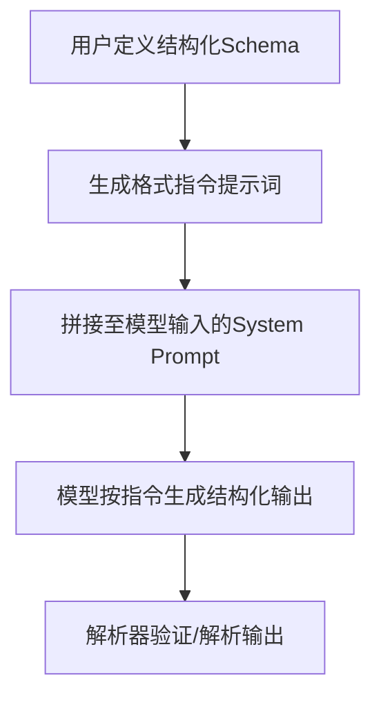
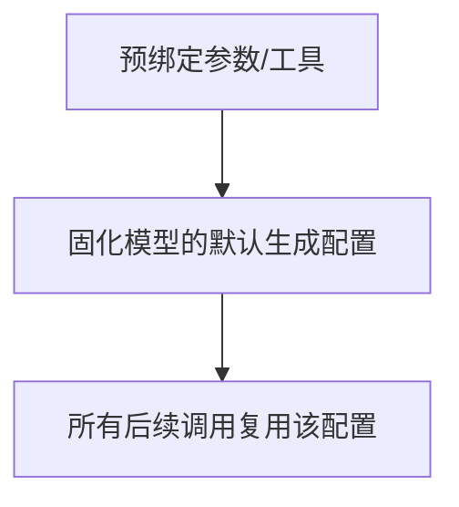

# Agents

Agents combine **language models** with **tools** to create systems that can reason about tasks, decide which tools to use, and iteratively work towards solutions.
> 智能体将语言模型与工具相结合，创建出能够对任务进行推理、决定使用哪些工具并迭代地朝着解决方案努力的系统。

[`create_agent`](https://github.com/meng-yijie1996/myNotes/blob/master/LLM/AgentGuide/LangChainReference/01_create_agent.md) provides a production-ready agent implementation.
> `create_agent`提供了一个可用于生产环境的智能体实现。

An LLM Agent runs tools in a **loop** to achieve a goal. An agent runs until a stop condition is met - i.e., when the model emits a final output or an iteration limit is reached.
> 大语言模型智能体通过循环运行工具来实现目标。智能体会一直运行，直到满足停止条件——即当模型输出最终结果或达到迭代次数限制时。


`create_agent` builds a graph-based agent runtime using [LangGraph](https://github.com/meng-yijie1996/myNotes/blob/master/LLM/AgentGuide/LangGraph/LangGraph_0_overview.md). A graph consists of **nodes** (steps) and **edges** (connections) that define how your agent processes information. The agent **moves through this graph**, **executing nodes** like the model node (which calls the model), the tools node (which executes tools), or middleware.
> create_agent使用LangGraph构建基于图的智能体运行时。图由节点（步骤）和边（连接）组成，这些节点和边定义了智能体处理信息的方式。智能体在该图中移动，执行各种节点，如模型节点（用于调用模型）、工具节点（用于执行工具）或中间件。
Learn more about the [Graph API](https://github.com/meng-yijie1996/myNotes/blob/master/LLM/AgentGuide/LangGraph/LangGraph_05_02_Graph_API.md).
​
## Core components
​### Model
The model is the reasoning engine of your agent. It can be specified in multiple ways, supporting both static and dynamic model selection.
> 模型是智能体的推理引擎。它可以通过多种方式指定，支持静态和动态模型选择。
​
#### Static model
Static models are configured once when creating the agent and remain unchanged throughout execution. This is the most common and straightforward approach.
> 静态模型在创建智能体时配置一次，并且在整个执行过程中保持不变。这是最常见且最简单直接的方法。

##### model identifier string
To initialize a static model from a model identifier string

Model identifier strings support **`automatic inference`** (e.g., "gpt-5" will be inferred as "openai:gpt-5"). Refer to the [reference](https://reference.langchain.com/python/langchain/chat_models/base/init_chat_model?_gl=1*12bp8va*_gcl_au*Mzc5MTc3ODg5LjE3NzEwNTk5ODM.*_ga*MTg3MTg2ODE2NS4xNzcxMDU5OTg0*_ga_47WX3HKKY2*czE3NzM1NDA0MzAkbzkkZzEkdDE3NzM1NDQzODYkajYwJGwwJGgw) to see a full list of model identifier string mappings.
> 模型标识符字符串支持自动推断（例如，"gpt-5" 将被推断为 "openai:gpt-5"）。请参考参考资料 查看完整的模型标识符字符串映射列表。

``` python
from langchain.agents import create_agent

agent = create_agent("openai:gpt-5", tools=tools)
```

##### using the provider package
For **more control** over the model configuration, initialize a model instance directly using the provider package. In this example, we use ChatOpenAI. See [Chat models](https://docs.langchain.com/oss/python/integrations/chat) for other available chat model classes.
> 若要更好地控制模型配置，可以直接使用提供程序包初始化模型实例。在本示例中，我们使用ChatOpenAI。有关其他可用的聊天模型类，请参见聊天模型。

``` python
from langchain.agents import create_agent
from langchain_openai import ChatOpenAI

model = ChatOpenAI(
    model="gpt-5",
    temperature=0.1,
    max_tokens=1000,
    timeout=30
    # ... (other params)
)
agent = create_agent(model, tools=tools)
```

Model instances give you complete control over configuration. Use them when you need to set specific parameters like `temperature`, `max_tokens`, `timeouts`, `base_url`, and other provider-specific settings. Refer to the [reference](https://docs.langchain.com/oss/python/integrations/providers/all_providers) to see available params and methods on your model.
> 模型实例让你能够完全控制配置。当你需要设置特定的参数（如temperature、max_tokens、timeouts、base_url）以及其他特定于提供商的设置时，可以使用它们。请参考参考文档，了解模型上可用的参数和方法。
​
#### Dynamic model
Dynamic models are selected at runtime based on the current state and context. This enables sophisticated routing logic and cost optimization.
> 动态模型会在运行时根据当前状态和上下文进行选择。这实现了复杂的路由逻辑和成本优化。

To use a dynamic model, create middleware using the `@wrap_model_call` decorator that modifies the model in the request:
> 要使用动态模型，请使用@wrap_model_call装饰器创建中间件，以修改请求中的模型：

``` python
from langchain_openai import ChatOpenAI
from langchain.agents import create_agent
from langchain.agents.middleware import wrap_model_call, ModelRequest, ModelResponse


basic_model = ChatOpenAI(model="gpt-4.1-mini")
advanced_model = ChatOpenAI(model="gpt-4.1")

# Note1: 装饰器与模型修改函数，函数返回模型实例
@wrap_model_call
def dynamic_model_selection(request: ModelRequest, handler) -> ModelResponse:
    """Choose model based on conversation complexity."""
    message_count = len(request.state["messages"])

    if message_count > 10:
        # Use an advanced model for longer conversations
        model = advanced_model
    else:
        model = basic_model

    return handler(request.override(model=model))

agent = create_agent(
    # Note2: 要指定一个初始阶段使用的默认模型
    model=basic_model,  # Default model
    tools=tools,
    # 中间件必须要指定模型修改函数
    middleware=[dynamic_model_selection]
)
```

Pre-bound models (models with [bind_tools](https://github.com/meng-yijie1996/myNotes/blob/master/LLM/AgentGuide/LangChainReference/02_bind_tools.md) already called) are not supported when using structured output. If you need dynamic model selection with structured output, ensure the models passed to the middleware are not pre-bound.
> 使用结构化输出时，不支持预绑定模型（已调用bind_tools的模型）。如果需要结合结构化输出进行动态模型选择，请确保传递给中间件的模型未经过预绑定。

---

### Why?
在 LangChain 中，「结构化输出（Structured Output）」与「模型预绑定（如 `bind_tools()`/`bind()`）」无法兼容的核心原因是：**结构化输出需要动态调整模型的生成格式/参数，而预绑定会固化模型配置，导致格式指令失效或冲突**。下面从技术原理、核心冲突点、解决方案三个维度，帮你彻底理解这个问题：

### 一、先理清核心概念（避免混淆）
| 概念                | 核心作用                                                                 |
|---------------------|--------------------------------------------------------------------------|
| 模型预绑定（bind）  | 通过 `bind()`/`bind_tools()` 将工具、参数（temperature、top_p）等「固化」到模型实例中，后续调用无需重复传参 |
| 结构化输出          | 要求模型严格按照指定 schema（如 Pydantic 类、JSON Schema）生成输出，需向模型注入「格式指令」并控制生成行为 |

### 二、核心冲突：预绑定为什么会破坏结构化输出？
#### 1. 冲突根源：预绑定固化了「生成参数/提示词」
结构化输出的核心是**动态注入格式约束**（如「必须输出 JSON，字段为 xxx」），而预绑定会：
- 固化模型的 `stop` 词、`temperature` 等关键参数（结构化输出需要 `temperature=0` 保证格式稳定，预绑定若设为其他值会导致格式错乱）；
- 覆盖结构化输出的「格式指令提示词」（预绑定的 system prompt 会优先级更高，导致结构化 schema 指令被忽略）；
- 冲突的工具调用配置（若预绑定了 `bind_tools()`，模型会优先响应工具调用格式，而非结构化输出格式）。

#### 2. 技术层面的具体原因
LangChain 实现结构化输出的核心逻辑是：

而预绑定（`bind()`）的逻辑是：

两者冲突的关键场景：
- **场景1：预绑定的 stop 词打断结构化输出**  
  结构化输出需要模型生成完整的 JSON 结构，但预绑定的 `stop=["\n"]` 等 stop 词会提前终止生成，导致 JSON 不完整；
- **场景2：预绑定的工具调用格式覆盖结构化指令**  
  若用 `bind_tools()` 预绑定了工具，模型会优先生成「工具调用格式」（如 `{"name": "xxx", "args": {}}`），而非你定义的结构化 schema（如 `{"punny_response": "", "weather": ""}`）；
- **场景3：预绑定的 prompt 覆盖格式指令**  
  结构化输出需要在 system prompt 中注入「格式约束指令」，但预绑定的 system prompt 会覆盖该指令，模型无法识别结构化要求。

#### 3. 官方设计层面的考量
LangChain 的结构化输出模块（如 `PydanticOutputParser`、`JsonOutputParser`）被设计为「动态适配」—— 每次调用可灵活修改 schema、格式指令，而预绑定的核心是「静态复用」，两者设计目标完全相反，因此官方未做兼容支持。

### 三、直观示例：预绑定导致结构化输出失败
#### ❶ 失败案例（预绑定 + 结构化输出）
```python
import os
from langchain_community.chat_models import ChatDashScope
from langchain_core.output_parsers import PydanticOutputParser
from pydantic import BaseModel

# 定义结构化Schema
class WeatherResponse(BaseModel):
    city: str
    weather: str

parser = PydanticOutputParser(pydantic_object=WeatherResponse)

# 预绑定模型（固化参数）
llm = ChatDashScope(model="qwen3.5-plus", api_key=os.getenv("DASHSCOPE_API_KEY"))
llm_bound = llm.bind(temperature=0.7, stop=["\n"])  # 预绑定非结构化参数

# 调用时注入结构化指令（会失效）
prompt = f"告诉我sf的天气\n{parser.get_format_instructions()}"
response = llm_bound.invoke(prompt)

# 解析失败：预绑定的stop词导致JSON不完整
try:
    parser.parse(response.content)
except Exception as e:
    print("解析失败：", e)  # 输出：JSONDecodeError（因\n提前终止生成）
```

#### ❷ 成功案例（放弃预绑定 + 动态传参）
```python
# 不预绑定，每次调用动态传参
response = llm.invoke(
    prompt,
    temperature=0,  # 结构化输出需低随机性
    stop=None       # 取消stop词，保证JSON完整
)
parser.parse(response.content)  # 解析成功
```

### 四、解决方案：结构化输出的正确姿势（替代预绑定）
既然预绑定不兼容结构化输出，推荐以下两种「既保留便捷性，又保证结构化生效」的方案：

#### 方案1：封装为函数（动态传参，替代预绑定）
将「模型初始化 + 结构化参数」封装为函数，每次调用动态传入结构化指令，兼顾便捷性和灵活性：
```python
def get_structured_llm(schema, temperature=0):
    """封装结构化模型调用函数（替代预绑定）"""
    llm = ChatDashScope(model="qwen3.5-plus", api_key=os.getenv("DASHSCOPE_API_KEY"))
    parser = PydanticOutputParser(pydantic_object=schema)
    # 动态生成格式指令
    def invoke_with_schema(prompt_text):
        full_prompt = f"{prompt_text}\n{parser.get_format_instructions()}"
        response = llm.invoke(full_prompt, temperature=temperature)
        return parser.parse(response.content)
    return invoke_with_schema

# 使用
weather_parser = get_structured_llm(WeatherResponse)
result = weather_parser("告诉我sf的天气，按JSON返回city和weather字段")
print(result.city)  # 输出：sf
```

#### 方案2：使用 Runnable 链（LangChain 推荐）
通过 `Runnable` 链将「提示词 + 模型 + 解析器」串联，既避免预绑定，又实现流程固化：
```python
from langchain_core.prompts import ChatPromptTemplate
from langchain_core.runnables import RunnablePassthrough

# 1. 定义提示词模板（包含结构化指令）
prompt = ChatPromptTemplate.from_messages([
    ("system", "严格按照以下格式输出：{format_instructions}"),
    ("user", "{input}")
])

# 2. 构建结构化链
structured_chain = (
    RunnablePassthrough.assign(format_instructions=parser.get_format_instructions)
    | prompt
    | llm  # 未预绑定的原始模型
    | parser
)

# 3. 调用（无需重复配置）
result = structured_chain.invoke({"input": "告诉我sf的天气"})
```

### 五、总结
1. **核心原因**：预绑定固化模型参数/提示词，破坏结构化输出所需的「动态格式指令注入」和「生成参数调整」；
2. **关键冲突点**：预绑定的 stop 词、工具调用格式、prompt 会覆盖/打断结构化输出的约束；
3. **解决方案**：
   - 放弃预绑定，改用「函数封装」或「Runnable 链」实现结构化输出；
   - 结构化输出需保证 `temperature=0`、无冲突 stop 词、格式指令优先级最高；
4. **官方建议**：LangChain 文档明确推荐「结构化输出使用 Runnable 链」，而非预绑定模型。

简单来说：**预绑定追求「复用性」，结构化输出追求「动态适配性」，两者设计目标冲突，因此无法兼容**。采用函数/链的方式，既能实现「一次定义、多次调用」，又能保证结构化输出的有效性。

---

For model configuration details, see Models. For dynamic model selection patterns, see Dynamic model in middleware.
​
### Tools
Tools give agents the ability to take actions. Agents go beyond simple model-only tool binding by facilitating:
> 工具赋予智能体采取行动的能力。智能体超越了单纯的模型工具绑定，其优势在于：

- Multiple tool calls in sequence (triggered by a single prompt)
> 由单个提示触发的多轮工具调用序列
- Parallel tool calls when appropriate
> 在适当的时候进行并行工具调用
- Dynamic tool selection based on previous results
> 基于先前结果的动态工具选择
- Tool retry logic and error handling
> 工具重试逻辑和错误处理
- State persistence across tool calls
> 工具调用间的状态持久性

For more information, see Tools.
​
#### Static tools
Static tools are defined when creating the agent and remain unchanged throughout execution. This is the most common and straightforward approach.
> 静态工具在创建智能体时就已定义，并且在整个执行过程中保持不变。这是最常见且最简单直接的方法。

To define an agent with static tools, pass a list of the tools to the agent.
> 要定义一个具有静态工具的智能体，请将工具列表传递给该智能体。

Tools can be specified as **plain Python functions or coroutines**.
> 工具可以指定为普通的Python函数或协程

The `tool decorator` can be used to customize tool names, descriptions, argument schemas, and other properties.
工具装饰器可用于自定义工具名称、描述、参数模式和其他属性。

``` python
from langchain.tools import tool
from langchain.agents import create_agent


@tool
def search(query: str) -> str:
    """Search for information."""
    return f"Results for: {query}"

@tool
def get_weather(location: str) -> str:
    """Get weather information for a location."""
    return f"Weather in {location}: Sunny, 72°F"

agent = create_agent(model, tools=[search, get_weather])
```

If an empty tool list is provided, the agent will consist of a single LLM node without tool-calling capabilities.
> 如果提供的工具列表为空，智能体将由一个不具备工具调用能力的单一LLM节点组成。
​
#### Dynamic tools
With dynamic tools, the set of tools available to the agent is modified at runtime rather than defined all upfront. Not every tool is appropriate for every situation. **Too many** tools may overwhelm the model (overload context) and increase errors; **too few** limit capabilities. Dynamic tool selection enables adapting the available toolset based on authentication state, user permissions, feature flags, or conversation stage.
> 借助动态工具，智能体可用的工具集是在运行时可修改的，而非预先全部定义好。并非每种工具都适用于所有情况。工具过多可能会让模型不堪重负（上下文过载）并增加错误；工具过少则会限制功能。动态工具选择能够根据认证状态、用户权限、功能标志或对话阶段来调整可用的工具集。

There are two approaches depending on **whether tools are known ahead of time**:
> 根据工具是否提前已知，有两种方法：

##### Filtering pre-registered tools 筛选预先注册的工具
When all possible tools are known at agent creation time, you can pre-register them and dynamically filter which ones are exposed to the model based on `state`, `permissions`, or `context`.
> 当所有可能的工具在智能体创建时都已知晓，你可以预先注册这些工具，并根据状态、权限或上下文动态筛选哪些工具对模型开放。

###### State
Enable advanced tools only after certain conversation milestones:
> 仅在达到特定对话里程碑后启用高级工具：

``` python
from langchain.agents import create_agent
from langchain.agents.middleware import wrap_model_call, ModelRequest, ModelResponse
from typing import Callable

@wrap_model_call
def state_based_tools(
    request: ModelRequest,
    handler: Callable[[ModelRequest], ModelResponse]
) -> ModelResponse:
    """Filter tools based on conversation State."""
    # Read from State: check if user has authenticated
    state = request.state
    # NOTE1: 从state中获取是否得到授权
    is_authenticated = state.get("authenticated", False)
    message_count = len(state["messages"])

    # NOTE2: 根据是否得到授权，决定模型使用哪些工具
    # Only enable sensitive tools after authentication
    if not is_authenticated:
        tools = [t for t in request.tools if t.name.startswith("public_")]
        request = request.override(tools=tools)
    elif message_count < 5:
        # Limit tools early in conversation
        tools = [t for t in request.tools if t.name != "advanced_search"]
        request = request.override(tools=tools)

    return handler(request)

agent = create_agent(
    model="gpt-4.1",
    tools=[public_search, private_search, advanced_search],
    middleware=[state_based_tools]
)
```

###### Store
Filter tools based on user preferences or feature flags in Store:
> 在存储中根据用户偏好或feature标志筛选工具：

``` python
from dataclasses import dataclass
from langchain.agents import create_agent
from langchain.agents.middleware import wrap_model_call, ModelRequest, ModelResponse
from typing import Callable
from langgraph.store.memory import InMemoryStore

@dataclass
class Context:
    user_id: str

@wrap_model_call
def store_based_tools(
    request: ModelRequest,
    handler: Callable[[ModelRequest], ModelResponse]
) -> ModelResponse:
    """Filter tools based on Store preferences."""
    user_id = request.runtime.context.user_id

    # Read from Store: get user's enabled features
    store = request.runtime.store
    # NOTE1: 从store中获取features
    feature_flags = store.get(("features",), user_id)

    # NOTE2: 根据feature，过滤工具
    if feature_flags:
        enabled_features = feature_flags.value.get("enabled_tools", [])
        # Only include tools that are enabled for this user
        tools = [t for t in request.tools if t.name in enabled_features]
        request = request.override(tools=tools)

    return handler(request)

agent = create_agent(
    model="gpt-4.1",
    tools=[search_tool, analysis_tool, export_tool],
    middleware=[store_based_tools],
    context_schema=Context,
    store=InMemoryStore()
)
```

###### Runtime Context
Filter tools based on user permissions from Runtime Context:
> 根据运行时上下文中的用户权限过滤工具：

``` python
from dataclasses import dataclass
from langchain.agents import create_agent
from langchain.agents.middleware import wrap_model_call, ModelRequest, ModelResponse
from typing import Callable

@dataclass
class Context:
    user_role: str

@wrap_model_call
def context_based_tools(
    request: ModelRequest,
    handler: Callable[[ModelRequest], ModelResponse]
) -> ModelResponse:
    """Filter tools based on Runtime Context permissions."""
    # Note1: Read from Runtime Context: get user role
    if request.runtime is None or request.runtime.context is None:
        # If no context provided, default to viewer (most restrictive)
        user_role = "viewer"
    else:
        user_role = request.runtime.context.user_role

    # Note2: 根据角色，过滤要使用的工具
    if user_role == "admin":
        # Admins get all tools
        pass
    elif user_role == "editor":
        # Editors can't delete
        tools = [t for t in request.tools if t.name != "delete_data"]
        request = request.override(tools=tools)
    else:
        # Viewers get read-only tools
        tools = [t for t in request.tools if t.name.startswith("read_")]
        request = request.override(tools=tools)

    return handler(request)

agent = create_agent(
    model="gpt-4.1",
    tools=[read_data, write_data, delete_data],
    middleware=[context_based_tools],
    context_schema=Context
)
```

This approach is best when:
- All possible tools are known at compile/startup time
> 所有可能的工具在编译/启动时都是已知的
- You want to filter based on permissions, feature flags, or conversation state
> 你希望根据权限、功能标志或对话状态进行筛选
- Tools are static but their availability is dynamic
> 工具是静态的，但其可用性是动态的

##### Runtime tool registration 运行时工具注册
When tools are discovered or created at runtime (e.g., loaded from an MCP server, generated based on user data, or fetched from a remote registry), you need to both register the tools and handle their execution dynamically.
> 当工具在运行时被发现或创建（例如，从MCP服务器加载、基于用户数据生成或从远程注册表获取），你需要既注册这些工具，又动态处理它们的执行。

This requires two middleware hooks:
- 1.`wrap_model_call` - Add the dynamic tools to the request
> 向请求添加动态工具
- 2.`wrap_tool_call` - Handle execution of the dynamically added tools
> 处理动态添加工具的执行

``` python
from langchain.tools import tool
from langchain.agents import create_agent
from langchain.agents.middleware import AgentMiddleware, ModelRequest, ToolCallRequest

# A tool that will be added dynamically at runtime
@tool
def calculate_tip(bill_amount: float, tip_percentage: float = 20.0) -> str:
    """Calculate the tip amount for a bill."""
    tip = bill_amount * (tip_percentage / 100)
    return f"Tip: ${tip:.2f}, Total: ${bill_amount + tip:.2f}"

class DynamicToolMiddleware(AgentMiddleware):
    """Middleware that registers and handles dynamic tools."""

    def wrap_model_call(self, request: ModelRequest, handler):
        # Add dynamic tool to the request
        # This could be loaded from an MCP server, database, etc.
        updated = request.override(tools=[*request.tools, calculate_tip])
        return handler(updated)

    def wrap_tool_call(self, request: ToolCallRequest, handler):
        # Handle execution of the dynamic tool
        if request.tool_call["name"] == "calculate_tip":
            return handler(request.override(tool=calculate_tip))
        return handler(request)

agent = create_agent(
    model="gpt-4o",
    tools=[get_weather],  # Only static tools registered here
    middleware=[DynamicToolMiddleware()],
)

# The agent can now use both get_weather AND calculate_tip
result = agent.invoke({
    "messages": [{"role": "user", "content": "Calculate a 20% tip on $85"}]
})
```

This approach is best when: 以下情况最适合采用这种方法：
- Tools are discovered at runtime (e.g., from an MCP server)
> 工具在运行时被发现（例如，从MCP服务器）
- Tools are generated dynamically based on user data or configuration
> 工具会根据用户数据或配置动态生成
- You’re integrating with external tool registries
> 你正在与外部工具注册表集成

The `wrap_tool_call` hook is required for runtime-registered tools because the agent needs to know how to execute tools that weren’t in the original tool list. Without it, the agent won’t know how to invoke the dynamically added tool.
> wrap_tool_call钩子对于运行时注册的工具是必需的，因为智能体需要知道如何执行那些不在原始工具列表中的工具。如果没有它，智能体将不知道如何调用动态添加的工具。


​
#### Tool error handling
To customize how tool errors are handled, use the `@wrap_tool_call` decorator to create middleware:
> 要自定义工具错误的处理方式，请使用@wrap_tool_call装饰器来创建中间件：

``` python
from langchain.agents import create_agent
from langchain.agents.middleware import wrap_tool_call
from langchain.messages import ToolMessage


@wrap_tool_call
def handle_tool_errors(request, handler):
    """Handle tool execution errors with custom messages."""
    try:
        return handler(request)
    except Exception as e:
        # Return a custom error message to the model
        return ToolMessage(
            content=f"Tool error: Please check your input and try again. ({str(e)})",
            tool_call_id=request.tool_call["id"]
        )

agent = create_agent(
    model="gpt-4.1",
    tools=[search, get_weather],
    middleware=[handle_tool_errors]
)
```

The agent will return a ToolMessage with the custom error message when a tool fails:
> 当工具失败时，智能体将返回一条包含自定义错误消息的ToolMessage：

``` json
[
    ...
    ToolMessage(
        content="Tool error: Please check your input and try again. (division by zero)",
        tool_call_id="..."
    ),
    ...
]
```
​
#### Tool use in the ReAct loop
Agents follow the **ReAct** (“Reasoning + Acting”) pattern, alternating between brief reasoning steps with targeted tool calls and feeding the resulting observations into subsequent decisions until they can deliver a final answer.
> 智能体遵循ReAct（“推理+行动”）模式，在简短的推理步骤与有针对性的工具调用之间交替进行，并将产生的观察结果纳入后续决策，直至能够给出最终答案。

Example of ReAct loop
**Prompt**: Identify the current most popular wireless headphones and verify availability.
> 找出当前最受欢迎的无线耳机并确认其可用性。

``` bash
================================ Human Message =================================

Find the most popular wireless headphones right now and check if they're in stock
```

**Reasoning**: “Popularity is time-sensitive, I need to use the provided search tool.”
> 流行度具有时间敏感性，我需要使用提供的搜索工具。

**Acting**: Call search_products("wireless headphones")

``` bash
================================== Ai Message ==================================
Tool Calls:
  search_products (call_abc123)
 Call ID: call_abc123
  Args:
    query: wireless headphones
```

``` bash
================================= Tool Message =================================

Found 5 products matching "wireless headphones". Top 5 results: WH-1000XM5, ...
```

**Reasoning**: “I need to confirm availability for the top-ranked item before answering.”
> 我需要先确认排名最高的物品是否有货，然后再回答。

**Acting**: Call check_inventory("WH-1000XM5")

``` bash
================================== Ai Message ==================================
Tool Calls:
  check_inventory (call_def456)
 Call ID: call_def456
  Args:
    product_id: WH-1000XM5
```

``` bash
================================= Tool Message =================================

Product WH-1000XM5: 10 units in stock
```

**Reasoning**: “I have the most popular model and its stock status. I can now answer the user’s question.”

**Acting**: Produce final answer

``` bash
================================== Ai Message ==================================

I found wireless headphones (model WH-1000XM5) with 10 units in stock...
```
​
### System prompt
You can shape how your agent approaches tasks by providing a prompt. The `system_prompt` parameter can be provided as a string:
> 你可以通过提供提示词来塑造你的智能体处理任务的方式。

``` python
agent = create_agent(
    model,
    tools,
    system_prompt="You are a helpful assistant. Be concise and accurate."
)
```

When no `system_prompt` is provided, the agent will infer its task from the messages directly.
> 当未提供system_prompt时，智能体将直接从消息中推断其任务。

The `system_prompt` parameter accepts either a `str` or a `SystemMessage`. Using a SystemMessage gives you more control over the prompt structure, which is useful for provider-specific features like Anthropic’s prompt caching:
> system_prompt参数接受str或SystemMessage</b3作为输入。使用SystemMessage可以让你更好地控制提示词结构，这对于特定提供商的功能（如Anthropic的提示词缓存）很有用：

``` python
from langchain.agents import create_agent
from langchain.messages import SystemMessage, HumanMessage

literary_agent = create_agent(
    model="anthropic:claude-sonnet-4-5",
    system_prompt=SystemMessage(
        content=[
            {
                "type": "text",
                "text": "You are an AI assistant tasked with analyzing literary works.",
            },
            {
                "type": "text",
                "text": "<the entire contents of 'Pride and Prejudice'>", # 《傲慢与偏见》
                "cache_control": {"type": "ephemeral"}   # 
            }
        ]
    )
)

result = literary_agent.invoke(
    {"messages": [HumanMessage("Analyze the major themes in 'Pride and Prejudice'.")]}
)
```

The `cache_control` field with `{"type": "ephemeral"}` tells Anthropic to cache that content block, reducing latency and costs for repeated requests that use the same system prompt.
> 带有{"type": "ephemeral"}的cache_control字段会告知Anthropic缓存该内容块，从而减少使用相同系统提示的重复请求的延迟并降低成本。
​
#### Dynamic system prompt
For more advanced use cases where you need to modify the system prompt based on runtime context or agent state, you can use middleware.
> 对于需要根据运行时上下文或智能体状态修改系统提示的更高级用例，您可以使用中间件。

The `@dynamic_prompt` decorator creates middleware that generates system prompts based on the model request:
> @dynamic_prompt装饰器会创建中间件，该中间件根据模型请求生成系统提示。

``` python
from typing import TypedDict

from langchain.agents import create_agent
from langchain.agents.middleware import dynamic_prompt, ModelRequest


class Context(TypedDict):
    user_role: str

@dynamic_prompt
def user_role_prompt(request: ModelRequest) -> str:
    """Generate system prompt based on user role."""
    user_role = request.runtime.context.get("user_role", "user")
    base_prompt = "You are a helpful assistant."

    # 根据role，设置prompt
    if user_role == "expert":
        return f"{base_prompt} Provide detailed technical responses."
    elif user_role == "beginner":
        return f"{base_prompt} Explain concepts simply and avoid jargon."

    return base_prompt

agent = create_agent(
    model="gpt-4.1",
    tools=[web_search],
    middleware=[user_role_prompt],
    context_schema=Context
)

# The system prompt will be set dynamically based on context
result = agent.invoke(
    {"messages": [{"role": "user", "content": "Explain machine learning"}]},
    # 设置role
    context={"user_role": "expert"}
)
```
​
### Name
Set an optional name for the agent. This is used as the **node identifier** when adding the agent as a subgraph in multi-agent systems:
> 为智能体设置一个可选的name。在多智能体系统中将该智能体作为子图添加时，此名称会用作节点标识符：

``` python
agent = create_agent(
    model,
    tools,
    name="research_assistant"
)
```

Prefer `snake_case` for agent names (e.g., research_assistant instead of Research Assistant). Some model providers reject names containing spaces or special characters with errors. Using alphanumeric characters, underscores, and hyphens only ensures compatibility across all providers. The same applies to tool names.
> 智能体名称最好使用`蛇形命名法`（例如，使用research_assistant而不是Research Assistant）。一些模型提供商不接受包含空格或特殊字符的名称，并会报错。仅使用字母数字字符、下划线和连字符可以确保在所有提供商处都能兼容。这一点同样适用于工具名称。
​
## Invocation
You can invoke an agent by **passing an update** to its `State`. All agents include a sequence of messages in their state; to invoke the agent, pass a new message:
> 你可以通过向智能体的State传递更新来调用它。所有智能体的状态中都包含一个消息序列；要调用智能体，请传递一条新消息：

``` python
result = agent.invoke(
    {"messages": [{"role": "user", "content": "What's the weather in San Francisco?"}]}
)
```

For streaming steps and / or tokens from the agent, refer to the streaming guide.
> 有关从智能体流式传输步骤和/或令牌的内容，请参考流式传输指南。

Otherwise, the agent follows the LangGraph Graph API and supports all associated methods, such as `stream` and `invoke`.
> 否则，该智能体遵循LangGraph 图API，并支持所有相关方法，例如stream和invoke。
​
## Advanced concepts
​### Structured output
In some situations, you may want the agent to return an output in a specific format. LangChain provides strategies for structured output via the `response_format` parameter.
> 在某些情况下，你可能希望智能体以特定格式返回输出。LangChain 通过 response_format 参数提供了结构化输出的策略。
​
#### ToolStrategy
`ToolStrategy` uses artificial tool calling to generate structured output. This works with any model that supports tool calling. `ToolStrategy` should be used when provider-native structured output (via `ProviderStrategy`) is not available or reliable.
> ToolStrategy使用人工工具调用生成结构化输出。这适用于任何支持工具调用的模型。当原生提供商的结构化输出（通过ProviderStrategy）不可用或不可靠时，应使用ToolStrategy。

``` python
from pydantic import BaseModel
from langchain.agents import create_agent
from langchain.agents.structured_output import ToolStrategy


class ContactInfo(BaseModel):
    name: str
    email: str
    phone: str

agent = create_agent(
    model="gpt-4.1-mini",
    tools=[search_tool],
    # Note1: via the response_format parameter
    # Note2: uses artificial tool calling
    response_format=ToolStrategy(ContactInfo)
)

result = agent.invoke({
    "messages": [{"role": "user", "content": "Extract contact info from: John Doe, john@example.com, (555) 123-4567"}]
})

result["structured_response"]
# ContactInfo(name='John Doe', email='john@example.com', phone='(555) 123-4567')
```
​
#### ProviderStrategy
`ProviderStrategy` uses the model provider’s native structured output generation. This is more reliable but only works with providers that support native structured output:
> ProviderStrategy 使用模型提供商的原生结构化输出生成。这种方式更可靠，但仅适用于支持原生结构化输出的提供商：

``` python
from langchain.agents.structured_output import ProviderStrategy

agent = create_agent(
    model="gpt-4.1",
    response_format=ProviderStrategy(ContactInfo)
)
```

As of langchain 1.0, simply passing a schema (e.g., response_format=ContactInfo) will default to ProviderStrategy if the model supports native structured output. It will fall back to ToolStrategy otherwise.
> 在langchain 1.0中，只需传递一个模式（例如，response_format=ContactInfo），如果模型支持原生结构化输出，将默认使用ProviderStrategy；否则，将回退到ToolStrategy。
​
### Memory
Agents maintain conversation history automatically through the **message state**. You can also configure the agent to use a **custom state schema** to remember additional information during the conversation.
> 智能体通过消息状态自动保存对话历史。你也可以配置智能体使用自定义状态模式，以在对话过程中记住更多信息。

Information stored in the state can be thought of as the `short-term memory` of the agent:
> 存储在状态中的信息可以被视为智能体的短期记忆：

Custom state schemas must extend `AgentState` as a `TypedDict`.

There are two ways to define custom state:
- 1.Via `middleware` (preferred)
- 2.Via `state_schema` on `create_agent`
​
#### Defining state via middleware
Use middleware to define custom state when your custom state needs to **be accessed by specific middleware hooks and tools attached to said middleware.**
当你的自定义状态需要被特定的中间件钩子和附加到该中间件的工具访问时，请使用中间件来定义自定义状态。

``` python
from langchain.agents import AgentState
from langchain.agents.middleware import AgentMiddleware
from typing import Any


class CustomState(AgentState):
    user_preferences: dict

class CustomMiddleware(AgentMiddleware):
    state_schema = CustomState
    tools = [tool1, tool2]

    def before_model(self, state: CustomState, runtime) -> dict[str, Any] | None:
        ...

agent = create_agent(
    model,
    tools=tools,
    # Note1: Via middleware
    middleware=[CustomMiddleware()]
)

# The agent can now track additional state beyond messages
result = agent.invoke({
    "messages": [{"role": "user", "content": "I prefer technical explanations"}],
    # Note2: define custom state
    "user_preferences": {"style": "technical", "verbosity": "detailed"},
})
​
#### Defining state via state_schema
Use the state_schema parameter as a shortcut to define custom state that is only used in tools.
> 使用state_schema参数作为快捷方式来定义仅在工具中使用的自定义状态。

``` python
from langchain.agents import AgentState


class CustomState(AgentState):
    user_preferences: dict

agent = create_agent(
    model,
    tools=[tool1, tool2],
    # Note1: via state_schema
    state_schema=CustomState
)
# The agent can now track additional state beyond messages
result = agent.invoke({
    "messages": [{"role": "user", "content": "I prefer technical explanations"}],
    # Note2: define custom state
    "user_preferences": {"style": "technical", "verbosity": "detailed"},
})
```

As of langchain 1.0, custom state schemas must be `TypedDict` types. Pydantic models and dataclasses are no longer supported. See the v1 migration guide for more details.
> 自langchain 1.0起，自定义状态模式必须为TypedDict类型。Pydantic模型和数据类不再受支持。有关更多详细信息，请参阅v1迁移指南。

Defining custom state via middleware is preferred over defining it via state_schema on create_agent because it allows you to keep state extensions conceptually **scoped** to the relevant middleware and tools.
> 通过中间件定义自定义状态比在state_schema上通过create_agent定义更可取，因为它允许你将状态扩展从概念上限定在相关的中间件和工具范围内。

state_schema is still supported for backwards compatibility on create_agent.
> 为了向后兼容，state_schema在create_agent上仍然受支持。
​
### Streaming
We’ve seen how the agent can be called with `invoke` to get a final response. If the agent executes multiple steps, this may take a while. To **show intermediate progress**, we can stream back messages as they occur.
> 我们已经了解到如何使用invoke调用智能体以获取最终响应。如果智能体执行多个步骤，这可能需要一段时间。为了展示中间进度，我们可以在消息出现时将其流式返回。

``` python
from langchain.messages import AIMessage, HumanMessage

for chunk in agent.stream({
    "messages": [{"role": "user", "content": "Search for AI news and summarize the findings"}]
}, stream_mode="values"):
    # Each chunk contains the full state at that point
    latest_message = chunk["messages"][-1]
    if latest_message.content:
        if isinstance(latest_message, HumanMessage):
            print(f"User: {latest_message.content}")
        elif isinstance(latest_message, AIMessage):
            print(f"Agent: {latest_message.content}")
    elif latest_message.tool_calls:
        print(f"Calling tools: {[tc['name'] for tc in latest_message.tool_calls]}")
```
​
### Middleware
Middleware provides powerful extensibility for customizing agent behavior at different stages of execution. You can use middleware to:
> 中间件为在执行的不同阶段自定义智能体行为提供了强大的扩展性。您可以使用中间件来：

- Process state before the model is called (e.g., message trimming, context injection)
> 在调用模型之前处理状态（例如，消息截断、上下文注入）
- Modify or validate the model’s response (e.g., guardrails, content filtering)
> 修改或验证模型的响应（例如，安全护栏、内容过滤）
- Handle tool execution errors with custom logic
> 用自定义逻辑处理工具执行错误
- Implement dynamic model selection based on state or context
> 基于状态或上下文实现动态模型选择
- Add custom logging, monitoring, or analytics
> 添加自定义日志记录、监控或分析

Middleware integrates seamlessly into the agent’s execution, allowing you to intercept and modify data flow at key points without changing the core agent logic.
> 中间件可无缝集成到智能体的执行过程中，让您能够在关键节点拦截和修改数据流，而无需更改智能体的核心逻辑。
For comprehensive middleware documentation including decorators like @before_model, @after_model, and @wrap_tool_call, see Middleware.
有关包含@before_model、@after_model和@wrap_tool_call等装饰器在内的完整中间件文档，请参阅中间件。
