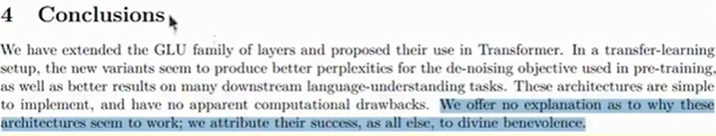
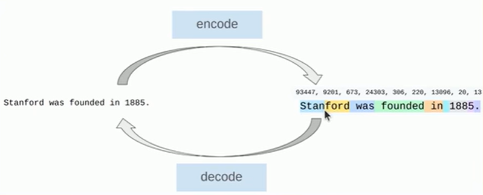

## What's new?
- Same 'from scratch' philosophy
> 同样的“从零开始”理念
- Prioritize high value-per-time concepts, don't lose the forestfor the trees
> 优先学习单位时间价值高的概念，不要只见树木不见森林
- More coverage of modern LM ingredients (mixture of experts, long-context, agents)
> 更多讲解现代大语言模型的核心组件（混合专家模型、长上下文、智能体）

## why did we make this course?
Problem: researchers are becoming disconnected from the underlying technology.
- 2016: researchers implemented and trained their own models.
- 2018: researchers downloaded models (e.g., BERT) and fine-tuned thhem
- Today: researchers prompt API models (e.g., GPT/Claude/Gemini).

Moving up levels of abstraction boosts productivity, but
> 提升抽象层级可以提高生产力，但是
- These abstractions are leaky (in contrast to programming languages or operating systems).
> 这些抽象是有漏洞的（与编程语言或操作系统形成对比）。如：想做某件事，但就是做不到，而且没有别的办法。仅仅通过prompt使用一个模型，会极大限制使用的可能性。
- There is still fundamental research to be done that requirestearing up the stack
> 仍有部分基础研究有待开展，这需要彻底重构整个技术栈

Full understanding of this technology is necessary for fundameental research
> 开展基础研究需要充分理解这项技术。

Philosophy of this course: understanding via building.
> 本课程的理念：通过实践构建来理解。

But there's one small problem...

The industrialization of language models

Frontier models are really expensive:

- 2023: GPT-4 supposedly cost **$100M** to train.
- 2025: xAI builds cluster with **230K GPUs** for training Grok.

There are no public details on how frontier models are built.

From the GPT-4 technical report [OpenAI+ 2023]:出于竞争环境和安全考率

Frontier models are out of reach for us.
> 前沿模型对我们而言遥不可及。

We could build small language models (<1B parameters), but thismight not be representative models.
> 我们可以构建小型语言模型（参数小于10亿），但这可能不具备模型代表性，不能代表真正的前沿模型。

Example 1: fraction of FLOPs spent in attention versus MlP changes with scale.
> 示例1：注意力机制与多层感知机（MLP）所占浮点运算量（FLOPs）的占比随模型规模发生变化。

小规模的模型中，MLP层中flops占比是44%，扩展到175B时，会上升到80%。导致了：在大模型中优化什么，以及什么重要，对于小模型并不适用。或者在小模型中对注意力的优化，可能不会在大模型上获得同样的收益。

Example 2: emergence of behavior with scale
> 规模带来的行为涌现

只有当达到临界规模时，才会看到改进。在小模型上工作时，看不到某些现象

Zero-Shot学习：在训练集中没有某个类别的样本，但在测试集中出现了这个类别。我们需要模型在训练过程中，即使没有接触过这个类别的样本，但仍然可以通过对这个类别的描述，对没见过的类别进行分类。

One-Shot学习：可以理解为用一条数据fine-tune模型。例如，在人脸识别场景里，你只提供一张照片，门禁就能认识各个角度的你。属于Few-Shot学习的特例。

Few-Shot学习：在模型训练过程中，如果每个类别只有少量样本（一个或几个），研究人员希望机器学习模型在学习了一定类别的大量数据后，对于新的类别，只需要少量的样本就能快速学习。

## What can we learn in this class that transfers to frontier model
> 我们能从这门课中学到哪些可迁移应用到前沿模型的知识

There are three types of knowledge:
- Mechanics: how things work (what a Transformer is, how model parallelism works)
> 机制原理：事物如何运作（什么是Transformer，模型并行如何工作）
- Mindset: squeezing the most out of the hardware,taking scaling seriously
> 思维模式：充分挖掘硬件的全部性能，高度重视规模扩展。即：如何着手构建一个语言模型？
- Intuitions: which data and modeling decisions yield good accuraacy
> 直觉认知：哪些数据与建模决策能够带来良好的准确率

We can teach mechanics and mindset (these do transfer).
> 我们可以教授操作方法与思维模式（这些是确实可以迁移的）。
We can only partially teach intuitions (do not necessarily transfer across scales).
> 我们只能部分传授直觉（这类直觉不一定能跨规模迁移）。

## Intuitions?
Some design decisions are simply not (yet) justifiable and just come from experimentation
> 有些设计决策目前（尚且）无法给出合理的理论依据，纯粹来源于实验探索。

Example: Noam Shazeer paper that introduced SwiGLU [Shazeeer 2020]

## The bitter lesson
> 深刻教训

Wrong interpretation: scale is all that matters, algorithms don't matter
> 错误解读：规模就是全部，算法无关紧要

Right interpretation: algorithms that scale are what matter.
> 正确解读：具备可扩展性的算法才是关键。

accuracy = efficiency x resources
> 准确率 = 效率 × 资源

In fact, efficiency is way more important at larger scales (cant afford to be wasteful).
> 实际上，在更大规模下，效率要重要得多（承担不起资源浪费的代价）。

[Hernandez+ 2020] showed 44x algorithmic efficiency on ImaageNet between 2012 and 2019.
> [Hernandez+ 2020]的研究表明，2012至2019年间，ImageNet上的算法效率提升了44倍。

Framing: what is the best model one can build given a certaincompute and data budget?
> 问题界定：在给定计算与数据预算的前提下，人们能够构建出的最优模型是什么？

In other words, maximize efficiency!

## Neural ingredients (2010s)
- Long-Short Term Memory (LSTM) [Hochreiter+ 1997]
- First neural language model [Bengio+ 2003]
- Sequence-to-sequence modeling (for machine translation) [Siutskever+ 2014]: 可以把句子压缩成一个向量
- Adam optimizer [Kingma+ 2014]
- Attention mechanism (for machine translation) [Bahdanau+ 2014
- Transformer architecture (for machine translation) [Vaswani+ 2017Nh
- Mixture of experts [Shazeer+2017]
- Model parallelism

## Embracing scaling
- OpenAI's GPT-2 (1.5B): fluent text, first signs of zero-shot [Radfod+ 2019
- Scaling laws: provide hope / predictability for scaling [Kaplan+ 2020]
- OpenAl's GPT-3 (175B): in-context learning [Brown+ 2020]
- Google's PaLM (540B): massive scale, undertrained (Chowdhery+ 2022]
- DeepMind's Chinchilla (70B): compute-optimal scaling laws [Hoffmann+ 2022]

## Open models
Early attempts (attempts to replicate GPT-3):

- EleutherAl's open datasets (The Pile) and models (GPT-J)[Gao+ 2020][Wang+ 2021]
- Meta's OPT (175B): GPT-3 replication, lots of hardware issues[Zhang+ 2022]
- Hugging Face / BigScience's BLOOM (176B): focused on data sourrcing [Workshop+ 2022]

Credible open-weight models (weights + paper):
- Meta's Llama models [Touvron+ 2023][Touvron+ 2023][Grattafiori+ 2024
- Mistral's models [Jiang+ 2023][Jiang+ 2024]
- DeepSeek's models [DeepSeek-Al+ 2024][DeepSeek-Al+ 2024][DeepSeek-Al+ 2024][DeepSeek-Al+ 2025]
- Alibaba's Qwen models [Qwen+ 2024][Yang+ 2025]
- Moonshot's Kimi models [Kimi Team 2025][Kimi Team 2026]
- Z.ai's GLM models [GLM-4.5 Team 2025][GLM-5-Team 2026]
- Minimax's models [MiniMax M2.5]
- Xiaomi's MIMO models [Xiaomi MIMO v2]

These models are approaching closed models (GPT, Claude, Gennini, etc.).

Open-source models (weights + paper + code + data), 提供更多细节，便于了解模型:
- Al2's Olmo models [Groeneveld+ 2024][Team OLMo 2024][Tearm Olmo 2025]
- NVIDIA's Nemotron models [Parmar+ 2024][NVIDIA+ 2025]
- Marin's models (open development) [Marin 8B retro][Marin 32B retr70]

Openness is important for trust and innovation [Kapoor+22024]. Ideas from open models enable us to teach CS336.
> 开放性对于信任与创新至关重要［Kapoor+22024]。开源模型带来的思路让我们得以开展CS336课程教学。

## What is a language model?
- 2018 (BERT): something you fine-tune
- 2020 (GPT-3): something you prompt
- 2022 (ChatGPT): something you talk to [example conversaticbn]
- 2026 (agents): something that acts autonomously [example trace]

The fundamentals are the same (attention, kernels, optimhization)
> 基础原理是相同的（注意力机制、内核、优化，如梯度和随机）

The specs are different (longer context, inference efficiency matterseven more).
> 技术规格有所不同（更长的上下文窗口，推理效率变得更为重要）。

## course syllabus【大纲】
- basics：Assignment 1: tokenization,model architecture, training
- systems：Assignment 2: kernels,parallelism, inference
- scaling laws：Assignment 3: scaling laws
- data：Assignment 4: evaluation, curation, transformation, filtering,dedupl
- alignment：Assignment 5: RLHF, RL algorithms,RL systems

### basics
Goal: be able to train a basic language model

Components: tokenization, model architecture, training

#### Tokenization
What are the atoms that the model operates on?
> 模型处理的基本单元（原子）是什么？

Formally: a tokenizer converts between raw inputs (bytes) and sequences of integers (tokens)
> 严格来说：分词器实现原始输入（字节）与整数序列（词元）之间的转换。即：这些整数就代表token。概念上，即是对文本的切分。

Popular tokenizer: Byte-Pair Encoding (BPE) [Sennrich+ 2015]
> 常用分词器：字节对编码（BPE）

Intuition: break input into frequently-occuring chunks
> 核心思路：将输入切分为频繁出现的片段

Efficiency lens
> 效率视角看，tokenization是很好的

Reduce context length (1000 bytes - ~250 tokens)
> 降低上下文长度（1000字节 → 约250个token）：将一个长的序列（原始字节流）减少为更少数量的token。

Adaptive computation (more modeling capacity on interesting partsof input)
> 自适应计算（对输入中**关键部分**分配更多建模能力）：某些地方也许有很多字节，但实际被压缩成了一个token，而输入中更少或者更关键的地方被保留为多个token。

The dream: tokenizer-free model architectures, which operatedirectly on bytes
> 愿景：无分词器模型架构，直接基于字节进行运算

These are promising, but have not yet been scaled up to thhe frontier
> 这些方案前景可观，但尚未扩大规模应用至前沿领域

#### Model architecture
Starting point: original Transformer [Vaswani+ 2017]
> 起点：原始Transformer

Refinements:
- Activation functions: ReLU, SwiGLU , shazeer_2020
- Positional encodings: sinusoidal, RoPE , rope_2021
- Normalization: LayerNorm, RMSNorm, QK norm, pre-norm versus post-norm , layernorm_2016, rms_norm_2019, qk_norm_2023, pre_post_norm_2020
- Attention: full, sparse/local attention, group-query attention (GQA), multi-head latent attention (MLA) , sparse_transformer_2019), gqa_2023), mla_2024)
- Recurrence/state-space models/linear attention: Mamba, Gated DeltaNet , linear_attention_2020), mamba_2_2024), gdn_2024), mamba_3_2026)
- MLP: dense, mixture of experts , moe_2017), switch_transformers_2021)
- Shape (hidden dimension, depth, number of heads, number of experts)

