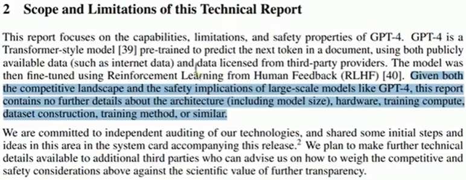
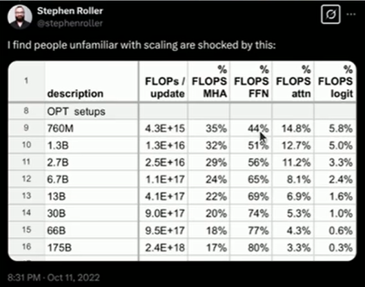
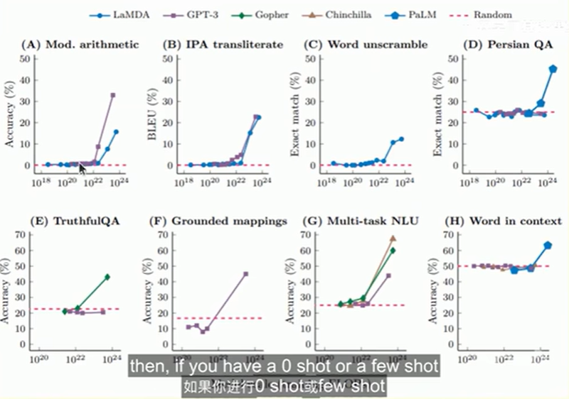

## What's new?
- Same 'from scratch' philosophy
> 同样的“从零开始”理念
- Prioritize high value-per-time concepts, don't lose the forestfor the trees
> 优先学习单位时间价值高的概念，不要只见树木不见森林
- More coverage of modern LM ingredients (mixture of experts, long-context, agents)
> 更多讲解现代大语言模型的核心组件（混合专家模型、长上下文、智能体）

## why did we make this course?
Problem: researchers are becoming disconnected from the underlying technology.
- 2016: researchers implemented and trained their own models.
- 2018: researchers downloaded models (e.g., BERT) and fine-tuned thhem
- Today: researchers prompt API models (e.g., GPT/Claude/Gemini).

Moving up levels of abstraction boosts productivity, but
> 提升抽象层级可以提高生产力，但是
- These abstractions are leaky (in contrast to programming languages or operating systems).
> 这些抽象是有漏洞的（与编程语言或操作系统形成对比）。如：想做某件事，但就是做不到，而且没有别的办法。仅仅通过prompt使用一个模型，会极大限制使用的可能性。
- There is still fundamental research to be done that requirestearing up the stack
> 仍有部分基础研究有待开展，这需要彻底重构整个技术栈

Full understanding of this technology is necessary for fundameental research
> 开展基础研究需要充分理解这项技术。

Philosophy of this course: understanding via building.
> 本课程的理念：通过实践构建来理解。

But there's one small problem...

The industrialization of language models

Frontier models are really expensive:

- 2023: GPT-4 supposedly cost **$100M** to train.
- 2025: xAI builds cluster with **230K GPUs** for training Grok.

There are no public details on how frontier models are built.

From the GPT-4 technical report [OpenAI+ 2023]:出于竞争环境和安全考率

Frontier models are out of reach for us.
> 前沿模型对我们而言遥不可及。

We could build small language models (<1B parameters), but thismight not be representative models.
> 我们可以构建小型语言模型（参数小于10亿），但这可能不具备模型代表性，不能代表真正的前沿模型。

Example 1: fraction of FLOPs spent in attention versus MlP changes with scale.
> 示例1：注意力机制与多层感知机（MLP）所占浮点运算量（FLOPs）的占比随模型规模发生变化。

小规模的模型中，MLP层中flops占比是44%，扩展到175B时，会上升到80%。导致了：在大模型中优化什么，以及什么重要，对于小模型并不适用。或者在小模型中对注意力的优化，可能不会在大模型上获得同样的收益。

Example 2: emergence of behavior with scale
> 规模带来的行为涌现

只有当达到临界规模时，才会看到改进。在小模型上工作时，看不到某些现象

Zero-Shot学习：在训练集中没有某个类别的样本，但在测试集中出现了这个类别。我们需要模型在训练过程中，即使没有接触过这个类别的样本，但仍然可以通过对这个类别的描述，对没见过的类别进行分类。

One-Shot学习：可以理解为用一条数据fine-tune模型。例如，在人脸识别场景里，你只提供一张照片，门禁就能认识各个角度的你。属于Few-Shot学习的特例。

Few-Shot学习：在模型训练过程中，如果每个类别只有少量样本（一个或几个），研究人员希望机器学习模型在学习了一定类别的大量数据后，对于新的类别，只需要少量的样本就能快速学习。

## What can we learn in this class that transfers to frontier model
> 我们能从这门课中学到哪些可迁移应用到前沿模型的知识

There are three types of knowledge:
- Mechanics: how things work (what a Transformer is, how model parallelism works)
> 机制原理：事物如何运作（什么是Transformer，模型并行如何工作）
- Mindset: squeezing the most out of the hardware,taking scaling seriously
> 思维模式：充分挖掘硬件的全部性能，高度重视规模扩展
- Intuitions: which data and modeling decisions yield good accuraacy
> 直觉认知：哪些数据与建模决策能够带来良好的准确率

