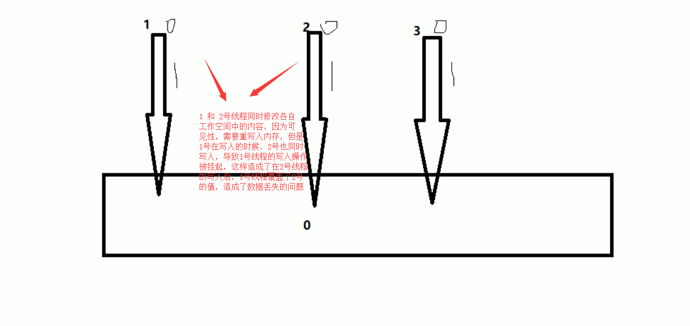

### JUC涉及的包：
java.util.concurrent 
java.util.concurrent.atomic 
java.util.concurrent.locks
###volatile是Java虚拟机提供的轻量级的同步机制。

### volatile三大特性：
- 保证可见性：当主内存区域中的值被某个线程写入更改后，其它线程会**马上**知晓更改后的值，并重新得到更改后的值。


- 不保证原子性


- 禁止指令重排

## volatile与JMM内存模型可见性

### JMM

JMM是Java内存模型，也就是Java Memory Model，简称JMM，本身是一种抽象的概念，并不真实存在，它定义了主存、工作内存抽象概念，它描述的是一组规则或规范，通过这组规范定义了程序中各个变量（包括实例字段，静态字段和构成数组对象的元素）的**访问方式**。

JMM关于同步的规定：

1. 线程解锁前，必须把共享变量的值刷新回**主内存**

2. 线程加锁前，必须读取主内存的最新值，拷贝到自己的**工作内存**

3. 加锁和解锁是同一把锁
    数据传输速率：硬盘 < 内存 < < cache < CPU

由于JVM运行程序的实体是线程，而每个线程创建时JVM都会为其创建一个工作内存（有些地方称为栈空间），工作内存是每个线程的私有数据区域，而Java内存模型中规定所有变量都存储在主内存，主内存是共享内存区域，所有线程都可以访问，但线程对变量的操作（读取赋值等）必须在工作内存中进行：首先要将变量从主内存拷贝到自己的工作内存空间，然后对变量进行操作，操作完成后再将变量写会主内存，不能直接操作主内存中的变量，各个线程中的工作内存中存储着主内存中的变量副本拷贝，因此不同的线程间无法访问对方的工作内存，线程间的通信（传值）必须通过主内存来完成，其简要访问过程：

  

  - 当同时有三个线程同时访问 student中的age变量时，那么每个线程都会拷贝一份，到各自的工作内存，从而实现了变量的拷贝。

    

  ### 缓存一致性

  为什么这里主线程中某个值被更改后，其它线程能马上知晓呢？其实这里是用到了总线嗅探技术

  在说嗅探技术之前，首先谈谈缓存一致性的问题，就是当多个处理器运算任务都涉及到同一块主内存区域的时候，将可能导致各自的缓存数据不一。

  为了解决缓存一致性的问题，需要各个处理器访问缓存时都遵循一些协议，在读写时要根据协议进行操作，这类协议主要有MSI、MESI等等。

  #### MESI

  当CPU写数据时，如果发现操作的变量是共享变量，即在其它CPU中也存在该变量的副本，会发出信号通知其它CPU将该内存变量的缓存行设置为**无效**，因此当其它CPU读取这个变量的时，发现自己缓存该变量的缓存行是无效的，那么它就会从内存中重新读取。

  #### 总线嗅探

  那么是如何发现数据是否失效呢？

  这里是用到了总线嗅探技术，就是每个处理器通过嗅探在总线上传播的数据来检查自己缓存值是否过期了，当处理器发现自己的缓存行对应的内存地址被修改，就会将当前处理器的缓存行设置为无效状态，当处理器对这个数据进行修改操作的时候，会重新从内存中把数据读取到处理器缓存中。

  ### 总线风暴

  总线嗅探技术有哪些缺点？

  由于Volatile的MESI缓存一致性协议，需要不断的从主内存嗅探和CAS循环，无效的交互会导致总线带宽达到峰值。因此不要大量使用volatile关键字，至于什么时候使用volatile、什么时候用锁以及Syschonized都是需要根据实际场景的。

  ### JMM的特性

  JMM的三大特性，volatile只保证了两个，即可见性和有序性，不满足原子性

  - 可见性：保证指令不会受 cpu 缓存的影响。
  - 原子性：保证指令不会受到线程上下文切换的影响。
  - 有序性：保证指令不会受 cpu 指令并行优化的影响。

  ### 可见性代码验证

  但我们对于成员变量没有添加任何修饰时，是无法感知其它线程修改后的值

  ```java
  class MyData {
      volatile int number = 0; // 重点就在于加与不加volatile
      public void addTo60() {
          this.number = 60;
      }
  }
  public class VolatileDemo {
      public static void main(String[] args) {
          MyData myData = new MyData();
  
          new Thread(()->{
              System.out.println(Thread.currentThread().getName() + "\t come in");
              try {TimeUnit.SECONDS.sleep(3);} catch (InterruptedException e){e.printStackTrace();}
              myData.addTo60();
              System.out.println(Thread.currentThread().getName() + "\t update value:" + myData.number);
          }, "AAA").start();
  
          while (myData.number == 0) {
  //            System.out.println(myData.number);
          }
          System.out.println(Thread.currentThread().getName() + "\t mission is over" + myData.number);
      }
  }
  ```


## volatile不保证原子性

### 前言

- 各个线程对主内存中共享变量的操作都是各个线程各自**拷贝**到自己的工作内存进行**操作**后在**写回**到主内存中的。

- 这就可能存在一个线程A修改了共享变量X的值，但是还未写入主内存时，另外一个线程B又对主内存中同一共享变量X进行操作，但此时A线程工作内存中共享变量X对线程B来说是不可见，这种工作内存与主内存同步延迟现象就造成了可见性问题。

### 原子性

- 不可分割，完整性，也就是说某个线程正在做某个具体业务时，中间不可以被加塞或者被分割，需要具体完成，要么同时成功，要么同时失败。

- 数据库也经常提到事务具备原子性。

### 代码测试

- 为了测试volatile是否保证原子性，我们创建了20个线程，然后每个线程分别循环1000次，来调用number++的方法

```java
        MyData myData = new MyData();
        for (int i = 0; i < 20; i++) {
            new Thread(() -> {
                for (int j = 0; j < 1000; j++) {
                    myData.addPlusPlus();
                }
            }, String.valueOf(i)).start();
        }
```

- 最后通过 Thread.activeCount()，来感知20个线程是否执行完毕
  - 这里的判断为什么是线程数大于2？因为默认是有两个线程的，一个main线程，一个gc线程

```java
// 需要等待上面20个线程都计算完成后，在用main线程取得最终的结果值
while(Thread.activeCount() > 2) {
    // yield表示不执行
    Thread.yield();
}
```

- 线程执行完毕后，再查看number的值，假设volatile保证原子性的话，那么最后输出的值应该是20 * 1000 = 20000。

- 最终结果：number输出的值并没有20000，而且是每次运行的结果都不一致的。
- 结论：这说明了volatile修饰的变量不保证原子性。

### 为什么出现数值丢失?



- 各自线程在写入主内存的时候，出现了数据的丢失，而引起的数值缺失的问题。

- 下面我们将一个简单的number++操作，转换为字节码文件一探究竟

```java
public class T1 {
    volatile int n = 0;
    public void add() {
        n++;
    }
}
```

- 查看字节码的操作，是用到了IDEA的javap命令

  - 我们首先，使用IDEA提供的External Tools，来扩展javap命令
  - settings——>Tools>External Tools——>+

  - 在需要查看字节码的文件下，右键选择 External Tools即可

  - 如果出现了找不到指定类，那是因为我们创建的是spring boot的maven项目，我们之前需要执行mvn package命令，进行打包操作，将其编译成class文件

- 分析add() 方法的字节码文件

```java
  public void add();
    Code:
       0: aload_0             // 将第一个引用类型本地变量推送至栈顶
       1: dup                 // 复制栈顶数值并将复制值压入栈顶
       2: getfield      #2    // Field n:I。获取指定类的实例域, 并将其压入栈顶
       5: iconst_1            // 将int型1推送至栈顶
       6: iadd                // 将栈顶两int型数值相加并将结果压入栈顶
       7: putfield      #2    // Field n:I。为指定类的实例域赋值
      10: return              // 从当前方法返回void
```

- 我们能够发现 n++这条命令，被拆分成了3个指令

  - 执行`getfield` ：从主内存拿到原始n

  - 执行`iadd` ：进行加1操作

  - 执行`putfileld` ：把累加后的值写回主内存

- 假设我们没有加 `synchronized`那么第一步就可能存在着，三个线程同时通过getfield命令，拿到主存中的 n值，然后三个线程，各自在自己的工作内存中进行加1操作，但他们并发进行 `iadd` 命令的时候，因为只能一个进行写，所以其它操作会被挂起，假设1线程，先进行了写操作，在写完后，volatile的可见性，应该需要告诉其它两个线程，主内存的值已经被修改了，但是因为太快了（总线嗅探等未来得及），其它两个线程，陆续执行 `iadd`命令，进行写入操作，这就造成了其他线程没有接受到主内存n的改变，从而覆盖了原来的值，出现写丢失，这样也就让最终的结果少于20000

### 如何解决

- 因此这也说明，在多线程环境下 number ++ 在多线程环境下是非线程安全的。

- 解决方案1：在方法上加入 synchronized

```
    public synchronized void addPlusPlus() {
        number ++;
    }
```

* 结果：引入synchronized关键字后，保证了该方法每次只能够一个线程进行访问和操作，最终输出的结果也就为20000。

### 其它解决方法

* 方案1评价：引入synchronized，虽然能够保证原子性，但是为了解决number++，而引入重量级的同步机制，杀鸡焉用牛刀。

* 解决方案2：使用JUC下面的原子包装类，即刚刚的int类型的number，可以使用AtomicInteger来代替

```java
    /** 创建一个原子Integer包装类，默认为0 */
    AtomicInteger atomicInteger = new AtomicInteger();
    public void addAtomic() {
        atomicInteger.getAndIncrement(); // 相当于 atomicInter ++
    }
```

### 字节码指令表

- 引用：[字节码指令表](https://segmentfault.com/a/1190000008722128)

| 字节码 | 助记符          | 指令含义                                                     |
| ------ | --------------- | ------------------------------------------------------------ |
| 0x00   | nop             | None                                                         |
| 0x01   | aconst_null     | 将null推送至栈顶                                             |
| 0x02   | iconst_m1       | 将int型-1推送至栈顶                                          |
| 0x03   | iconst_0        | 将int型0推送至栈顶                                           |
| 0x04   | iconst_1        | 将int型1推送至栈顶                                           |
| 0x05   | iconst_2        | 将int型2推送至栈顶                                           |
| 0x06   | iconst_3        | 将int型3推送至栈顶                                           |
| 0x07   | iconst_4        | 将int型4推送至栈顶                                           |
| 0x08   | iconst_5        | 将int型5推送至栈顶                                           |
| 0x09   | lconst_0        | 将long型0推送至栈顶                                          |
| 0x0a   | lconst_1        | 将long型1推送至栈顶                                          |
| 0x0b   | fconst_0        | 将float型0推送至栈顶                                         |
| 0x0c   | fconst_1        | 将float型1推送至栈顶                                         |
| 0x0d   | fconst_2        | 将float型2推送至栈顶                                         |
| 0x0e   | dconst_0        | 将double型0推送至栈顶                                        |
| 0x0f   | dconst_1        | 将double型1推送至栈顶                                        |
| 0x10   | bipush          | 将单字节的常量值(-128~127)推送至栈顶                         |
| 0x11   | sipush          | 将一个短整型常量(-32768~32767)推送至栈顶                     |
| 0x12   | ldc             | 将int,float或String型常量值从常量池中推送至栈顶              |
| 0x13   | ldc_w           | 将int,float或String型常量值从常量池中推送至栈顶(宽索引)      |
| 0x14   | ldc2_w          | 将long或double型常量值从常量池中推送至栈顶(宽索引)           |
| 0x15   | iload           | 将指定的int型本地变量推送至栈顶                              |
| 0x16   | lload           | 将指定的long型本地变量推送至栈顶                             |
| 0x17   | fload           | 将指定的float型本地变量推送至栈顶                            |
| 0x18   | dload           | 将指定的double型本地变量推送至栈顶                           |
| 0x19   | aload           | 将指定的引用类型本地变量推送至栈顶                           |
| 0x1a   | iload_0         | 将第一个int型本地变量推送至栈顶                              |
| 0x1b   | iload_1         | 将第二个int型本地变量推送至栈顶                              |
| 0x1c   | iload_2         | 将第三个int型本地变量推送至栈顶                              |
| 0x1d   | iload_3         | 将第四个int型本地变量推送至栈顶                              |
| 0x1e   | lload_0         | 将第一个long型本地变量推送至栈顶                             |
| 0x1f   | lload_1         | 将第二个long型本地变量推送至栈顶                             |
| 0x20   | lload_2         | 将第三个long型本地变量推送至栈顶                             |
| 0x21   | lload_3         | 将第四个long型本地变量推送至栈顶                             |
| 0x22   | fload_0         | 将第一个float型本地变量推送至栈顶                            |
| 0x23   | fload_1         | 将第二个float型本地变量推送至栈顶                            |
| 0x24   | fload_2         | 将第三个float型本地变量推送至栈顶                            |
| 0x25   | fload_3         | 将第四个float型本地变量推送至栈顶                            |
| 0x26   | dload_0         | 将第一个double型本地变量推送至栈顶                           |
| 0x27   | dload_1         | 将第二个double型本地变量推送至栈顶                           |
| 0x28   | dload_2         | 将第三个double型本地变量推送至栈顶                           |
| 0x29   | dload_3         | 将第四个double型本地变量推送至栈顶                           |
| 0x2a   | aload_0         | 将第一个引用类型本地变量推送至栈顶                           |
| 0x2b   | aload_1         | 将第二个引用类型本地变量推送至栈顶                           |
| 0x2c   | aload_2         | 将第三个引用类型本地变量推送至栈顶                           |
| 0x2d   | aload_3         | 将第四个引用类型本地变量推送至栈顶                           |
| 0x2e   | iaload          | 将int型数组指定索引的值推送至栈顶                            |
| 0x2f   | laload          | 将long型数组指定索引的值推送至栈顶                           |
| 0x30   | faload          | 将float型数组指定索引的值推送至栈顶                          |
| 0x31   | daload          | 将double型数组指定索引的值推送至栈顶                         |
| 0x32   | aaload          | 将引用类型数组指定索引的值推送至栈顶                         |
| 0x33   | baload          | 将boolean或byte型数组指定索引的值推送至栈顶                  |
| 0x34   | caload          | 将char型数组指定索引的值推送至栈顶                           |
| 0x35   | saload          | 将short型数组指定索引的值推送至栈顶                          |
| 0x36   | istore          | 将栈顶int型数值存入指定本地变量                              |
| 0x37   | lstore          | 将栈顶long型数值存入指定本地变量                             |
| 0x38   | fstore          | 将栈顶float型数值存入指定本地变量                            |
| 0x39   | dstore          | 将栈顶double型数值存入指定本地变量                           |
| 0x3a   | astore          | 将栈顶引用类型数值存入指定本地变量                           |
| 0x3b   | istore_0        | 将栈顶int型数值存入第一个本地变量                            |
| 0x3c   | istore_1        | 将栈顶int型数值存入第二个本地变量                            |
| 0x3d   | istore_2        | 将栈顶int型数值存入第三个本地变量                            |
| 0x3e   | istore_3        | 将栈顶int型数值存入第四个本地变量                            |
| 0x3f   | lstore_0        | 将栈顶long型数值存入第一个本地变量                           |
| 0x40   | lstore_1        | 将栈顶long型数值存入第二个本地变量                           |
| 0x41   | lstore_2        | 将栈顶long型数值存入第三个本地变量                           |
| 0x42   | lstore_3        | 将栈顶long型数值存入第四个本地变量                           |
| 0x43   | fstore_0        | 将栈顶float型数值存入第一个本地变量                          |
| 0x44   | fstore_1        | 将栈顶float型数值存入第二个本地变量                          |
| 0x45   | fstore_2        | 将栈顶float型数值存入第三个本地变量                          |
| 0x46   | fstore_3        | 将栈顶float型数值存入第四个本地变量                          |
| 0x47   | dstore_0        | 将栈顶double型数值存入第一个本地变量                         |
| 0x48   | dstore_1        | 将栈顶double型数值存入第二个本地变量                         |
| 0x49   | dstore_2        | 将栈顶double型数值存入第三个本地变量                         |
| 0x4a   | dstore_3        | 将栈顶double型数值存入第四个本地变量                         |
| 0x4b   | astore_0        | 将栈顶引用型数值存入第一个本地变量                           |
| 0x4c   | astore_1        | 将栈顶引用型数值存入第二个本地变量                           |
| 0x4d   | astore_2        | 将栈顶引用型数值存入第三个本地变量                           |
| 0x4e   | astore_3        | 将栈顶引用型数值存入第四个本地变量                           |
| 0x4f   | iastore         | 将栈顶int型数值存入指定数组的指定索引位置                    |
| 0x50   | lastore         | 将栈顶long型数值存入指定数组的指定索引位置                   |
| 0x51   | fastore         | 将栈顶float型数值存入指定数组的指定索引位置                  |
| 0x52   | dastore         | 将栈顶double型数值存入指定数组的指定索引位置                 |
| 0x53   | aastore         | 将栈顶引用型数值存入指定数组的指定索引位置                   |
| 0x54   | bastore         | 将栈顶boolean或byte型数值存入指定数组的指定索引位置          |
| 0x55   | castore         | 将栈顶char型数值存入指定数组的指定索引位置                   |
| 0x56   | sastore         | 将栈顶short型数值存入指定数组的指定索引位置                  |
| 0x57   | pop             | 将栈顶数值弹出(数值不能是long或double类型的)                 |
| 0x58   | pop2            | 将栈顶的一个(对于非long或double类型)或两个数值(对于非long或double的其他类型)弹出 |
| 0x59   | dup             | 复制栈顶数值并将复制值压入栈顶                               |
| 0x5a   | dup_x1          | 复制栈顶数值并将两个复制值压入栈顶                           |
| 0x5b   | dup_x2          | 复制栈顶数值并将三个(或两个)复制值压入栈顶                   |
| 0x5c   | dup2            | 复制栈顶一个(对于long或double类型)或两个(对于非long或double的其他类型)数值并将复制值压入栈顶 |
| 0x5d   | dup2_x1         | dup_x1指令的双倍版本                                         |
| 0x5e   | dup2_x2         | dup_x2指令的双倍版本                                         |
| 0x5f   | swap            | 将栈顶最顶端的两个数值互换(数值不能是long或double类型)       |
| 0x60   | iadd            | 将栈顶两int型数值相加并将结果压入栈顶                        |
| 0x61   | ladd            | 将栈顶两long型数值相加并将结果压入栈顶                       |
| 0x62   | fadd            | 将栈顶两float型数值相加并将结果压入栈顶                      |
| 0x63   | dadd            | 将栈顶两double型数值相加并将结果压入栈顶                     |
| 0x64   | isub            | 将栈顶两int型数值相减并将结果压入栈顶                        |
| 0x65   | lsub            | 将栈顶两long型数值相减并将结果压入栈顶                       |
| 0x66   | fsub            | 将栈顶两float型数值相减并将结果压入栈顶                      |
| 0x67   | dsub            | 将栈顶两double型数值相减并将结果压入栈顶                     |
| 0x68   | imul            | 将栈顶两int型数值相乘并将结果压入栈顶                        |
| 0x69   | lmul            | 将栈顶两long型数值相乘并将结果压入栈顶                       |
| 0x6a   | fmul            | 将栈顶两float型数值相乘并将结果压入栈顶                      |
| 0x6b   | dmul            | 将栈顶两double型数值相乘并将结果压入栈顶                     |
| 0x6c   | idiv            | 将栈顶两int型数值相除并将结果压入栈顶                        |
| 0x6d   | ldiv            | 将栈顶两long型数值相除并将结果压入栈顶                       |
| 0x6e   | fdiv            | 将栈顶两float型数值相除并将结果压入栈顶                      |
| 0x6f   | ddiv            | 将栈顶两double型数值相除并将结果压入栈顶                     |
| 0x70   | irem            | 将栈顶两int型数值作取模运算并将结果压入栈顶                  |
| 0x71   | lrem            | 将栈顶两long型数值作取模运算并将结果压入栈顶                 |
| 0x72   | frem            | 将栈顶两float型数值作取模运算并将结果压入栈顶                |
| 0x73   | drem            | 将栈顶两double型数值作取模运算并将结果压入栈顶               |
| 0x74   | ineg            | 将栈顶int型数值取负并将结果压入栈顶                          |
| 0x75   | lneg            | 将栈顶long型数值取负并将结果压入栈顶                         |
| 0x76   | fneg            | 将栈顶float型数值取负并将结果压入栈顶                        |
| 0x77   | dneg            | 将栈顶double型数值取负并将结果压入栈顶                       |
| 0x78   | ishl            | 将int型数值左移指定位数并将结果压入栈顶                      |
| 0x79   | lshl            | 将long型数值左移指定位数并将结果压入栈顶                     |
| 0x7a   | ishr            | 将int型数值右(带符号)移指定位数并将结果压入栈顶              |
| 0x7b   | lshr            | 将long型数值右(带符号)移指定位数并将结果压入栈顶             |
| 0x7c   | iushr           | 将int型数值右(无符号)移指定位数并将结果压入栈顶              |
| 0x7d   | lushr           | 将long型数值右(无符号)移指定位数并将结果压入栈顶             |
| 0x7e   | iand            | 将栈顶两int型数值"按位与"并将结果压入栈顶                    |
| 0x7f   | land            | 将栈顶两long型数值"按位与"并将结果压入栈顶                   |
| 0x80   | ior             | 将栈顶两int型数值"按位或"并将结果压入栈顶                    |
| 0x81   | lor             | 将栈顶两long型数值"按位或"并将结果压入栈顶                   |
| 0x82   | ixor            | 将栈顶两int型数值"按位异或"并将结果压入栈顶                  |
| 0x83   | lxor            | 将栈顶两long型数值"按位异或"并将结果压入栈顶                 |
| 0x84   | iinc            | 将指定int型变量增加指定值(如i++, i--, i+=2等)                |
| 0x85   | i2l             | 将栈顶int型数值强制转换为long型数值并将结果压入栈顶          |
| 0x86   | i2f             | 将栈顶int型数值强制转换为float型数值并将结果压入栈顶         |
| 0x87   | i2d             | 将栈顶int型数值强制转换为double型数值并将结果压入栈顶        |
| 0x88   | l2i             | 将栈顶long型数值强制转换为int型数值并将结果压入栈顶          |
| 0x89   | l2f             | 将栈顶long型数值强制转换为float型数值并将结果压入栈顶        |
| 0x8a   | l2d             | 将栈顶long型数值强制转换为double型数值并将结果压入栈顶       |
| 0x8b   | f2i             | 将栈顶float型数值强制转换为int型数值并将结果压入栈顶         |
| 0x8c   | f2l             | 将栈顶float型数值强制转换为long型数值并将结果压入栈顶        |
| 0x8d   | f2d             | 将栈顶float型数值强制转换为double型数值并将结果压入栈顶      |
| 0x8e   | d2i             | 将栈顶double型数值强制转换为int型数值并将结果压入栈顶        |
| 0x8f   | d2l             | 将栈顶double型数值强制转换为long型数值并将结果压入栈顶       |
| 0x90   | d2f             | 将栈顶double型数值强制转换为float型数值并将结果压入栈顶      |
| 0x91   | i2b             | 将栈顶int型数值强制转换为byte型数值并将结果压入栈顶          |
| 0x92   | i2c             | 将栈顶int型数值强制转换为char型数值并将结果压入栈顶          |
| 0x93   | i2s             | 将栈顶int型数值强制转换为short型数值并将结果压入栈顶         |
| 0x94   | lcmp            | 比较栈顶两long型数值大小, 并将结果(1, 0或-1)压入栈顶         |
| 0x95   | fcmpl           | 比较栈顶两float型数值大小, 并将结果(1, 0或-1)压入栈顶; 当其中一个数值为`NaN`时, 将-1压入栈顶 |
| 0x96   | fcmpg           | 比较栈顶两float型数值大小, 并将结果(1, 0或-1)压入栈顶; 当其中一个数值为`NaN`时, 将1压入栈顶 |
| 0x97   | dcmpl           | 比较栈顶两double型数值大小, 并将结果(1, 0或-1)压入栈顶; 当其中一个数值为`NaN`时, 将-1压入栈顶 |
| 0x98   | dcmpg           | 比较栈顶两double型数值大小, 并将结果(1, 0或-1)压入栈顶; 当其中一个数值为`NaN`时, 将1压入栈顶 |
| 0x99   | ifeq            | 当栈顶int型数值等于0时跳转                                   |
| 0x9a   | ifne            | 当栈顶int型数值不等于0时跳转                                 |
| 0x9b   | iflt            | 当栈顶int型数值小于0时跳转                                   |
| 0x9c   | ifge            | 当栈顶int型数值大于等于0时跳转                               |
| 0x9d   | ifgt            | 当栈顶int型数值大于0时跳转                                   |
| 0x9e   | ifle            | 当栈顶int型数值小于等于0时跳转                               |
| 0x9f   | if_icmpeq       | 比较栈顶两int型数值大小, 当结果等于0时跳转                   |
| 0xa0   | if_icmpne       | 比较栈顶两int型数值大小, 当结果不等于0时跳转                 |
| 0xa1   | if_icmplt       | 比较栈顶两int型数值大小, 当结果小于0时跳转                   |
| 0xa2   | if_icmpge       | 比较栈顶两int型数值大小, 当结果大于等于0时跳转               |
| 0xa3   | if_icmpgt       | 比较栈顶两int型数值大小, 当结果大于0时跳转                   |
| 0xa4   | if_icmple       | 比较栈顶两int型数值大小, 当结果小于等于0时跳转               |
| 0xa5   | if_acmpeq       | 比较栈顶两引用型数值, 当结果相等时跳转                       |
| 0xa6   | if_acmpne       | 比较栈顶两引用型数值, 当结果不相等时跳转                     |
| 0xa7   | goto            | 无条件跳转                                                   |
| 0xa8   | jsr             | 跳转至指定的16位offset位置, 并将jsr的下一条指令地址压入栈顶  |
| 0xa9   | ret             | 返回至本地变量指定的index的指令位置(一般与jsr或jsr_w联合使用) |
| 0xaa   | tableswitch     | 用于switch条件跳转, case值连续(可变长度指令)                 |
| 0xab   | lookupswitch    | 用于switch条件跳转, case值不连续(可变长度指令)               |
| 0xac   | ireturn         | 从当前方法返回int                                            |
| 0xad   | lreturn         | 从当前方法返回long                                           |
| 0xae   | freturn         | 从当前方法返回float                                          |
| 0xaf   | dreturn         | 从当前方法返回double                                         |
| 0xb0   | areturn         | 从当前方法返回对象引用                                       |
| 0xb1   | return          | 从当前方法返回void                                           |
| 0xb2   | getstatic       | 获取指定类的静态域, 并将其压入栈顶                           |
| 0xb3   | putstatic       | 为指定类的静态域赋值                                         |
| 0xb4   | getfield        | 获取指定类的实例域, 并将其压入栈顶                           |
| 0xb5   | putfield        | 为指定类的实例域赋值                                         |
| 0xb6   | invokevirtual   | 调用实例方法                                                 |
| 0xb7   | invokespecial   | 调用超类构建方法, 实例初始化方法, 私有方法                   |
| 0xb8   | invokestatic    | 调用静态方法                                                 |
| 0xb9   | invokeinterface | 调用接口方法                                                 |
| 0xba   | invokedynamic   | 调用动态方法                                                 |
| 0xbb   | new             | 创建一个对象, 并将其引用引用值压入栈顶                       |
| 0xbc   | newarray        | 创建一个指定的原始类型(如int, float, char等)的数组, 并将其引用值压入栈顶 |
| 0xbd   | anewarray       | 创建一个引用型(如类, 接口, 数组)的数组, 并将其引用值压入栈顶 |
| 0xbe   | arraylength     | 获取数组的长度值并压入栈顶                                   |
| 0xbf   | athrow          | 将栈顶的异常抛出                                             |
| 0xc0   | checkcast       | 检验类型转换, 检验未通过将抛出 ClassCastException            |
| 0xc1   | instanceof      | 检验对象是否是指定类的实际, 如果是将1压入栈顶, 否则将0压入栈顶 |
| 0xc2   | monitorenter    | 获得对象的锁, 用于同步方法或同步块                           |
| 0xc3   | monitorexit     | 释放对象的锁, 用于同步方法或同步块                           |
| 0xc4   | wide            | 扩展本地变量的宽度                                           |
| 0xc5   | multianewarray  | 创建指定类型和指定维度的多维数组(执行该指令时, 操作栈中必须包含各维度的长度值), 并将其引用压入栈顶 |
| 0xc6   | ifnull          | 为null时跳转                                                 |
| 0xc7   | ifnonnull       | 不为null时跳转                                               |
| 0xc8   | goto_w          | 无条件跳转(宽索引)                                           |
| 0xc9   | jsr_w           | 跳转至指定的32位offset位置, 并将jsr_w的下一条指令地址压入栈顶 |


## Volatile禁止指令重排

- 计算机在执行程序时，为了提高性能，编译器和处理器常常会对指令重排，一般分为以下三种：

  - 源代码 -> **编译器优化的重排** -> **指令并行的重排** -> **内存系统的重排** -> 最终执行指令

  - **单线程**环境里面确保最终执行结果和代码顺序的结果**一致**。

  - 处理器在进行重排序时，必须要考虑指令之间的**数据依赖性**。


  - 多线程环境中线程交替执行，由于编译器优化重排的存在，两个线程中使用的变量能否保证一致性无法确定，结果无法预测。


### 指令重排 - example 1

```java
public void mySort() {
	int x = 11;
	int y = 12;
	x = x + 5;
	y = x * x;
}
```

- 按照正常单线程环境，执行顺序是`1 2 3 4`。

- 但是在多线程环境下，可能出现以下的顺序：`2 1 3 4`或`1 3 2 4`，这个过程就可以当做是指令的重排，即内部执行顺序，和我们的代码顺序不一样。


- 但是指令重排也是有**限制**的，即不会出现`4 3 2 1`，因为处理器在进行重排时候，必须考虑到指令之间的数据依赖性。


### 例子

int a,b,x,y = 0

| 线程1        | 线程2  |
| ------------ | ------ |
| x = a;       | y = b; |
| b = 1;       | a = 2; |
|              |        |
| x = 0; y = 0 |        |

因为上面的代码，不存在数据的依赖性，因此编译器可能对数据进行重排

| 线程1        | 线程2  |
| ------------ | ------ |
| b = 1;       | a = 2; |
| x = a;       | y = b; |
|              |        |
| x = 2; y = 1 |        |

这样造成的结果，和最开始的就不一致了，这就是导致重排后，结果和最开始的不一样，因此为了防止这种结果出现，volatile就规定禁止指令重排，为了保证数据的一致性

## 指令重排 - example 2

比如下面这段代码

```java
public class ResortSeqDemo {
    int a= 0;
    boolean flag = false;
    public void method01() {
        a = 1;
        flag = true;
    }
    public void method02() {
        if(flag) {
            a = a + 5;
            System.out.println("reValue:" + a);
        }
    }
}
```

我们按照正常的顺序，分别调用method01() 和 method02() 那么，最终输出就是 a = 6

但是如果在多线程环境下，因为方法1 和 方法2，他们之间不存在数据依赖的问题，因此原先的顺序可能是

```java
a = 1;
flag = true;
a = a + 5;
System.out.println("reValue:" + a);
```

但是在经过编译器，指令，或者内存的重排后，可能会出现这样的情况

```java
flag = true;
a = a + 5;
System.out.println("reValue:" + a);
a = 1;
```

即先执行 flag = true后，另外一个线程马上调用方法2，满足 flag的判断，让a + 5，结果为5，这样同样出现了数据不一致的问题。

原因：多线程环境中线程交替执行，由于编译器优化重排的存在，两个线程中使用的变量能否保证一致性是无法确定的，结果无法预测。

这样就需要通过volatile来修饰，来保证线程安全性

### Volatile针对指令重排做了啥

Volatile实现禁止指令重排优化，从而避免了多线程环境下程序出现乱序执行的现象

首先了解一个概念，**内存屏障**（Memory Barrier）又称内存栅栏，是一个CPU指令，它的作用有两个：

- 保证特定操作的顺序
- 保证某些变量的内存可见性（利用该特性实现volatile的内存可见性）

由于编译器和处理器都能执行指令重排的优化，如果在指令间插入一条Memory Barrier则会告诉编译器和CPU，不管什么指令都不能和这条Memory Barrier指令重排序，也就是说，通过插入内存屏障禁止在内存屏障前后的指令执行重排序优化。 内存屏障另外一个作用是刷新出各种CPU的缓存数，因此任何CPU上的线程都能读取到这些数据的最新版本。


也就是过在Volatile的写 和 读的时候，加入屏障，防止出现指令重排的

### 线程安全获得保证

工作内存与主内存同步延迟现象导致的可见性问题

- 可通过synchronized或volatile关键字解决，他们都可以使一个线程修改后的变量立即对其它线程可见

对于指令重排导致的可见性问题和有序性问题

- 可以使用volatile关键字解决，因为volatile关键字的另一个作用就是禁止重排序优化


# Volatile的应用

### 单例模式DCL代码

- 单线程下的单例模式代码


```java
public class SingletonDemo {
    private static SingletonDemo instance = null;
    private SingletonDemo () {
        System.out.println(Thread.currentThread().getName() + "\t 我是构造方法SingletonDemo");
    }
    public static SingletonDemo getInstance() {
        if(instance == null) {
            instance = new SingletonDemo();
        }
        return instance;
    }
    public static void main(String[] args) {
        // 这里的 == 是比较内存地址
        System.out.println(SingletonDemo.getInstance() == SingletonDemo.getInstance());
        System.out.println(SingletonDemo.getInstance() == SingletonDemo.getInstance());
        System.out.println(SingletonDemo.getInstance() == SingletonDemo.getInstance());
        System.out.println(SingletonDemo.getInstance() == SingletonDemo.getInstance());
    }
}
```

- 最后输出的结果：main 我是构造方法SingletonDemo true true true true

- 多线程的环境下，单例模式是否还是同一个对象？


```java
public static void main(String[] args) {
    for (int i = 0; i < 10; i++) {
        new Thread(() -> {
            SingletonDemo.getInstance();
        }, String.valueOf(i)).start();
    }
}
```

结果：main 我是构造方法SingletonDemo 1 我是构造方法SingletonDemo 3 我是构造方法SingletonDemo...

结论：我们通过SingletonDemo.getInstance() 获取到的对象，并不是同一个，而是被下面几个线程都进行了创建。

问题：在多线程环境下，单例模式如何保证呢？

### 解决方法1

引入synchronized关键字

```java
    public synchronized static SingletonDemo getInstance() {
        if(instance == null) {
            instance = new SingletonDemo();
        }
        return instance;
    }
```

结果：通过引入Synchronized关键字，能够解决高并发环境下的单例模式问题。

评价：synchronized属于重量级的同步机制，它只允许一个线程同时访问获取实例的方法，但是为了保证数据一致性，而减低了并发性，因此采用的比较少。

### 解决方法2

通过引入DCL Double Check Lock 双端检锁机制

就是在进来和出去的时候，进行检测

```java
    public static SingletonDemo getInstance() {
        if(instance == null) {
            // 同步代码段的时候，进行检测
            synchronized (SingletonDemo.class) {
                if(instance == null) {
                    instance = new SingletonDemo();
                }
            }
        }
        return instance;
    }
```

结果：能够保证单例模式的正确性。

问题：DCL（双端检锁）机制不一定是线程安全的。

原因：是有**指令重排**的存在。

解决：加入volatile可以禁止指令重排。

原因：在某一个线程执行到第一次检测的时候，进行外层的if判断（因为内层的if判断已经被加了锁），读取到 instance 不为null，instance的引用对象可能没有完成实例化。

instance = new SingletonDemo()；可以分为以下三步进行完成：

- memory = allocate(); // 1、**分配**对象内存空间
- instance(memory); // 2、**初始化**对象
- instance = memory; // 3、设置instance**指向**刚刚分配的内存地址，此时instance != null

步骤2 和 步骤3之间不存在 数据依赖关系，而且无论重排前 还是重排后，程序的执行结果在单线程中并没有改变，因此这种重排优化是允许的。

- memory = allocate(); // 1、分配对象内存空间
- instance = memory; // 3、设置instance指向刚刚分配的内存地址，此时instance != null，但是对象**还没有**初始化完成
- instance(memory); // 2、初始化对象

总结：指令重排只会保证串行语义的执行一致性（单线程），但并不会关系多线程间的语义一致性。所以当一条线程访问instance不为null时，由于instance实例未必已初始化完成，这就造成了线程安全的问题。

所以需要引入volatile，来保证出现指令重排的问题，从而保证单例模式的线程安全性

```
private static volatile SingletonDemo instance = null;
```

### 最终代码

```java
public class SingletonDemo {
    private static volatile SingletonDemo instance = null;
    private SingletonDemo () {
        System.out.println(Thread.currentThread().getName() + "\t 我是构造方法SingletonDemo");
    }
    public static SingletonDemo getInstance() {
        if(instance == null) {
            // a 双重检查加锁多线程情况下会出现某个线程虽然这里已经为空，但是另外一个线程已经执行到d处
            synchronized (SingletonDemo.class) //b
            { 
           //c不加volitale关键字的话有可能会出现尚未完全初始化就获取到的情况。原因是内存模型允许无序写入
                if(instance == null) { 
                	// d 此时才开始初始化
                    instance = new SingletonDemo();
                }
            }
        }
        return instance;
    }
    public static void main(String[] args) {
        for (int i = 0; i < 10; i++) {
            new Thread(() -> {
                SingletonDemo.getInstance();
            }, String.valueOf(i)).start();
        }
    }
}
```