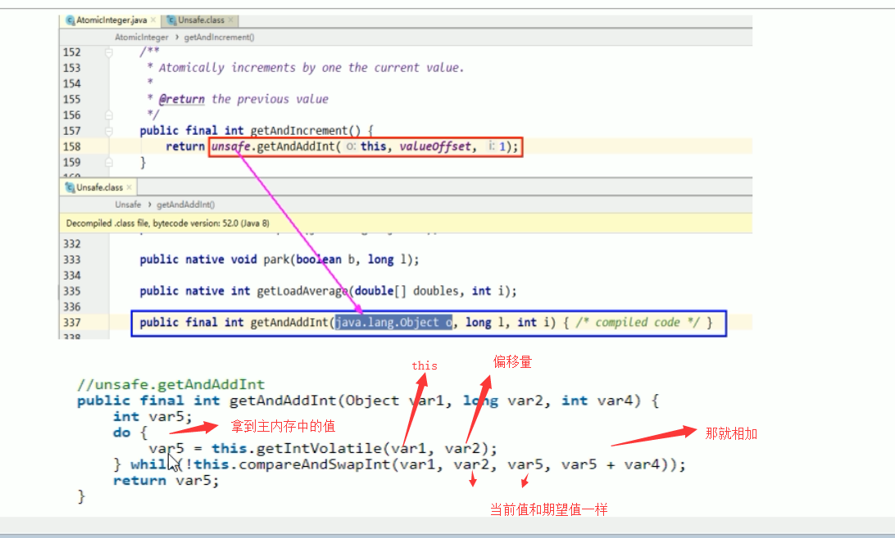

##  CAS底层原理

### 概念

CAS的全称是Compare-And-Swap，它是CPU**并发原语**。

它的功能是判断内存某个位置的值是否为**预期**值，**如果是则更改为新的值**，这个过程是**原子**的。

CAS并发原语体现在Java语言中就是`sun.misc.Unsafe`类的各个方法。调用UnSafe类中的CAS方法，JVM会帮我们实现出CAS汇编指令，这是一种完全依赖于硬件的功能，通过它实现了原子操作。

再次强调，由于CAS是一种系统原语，原语属于操作系统用语范畴，是由若干条指令组成，用于完成某个功能的一个过程，并且原语的执行必须是连续的，在执行过程中不允许被中断，也就是说CAS是一条CPU的原子指令，不会造成所谓的数据不一致的问题，也就是说CAS是**线程安全**的。

### 代码使用

完整代码如下：

```java
public class CASDemo {
    public static void main(String[] args) {
        // 首先调用AtomicInteger创建了一个实例， 并初始化为5
        AtomicInteger atomicInteger = new AtomicInteger(5);
        /**一个是期望值，一个是更新值，但期望值和原来的值相同时，才能够更改
         * 假设三秒前，我拿的是5，也就是expect为5，然后我需要更新成 2019
         */
        System.out.println(atomicInteger.compareAndSet(5, 2019)+ "\t current data: " + atomicInteger.get());
        System.out.println(atomicInteger.compareAndSet(5, 1024)+ "\t current data: " + atomicInteger.get());
    }
}
```

执行结果：true current data: 2019    false current data: 2019

原因：执行第一个，期望值和原本值是满足的，因此修改成功，但是第二次后，主内存的值已经修改成了2019，不满足期望值，因此返回了false，本次写入失败。


这个就类似于SVN或者Git的版本号，如果没有人更改过，就能够正常提交，否者需要先将代码pull下来，合并代码后，然后提交

### CAS底层原理

- 首先我们先看看 atomicInteger.getAndIncrement()方法的源码

```java
/**
 * Atomically increments by one the current value.
 * @param this 当前对象
 * @param valueOffset 内存偏移量，即内存地址
 * @return the previous value
 */
public final int getAndIncrement() {
    return unsafe.getAndAddInt(this, valueOffset, 1);
}
```

- 从这里能够看到，底层又调用了一个unsafe类的getAndAddInt方法

```java
public final int getAndAddInt(Object var1, long var2, int var4) {
    int var5;
    do {
        var5 = this.getIntVolatile(var1, var2);
    } while(!this.compareAndSwapInt(var1, var2, var5, var5 + var4));

    return var5;
}
```

```java
/** @since 1.5
 * @author Doug Lea
 */
public class AtomicInteger extends Number implements java.io.Serializable {
    private static final long serialVersionUID = 6214790243416807050L;

    // setup to use Unsafe.compareAndSwapInt for updates
    private static final Unsafe unsafe = Unsafe.getUnsafe();
    private static final long valueOffset;

    static {
        try {
            valueOffset = unsafe.objectFieldOffset
                (AtomicInteger.class.getDeclaredField("value"));
        } catch (Exception ex) { throw new Error(ex); }
    }

    private volatile int value;
```

#### 1、unsafe类

Unsafe是CAS的核心类，由于Java方法无法直接访问底层系统，需要通过本地（Native）方法来访问，Unsafe相当于一个后门，基于该类可以直接操作特定的内存数据。Unsafe类存在sun.misc包中，其内部方法操作可以像C的指针一样直接操作内存。

Java中的CAS操作的执行依赖于Unsafe类的方法。

注意：Unsafe类的所有方法都是native修饰的，也就是说unsafe类中的方法都直接调用操作系统底层资源执行相应的任务

为什么Atomic修饰的包装类，能够保证原子性，依靠的就是底层的unsafe类

#### 2、变量valueOffset

表示该变量值在内存中的偏移地址，因为Unsafe就是根据内存偏移地址获取数据。

通过valueOffset，直接通过内存地址，获取到值，然后进行加1的操作

#### 3、变量value用volatile修饰

保证了多线程之间的内存可见性



var5：就是我们从**主内存**中拷贝到工作内存中的值(每次都要从主内存拿到最新的值到自己的本地内存，然后执行compareAndSwapInt()在再和主内存的值进行比较。因为线程不可以直接越过高速缓存，直接操作主内存，所以执行上述方法需要比较一次，再执行加1操作)

那么操作的时候，需要比较工作内存中的值，和主内存中的值进行比较

假设执行 compareAndSwapInt返回false，那么就一直执行 while方法，直到期望的值和真实值一样

- val1：AtomicInteger对象本身
- var2：该对象值的引用地址
- var4：需要变动的数量
- var5：用var1和var2找到的内存中的真实值
  - 用该对象当前的值与var5比较
  - 如果相同，更新var5 + var4 并返回true
  - 如果不同，继续取值然后再比较，直到更新完成

#### AtomicInteger用CAS而不是synchronized的原因？

- synchronized加锁，同一时间只允许有一个线程访问，一致性得到了保证但是并发行下降；
- CAS使用的是do-while，没有加锁，反复比较直至成功，即保证了并发性又提高了一致性。

这里没有用synchronized，而用CAS，这样提高了并发性，也能够实现一致性，是因为每个线程进来后，进入的do while循环，然后不断的获取内存中的值，判断是否为最新，然后在进行更新操作。

##### 假设线程A和线程B同时执行getAndAddInt操作（分别跑在不同的CPU上）

1. AtomicInteger里面的value原始值为3，即主内存中AtomicInteger的 value 为3，根据JMM模型，线程A和线程B各自持有一份值为3的副本，分别存储在各自的工作内存。
2. 线程A通过getIntVolatile(var1 , var2) 拿到value值3，这是线程A被挂起（该线程失去CPU执行权）。
3. 线程B也通过getIntVolatile(var1, var2)方法获取到value值也是3，此时刚好线程B没有被挂起，并执行了compareAndSwapInt方法，比较内存的值也是3，成功修改内存值为4，线程B打完收工，一切OK。
4. 这是线程A恢复，执行CAS方法，比较发现自己手里的数字3和主内存中的数字4不一致，说明该值已经被其它线程抢先一步修改过了，那么A线程本次修改失败，只能够重新读取后在来一遍了，也就是再执行do while。
5. 线程A重新获取value值，因为变量value被volatile修饰，所以其它线程对它的修改，线程A总能够看到，线程A继续执行compareAndSwapInt进行比较替换，直到成功。

总结：Unsafe类 + CAS思想（自旋）

### 底层汇编

Unsafe类中的compareAndSwapInt是一个本地方法，该方法的实现位于unsafe.cpp中。

```c++
UNSAFE_ENTRY(jboolean, Unsafe_CompareAndSwapInt(JNIEnv *env, jobject unsafe, jobject obj, jlong offset, jint e, jint x))
  UnsafeWrapper("Unsafe_CompareAndSwapInt");
  oop p = JNIHandles::resolve(obj);
  jint* addr = (jint *) index_oop_from_field_offset_long(p, offset);
  return (jint)(Atomic::cmpxchg(x, addr, e)) == e;
UNSAFE_END
```

- 先想办法拿到变量value在内存中的地址
- 通过Atomic::cmpxchg实现比较替换，其中参数X是即将更新的值，参数e是原内存的值。

## CAS缺点

CAS不加锁，保证一次性，但是需要**多次比较**

- 循环时间长，开销大：执行do while，如果比较不成功一直在循环，最差的情况是某个线程一直取到的值和预期值都不一样，这样就会无限循环。
- 只能保证一个共享变量的原子操作
  - 当对一个共享变量执行操作时，我们可以通过循环CAS的方式来保证原子操作
  - 但是对于多个共享变量操作时，循环CAS就无法保证操作的原子性，这个时候只能用锁来保证原子性
- 引出来ABA问题

### 总结

#### CAS

CAS是compareAndSwap，比较当前工作内存中的值和主物理内存中的值，如果相同则执行规定操作，否者继续比较直到主内存和工作内存的值一致为止。

#### CAS应用

CAS有3个操作数，内存值V，旧的预期值A，要修改的更新值B。当且仅当预期值A和内存值V相同时，将内存值V修改为B，否者什么都不做。