1、断点类型
1）行断点（line breakpoints）
2）字段断点（field breakpoints）
3）方法断点（method breakpoints）
1> 加载类名上的断点
2> 正常方法断点
3> 通过匹配符批量添加方法断点
4）异常断点（exception breakpoints）
2、断点控制
1）断点删除
2）断点静音
3、断点属性配置
1）Enabled
2）Suspend
3）Condition
4）Log
效果展示
5）Remove once hit
6）Disable until hitting the following breakpoint
7）Pass count
4、断点的状态
对应的图标
5、Stream的调试
6、远程debug
使用建议
IDEA查看类实例所占内存

## IDEA断点用法

### 1、断点类型

#### 1）行断点（line breakpoints）

- 含义：在指定代码行设置断点，程序在到达设置断点的代码行时暂停程序。
- 位置：可以设置在任何可执行的代码行上。

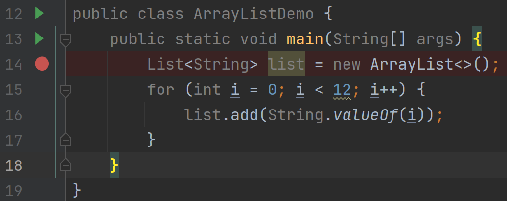

#### 2）字段断点（field breakpoints）

- 含义：当指定的字段被**读取或修改**时会进入端点，暂停程序。
- 作用：如果在一个复杂的过程结束时，某个字段出现了明显的错误值，设置一个字段观察点可能有助于确定故障的来源。
  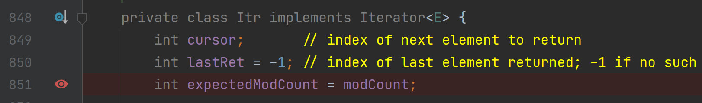

- 鼠标右键点击该断点图标 ，弹出该断点配置，会有Field access（访问该字段触发断点）和Field modification（修改该字段）选项；这两个选项项是字段类型断点特有的，两项同时选中，则访问、修改该字段都会触发断点。
- 默认只有修改字段时才会触发断点。

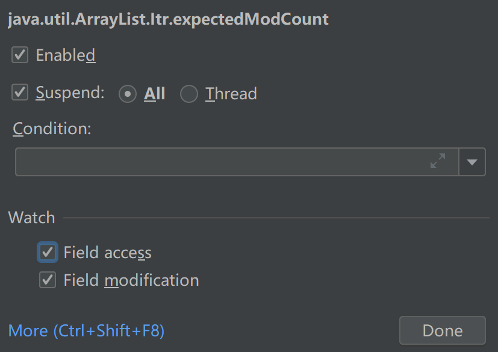

#### 3）方法断点（method breakpoints）

- 含义：在进入或退出指定的方法或其实现之一时暂停程序。
- 作用：检查该方法的进入/退出条件。

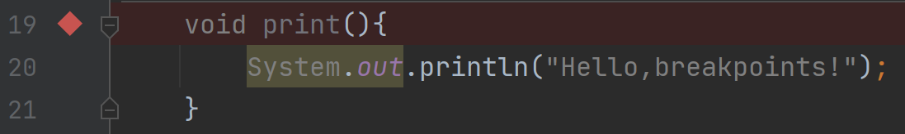

##### 1> 加载类名上的断点

- 说明：当断点加在class类名这一行，并且该类中没有编写构造函数（只有默认无参构造函数）时，当调用默认无参构造函数时会触发此断点，程序挂起；所以虽然这个断点的图标是行断点类型图标，但实际上其属于方法类型断点。

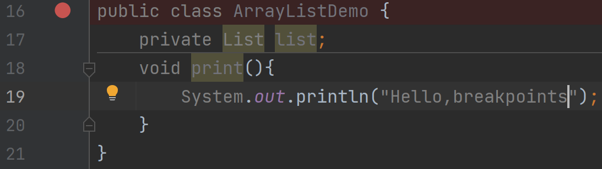

##### 2> 正常方法断点

- 在方法名这一行加断点，鼠标右键点击该断点图标 ，弹出该断点配置，会有Emulated、Method entry、Method exit选项，此选项是方法类型断点特有的。
- Emulated勾选中，会将方法断点优化成方法中第一条和最后一条语句的行断点，这样会优化调试的性能，因此在IDE中会默认选中。
- 实测：真正起到作用的是Method entry和Method exit。

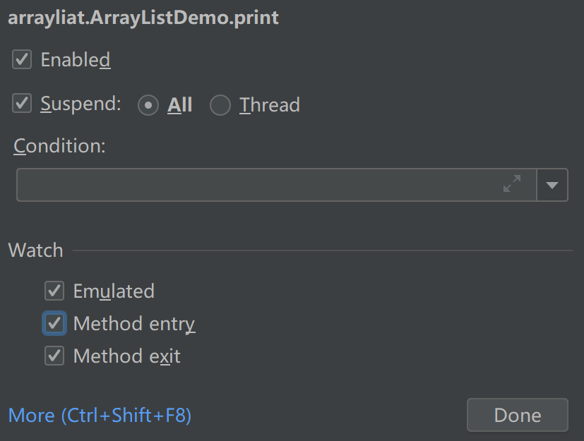

##### 3> 通过匹配符批量添加方法断点

- 鼠标右键点击某一个方法断点图标，然后点击More，会弹出断点列表页；

- 
  在断点列表页中，做如下操作：


- 点击+号，弹出下列选择框；

  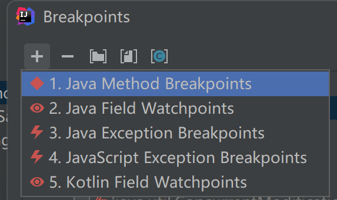

- 选择Java Method Breakpoints，弹出如下窗口；

  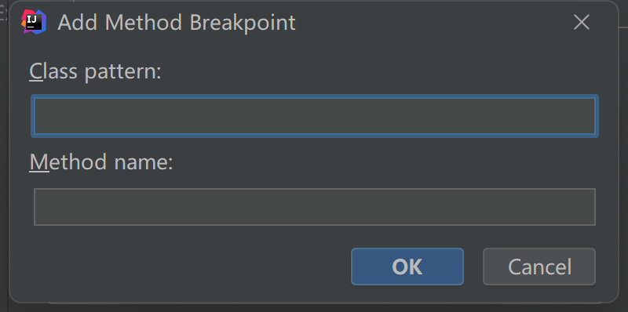

- Class pattern 和 Method name中输入的匹配符规则示例如下：

| Class pattern | Method | Result                                         |
| :-----------: | ------ | ---------------------------------------------- |
|       *       | print  | 匹配所有类的 `print()` 方法                    |
|   DebugTest   | *      | 匹配 `DebugTest` 类中的所有方法                |
|   DebugTest   | set*   | 匹配 `DebugTest` 类中的所有方法名set开头的方法 |

#### 4）异常断点（exception breakpoints）

- 当程序抛出指定异常时会激活异常断点，与行断点不同，异常断点不需要与源代码映射，因为异常断点是应用程序级别的。

- 异常断点分为两种：

  - 一种是Any Exception，任意Throwable异常被捕获或未被捕获就会触发断点；

  - 一种是指定类型的异常及其该异常子类被捕获或未被捕获会触发断点；

* 异常断点的添加方式——在断点列表页中，做如下操作：
  - 点击+号，弹出下列选择框；
  - 选择Java Exception Breakpoints，弹出如下窗口；

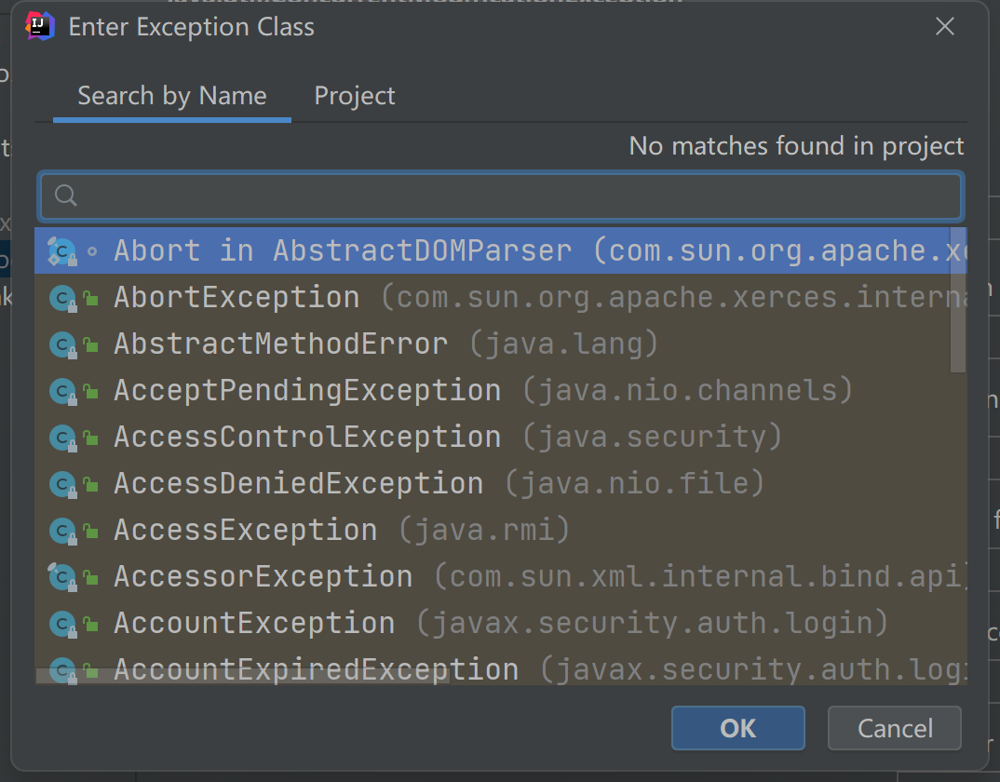

假如我们选择了java.lang.NullPointerException：

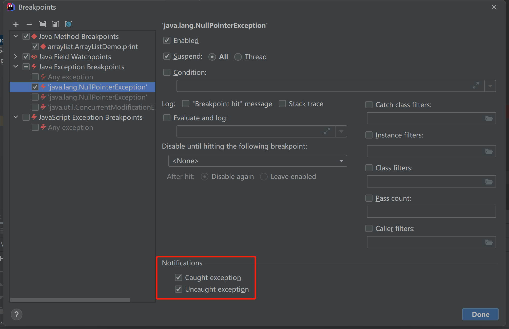

- 异常断点有两个特有的配置：Caught exception 和 Uncaught exception 选项。
  - Caught exception选项选中时，当指定的异常被**捕获**时，触发断点程序挂起；
  - Uncaught exception选中时，当指定的异常未被捕获时，触发断点程序挂起；

### 2、断点控制

#### 1）断点删除

##### 1> 所有类型的断点：在断点列表中用 - 号可以移除相应的断点；

##### 2> 快捷移除：行位置鼠标左键单击即可移除（异常断点除外）。

#### 2）断点静音

- 如果某些时候不需要在断点处停留一段时间，可以将断点静音。这样就可以在不离开调试器会话的情况下恢复程序的正常运行。之后，可以解除断点的静音，继续DEBUG调试。

- 断点静音会静音所有断点。


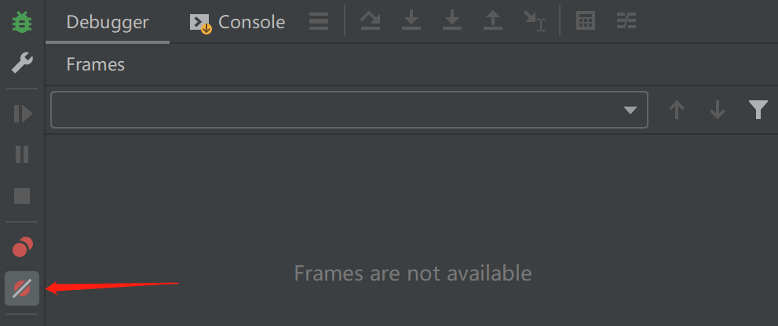

### 3、断点属性配置

- 鼠标操作：右键断点；

- 再点击：More(Ctrl+Shift+F8)，进入断点列表；


- 断点有许多属性配置；下面对各个属性的作用以及使用进行说明。


#### 1）Enabled

- 表示是否启用该断点，选中表示启用，取消选中表示不启用。

#### 2）Suspend

- Suspend属性除了自身是否勾选之外，还有两个选项：All、Thread；

- 当断点的 Suppend 属性被勾选，触发该断点时，程序挂起；当该属性未选中时，程序触发该断点时，程序不会挂起，不勾选Suspend属性的操作，常用于输出一些表达式结果日志。
- 当断点的 All 属性被勾选，触发该断点时，会挂起所有线程；
- 当断点的 Thead 属性被勾选，触发该断点时，只会挂起触发该断点的那个线程，不影响其他线程；
- 实际生产实践中，可用于调试多线程并发的问题。

#### 3）Condition

- 输入一段能获得true或false的表达式，程序运行到断点处，且表达式条件为true才会触发断点。
- 比如下图：当stop属性为true时才触发断点；
- 注意：使用属性等时，要注意其可以获取到。否则会报Breakpoint  Condition  Error。

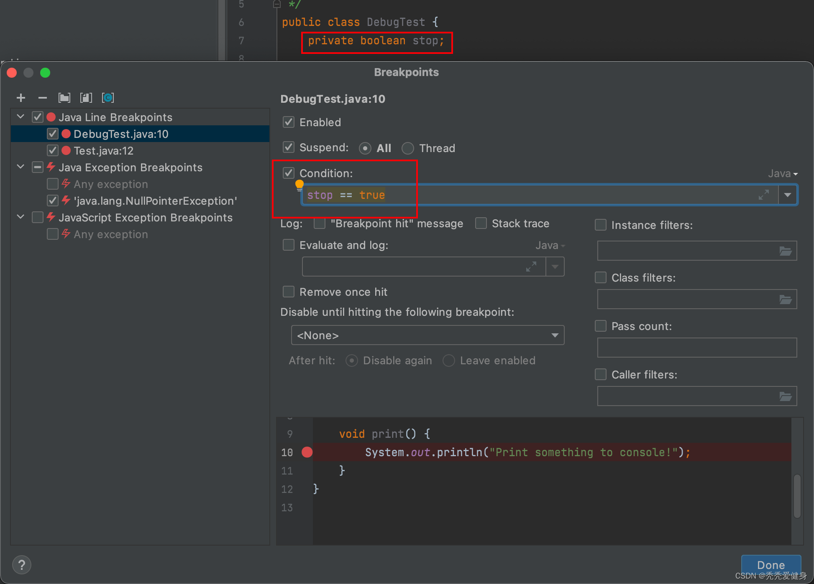

#### 4）Log

- Log有三个属性选项，经常配合 Suppend 属性不勾选时一起使用，用于在不挂起程序的情况下，输出一些想要的日志信息；

  - Breakpoint hit message ：控制台输出触发断点的日志信息；
    - 比如：`Breakpoint reached at com.saint.debug.DebugTest.print(DebugTest.java:10)`

  - Stack trace：输出触发断点时的堆栈信息；

    - 比如：

      ```java
      Breakpoint reached
      	at com.saint.debug.DebugTest.print(DebugTest.java:10)
      	at com.saint.debug.DebugTest.main(DebugTest.java:15)
      ```

  - Evaluate and log：计算表达式结果并输出表达式结果到控制台；

    - 表达式的计算基于断点所在行的上下文，表达式的语句可以是字符串字面量、方法调用、也可以是多行语句块；

##### 效果展示

断点配置如下：在不挂起程序的情况下输出日志


DEBUG后的控制台输出：


#### 5）Remove once hit

- 是否在断点触发后移除该断点，后续不再触发；

#### 6）Disable until hitting the following breakpoint

- 选择的另一个断点被触发后，该断点才启用。

#### 7）Pass count

- 勾选中并输入一个正整数N，N>=1，那么程序会每N次命中????断点才会触发挂起。
- 如果同时设置了condition 与 pass count 属性，ide会优先判断 condition 表达式，再判断 pass count 是否满足。

- DEBUG测试效果：


### 4、断点的状态

| 状态               | 描述                                                         |
| ------------------ | ------------------------------------------------------------ |
| Verified           | 启动调试器会话后，调试器会检查在技术上是否可以在断点处暂停程序。 |
| Warning            | 如果是，调试器将该断点标记为已验证。如果在技术上可以在断点处暂停程序，但是有相关的问题，调试器会给你 |
| Invalid            | 一个警告。例如，这可能发生在无法在某个方法的实现处暂停程序的情况如果在技术上不可能在断点处暂停程序，调试器会将其标记为无效。最常 |
| Inactive/dependent | 下。见的原因是该行没有可执行的代码。当一个断点被配置为禁用，直到另一个断点被击中，而这还没有发生时， |
| Muted              | 该断点被标记为非活动/依赖性。所有的断点都是暂时不活动的，因为它们已经被静止了。 |
| Disabled           | 该断点暂时不活动，因为它已被禁用。                           |
| Non-suspending     | 为该断点设置了暂停策略，因此，当击中该断点时不会暂停执行。   |

- 对应的图标

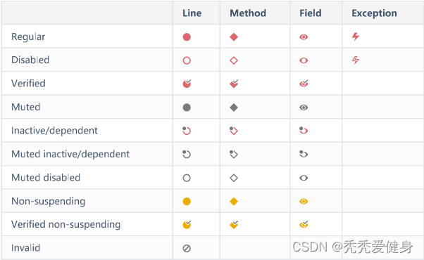


### 5、Stream的调试

这个看看就行，IDEA做的不怎么好，实际几乎也不用。

1> 在stream()方法处打个行断点；

2> 查看 Steam Trace；


### 6、远程debug

- 一般我们仅在开发环境和测试环境允许remote debug，UAT、Prod环境肯定不允许。

- 具体的步骤；

  - 1> 启动远程服务时加入如下参数：

    `java -agentlib:jdwp=transport=dt_socket,server=y,suspend=n,address=5005 -jar xxx.jar`

  - 2> 本地打开相应项目的 Edit Configurations，新增一个Remote


JVM参数添加 -agentlib:jdwp=transport=dt_socket,server=y,suspend=n,address=5005


3> Idea中启动remote，并打断点调试。

#### 使用建议

使用非暂停的日志断点进行“printf”调试，而不是在代码中插入打印语句。

为处理调试日志信息提供了一种更灵活和集中的方式。

场景： 所有需要打印的地方，生产上禁止 System.out.print();

测试程序是否有并发性问题

发现多线程程序在并发方面是否健壮的一个好方法是使用断点，在碰到时只暂停一个线程。

停止一个线程可能会揭示出应用程序设计中的问题，否则这些问题就不会显现出来。

#### IDEA查看类实例所占内存

IDEA在比较高的版本提供了查看类实例所占的保留内存大小能力，笔者的IDEA版本没那么高，这里简单提一下。

对于每个类的实例，你可以计算它的保留大小。保留大小是指对象本身和它所引用的所有对象以及没有被其他对象引用的对象所占据的内存量。

估算重型单体或从磁盘上读取的数据（例如，复杂的JSON）的内存占用时，可能很有用。

决定使用哪种数据结构时（例如，ArrayList与LinkedList），它也很有用。

使用方式：运行应用程序之前，确保在设置/首选项|构建、执行、部署|调试器中启用附加内存代理选项。

在查看类的实例时，右键单击一个实例并单击计算保留大小。