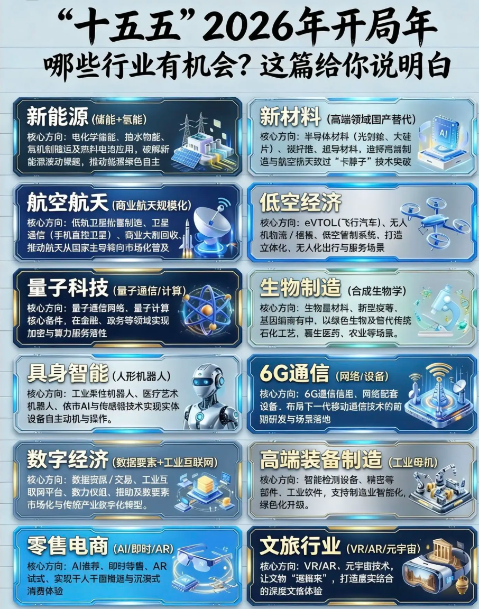

### “十五五”2026年开局年，哪些行业有机会?
#### 1、新能源(储能+氢能)
核心方向:电化学能、拍水物能、复机制随运及热抖电池应用，破解新能源流动眼题，推动能源绿色自主
#### 2、新材料(高端领域国产替代)
核心方向:半导体材料(光剑) 大硅片)、设计谁、追导材料，造疼高端制造与航空航天致过"卡胖子"技术失破
#### 3、航空航天(商业航天规模化)
核心方向:低轨卫星批量制造、卫星通信(手机直接卫星)、商业大制回收，推动航天从国家主导转向市场化管及
#### 4、低空经济
核心方向:eVTOL(飞行汽车)、无人机物流/相机、低空管制系统、打造立体化、无人化出行与服务场景
#### 5、量子科技(量子通信/计算)
核心方向:量子通信网络、量子计算核心备件，在金融、政务等领域实现加密与算力服务落性
#### 6、生物制造(合成生物学)
核心方向:生物量材料、新型疫等、基因编南有中、以绿色生物及管代传统石化工艺，裹生医药、农业等场景。
#### 7、具身智能(人形机器人)
核心方向:工业柔住机器人、医疗艺术机器人、依市AI与传感服技术实现实体设备自主动机与操作。
#### 8、6G通信(网络/设备)
核心方向:6G通信信组、网络配套设备.布局下一代移动通信技术的前期研发与场景落地
#### 9、数字经济(数据要素+工业互联网)
核心方向:数据资原/交易、工业互联网平台、数力仅组、指助及数要素市场化与传统产业纹字化转型。
#### 10、高端装备制造(工业母机)
核心方向:智能检测设备、精密等部件、工业软件，支持制造业智能化，绿色化开级。
#### 、零售电商(AI/即时/AR)
核心方向:Al谁荐、即时等售、AR试式、实现干人干面推进与沉浸式消费体验
#### 、文旅行业(VR/AR/元宇宙)
核心方向:VR/AR、元宇宙技术，让文物"退 来"，打造层实给合的深度文旅体验

