### 4个超实用居家小练习，可提高80%场上战斗力
#### 1、直升机摆臂
收益：羽毛球鞭打发力
#### 2、挥拍够天花板
收益：杀球不下网

Note：最高点回球，也能最快回球。减少对手反应、调整时间。
#### 3、挥拍打窗帘
收益：击球有力，不切拍。
#### 4、蹬转练习
收益：蹬转杀球

### 打完羽毛球身上疼的快来对照看看，各部位疼痛原因教你快速缓解。 今天你疼了吗？
#### 1、屁股大腿疼
原因：运动量太大；接被动球过多。

解决：臀腿拉伸

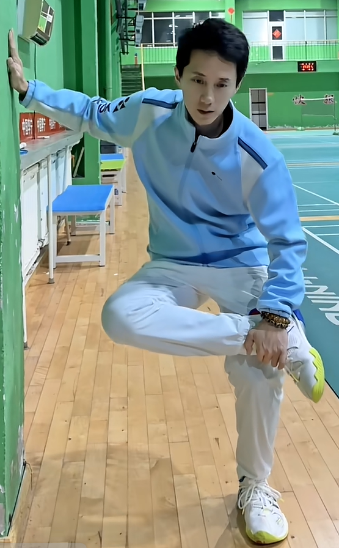
#### 2、膝盖疼
原因：膝关节肌群力量薄弱；打球强度过大。

解决：【**日常**】 靠墙静蹲，加强膝盖保护力量。每组2-3分钟，每天做4组。

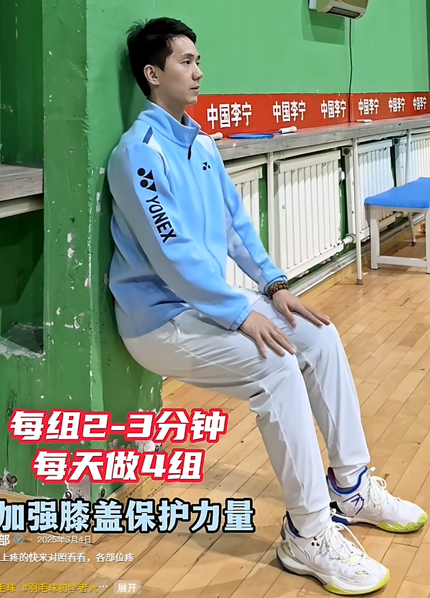
#### 3、大臂、肩膀疼
原因：打球经常抡大臂，发力不正确。

解决：对大臂和肩膀进行拉伸。

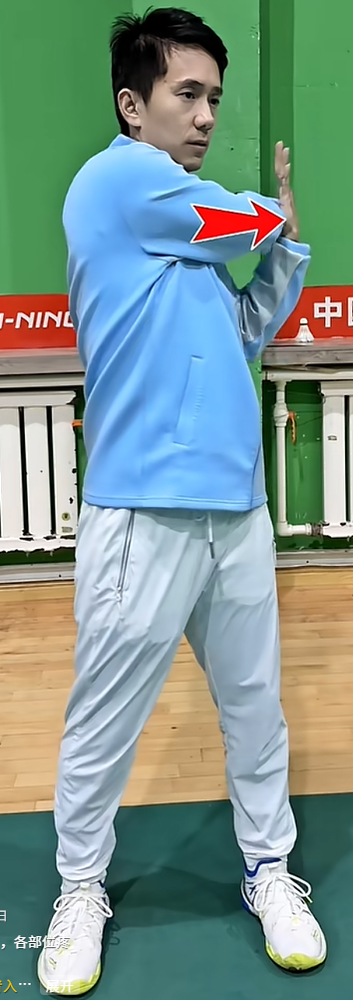
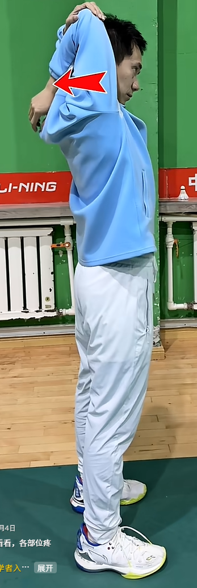
#### 4、腰背疼痛
原因：杀球过多；频繁接后仰球

解决：做腰背拉伸

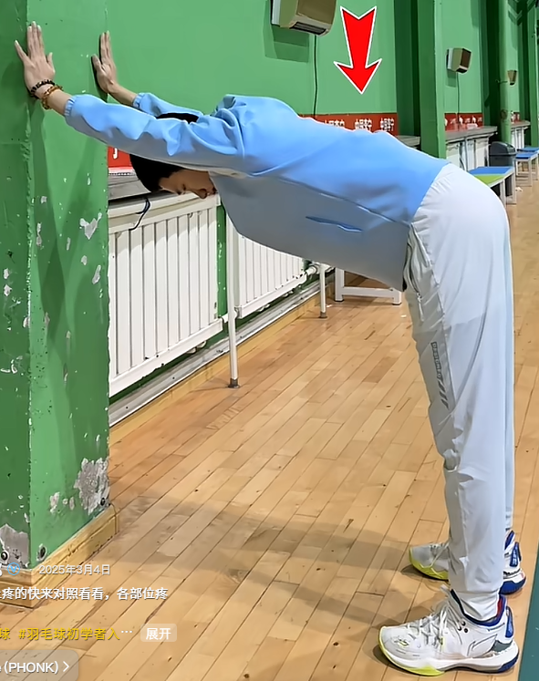
#### 5、小臂酸痛
原因：打球时间过长，发力过猛，造成的乳酸堆积。

解决：做小臂拉伸。四肢着地跪姿，需要拉伸的手臂朝前，手指朝后，身体慢慢**前后**移动。

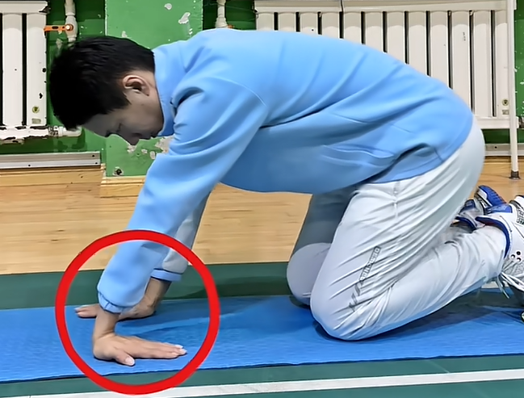
#### 6、小腿疼
原因：运动量过大，乳酸堆积

解决：小腿拉伸

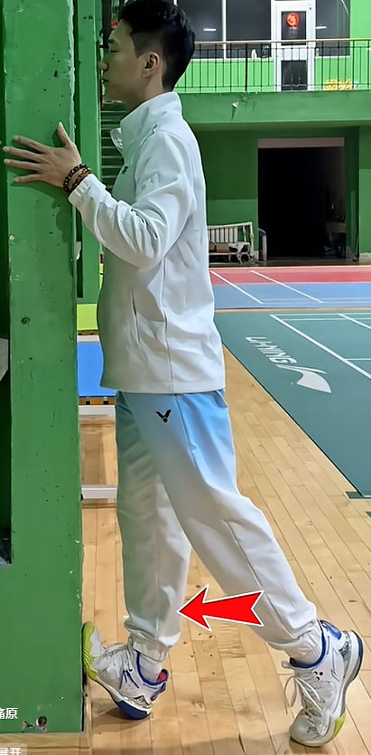
#### 7、脚底疼
原因：打球时，跳跃缓冲较多，造成足底筋膜炎。

解决：【**日常**】将网球放在脚底疼痛区域，轻踩并缓慢来回滚动。每次5分钟，每天2-3次。足弓、足跟、脚掌都适用。

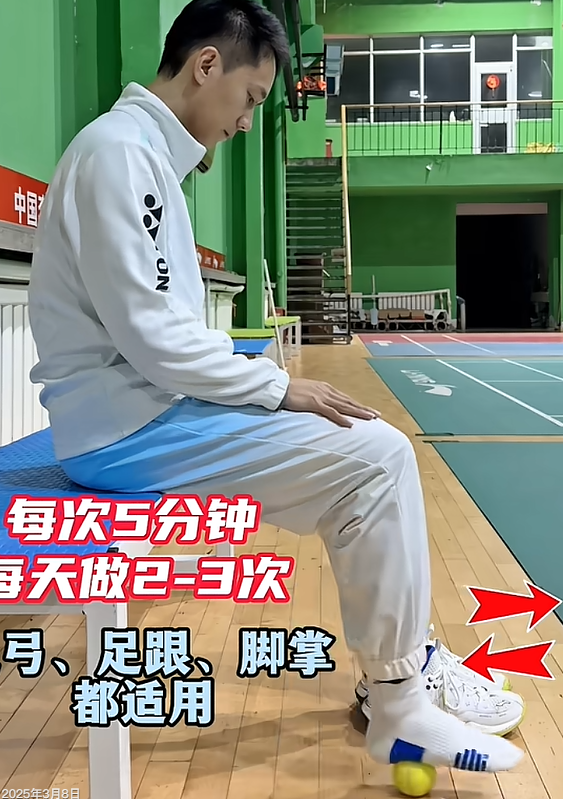
#### 8、手腕内侧疼
原因：手腕过度使用，频繁压腕

解决：拉伸手腕内侧肌群。

1、右手（打球常用手）祈福手势，向内用力。左手辅助更加向内。感受手腕内侧肌肉拉伸。保持30秒，每次做3组。

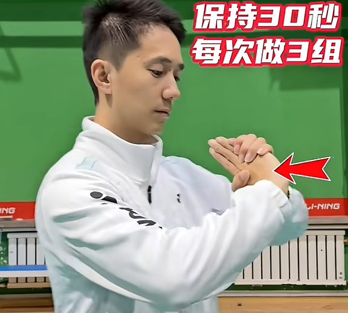
2、右手手掌朝上，向左发力，左手辅助向右推，产生对抗，使手腕内侧肌群有发力感，从而建立手腕肌群力量。

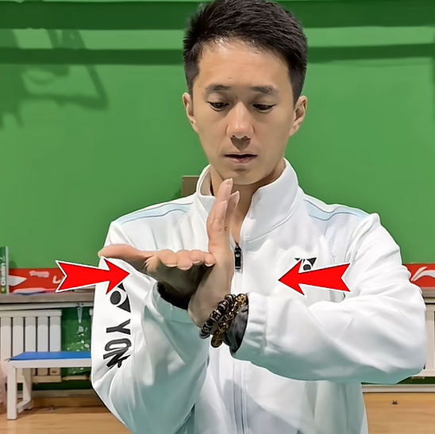
#### 9、大腿根内侧疼
原因：打球前热身不充分，大跨步抻到耻骨肌

解决：【**运动前后**】充分拉伸大腿内侧。

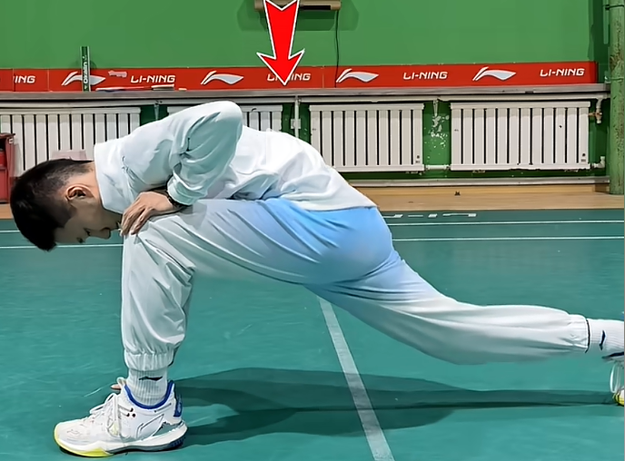
#### 10、斜方肌疼
原因：打球耸肩动作过多，用力过猛

解决：斜方肌拉伸，一侧肩部下沉，另一侧手扶头拉伸。保持10秒。

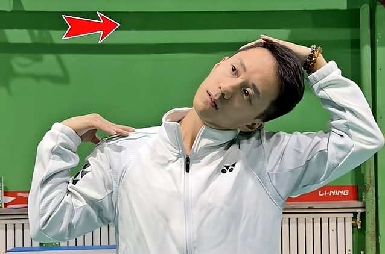
#### 注意
如无特殊说明，每次运动后做

### 双打中最拍的搭档和最喜欢的搭档 你喜欢哪一种
#### 1、【反面】挑球不后退
正确做法：起球后，前场队员直线后退，搭档横移，平行站位，二防一。
#### 2、【反面】放网不跟上
正确做法：放网队员出球后要马上跟进封网。
#### 3、【正面】队友进攻直线时，跟进直线；队友进攻斜线时，封住斜线网前
#### 4、【正面】队友杀上网时横移让位，形成完美轮换

### 4个基本技术发力小技巧
#### 1、发球总被扑
别翻拍面，保持拍面平行（与地平面垂直）往前推
#### 2、高远球没力
别用大臂抡，改用内旋鞭甩
#### 3、吊球过网高
别去平行推，用拍面先包，后切。
#### 4、杀球变平高球
手肘抬高，击球点放前
