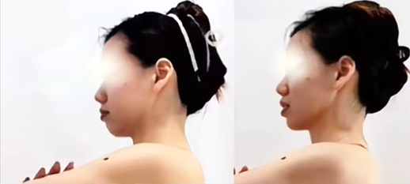

### 瘦腿经验分享
针对：大腿内外侧肉多，肉松跨的梨形身材
频次：1天2次
见效：坚持1周
【[去头尾]林芊妤20mins瘦大腿操】 https://www.bilibili.com/video/BV12J411R7BM/?share_source=copy_web&vd_source=d791638262cefd6ab2814a966499f2fa

### 瘦脸经验
——逆转体态型脸胖
#### 1、
#### 2、
#### 、
#### 、
#### 、

### 脸垮双下巴就去练背，坚持一段时间你会来谢我的！
案例：学员坚持一个月变化

目标：4个动作告别虎背熊腰，练出一字肩，紧致下颌线。

#### 动作一、前后绕肩
解决扣肩、双下巴、垮脸、富贵包

#### 动作二、左右侧拉
解决手臂拜拜肉、副乳

#### 动作三、高位下拉
解决背上赘肉多、斜方肌又高又厚

#### 动作四、W平推
挺拔胸型，练出一字肩

#### 规格
30次 * 5组

#### 视频
7.46 Z@z.GI 02/25 DuF:/ 脸垮双下巴就去练背，坚持一段时间你会来谢我的！# 居家锻炼 # 开肩美背 # 好身材练起来 # 背部训练  https://v.douyin.com/oMFadDHTdU0/ 复制此链接，打开Dou音搜索，直接观看视频！

### 颈椎前倾，颈椎曲度变直怎么办？一招教你缓解！
#### 为什么脖子会前倾？
1、睡觉时，侧卧、登山式睡姿

2、玩手机时，葛优躺

3、坐着时，低头看手机，翘起二郎腿

4、工作时，贴着屏幕工作。
#### 改善头前倾
握拳，离墙一臂距离；  ——>  踮脚；  ——>  双肘撑墙；  ——>  双手放于后颈部；  ——>  前胸尽量贴近墙壁，头往后仰

规格：坚持30秒
